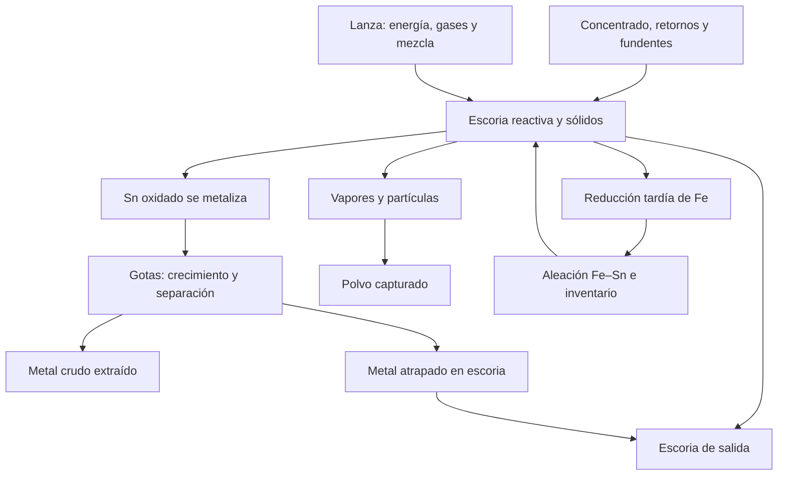
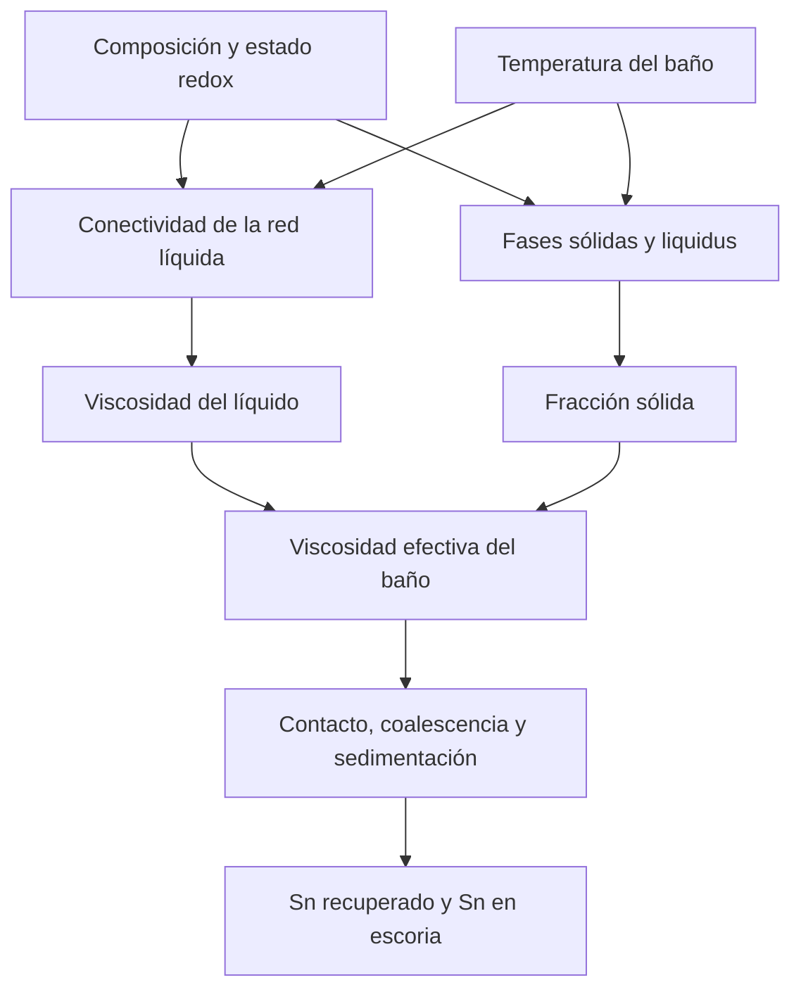
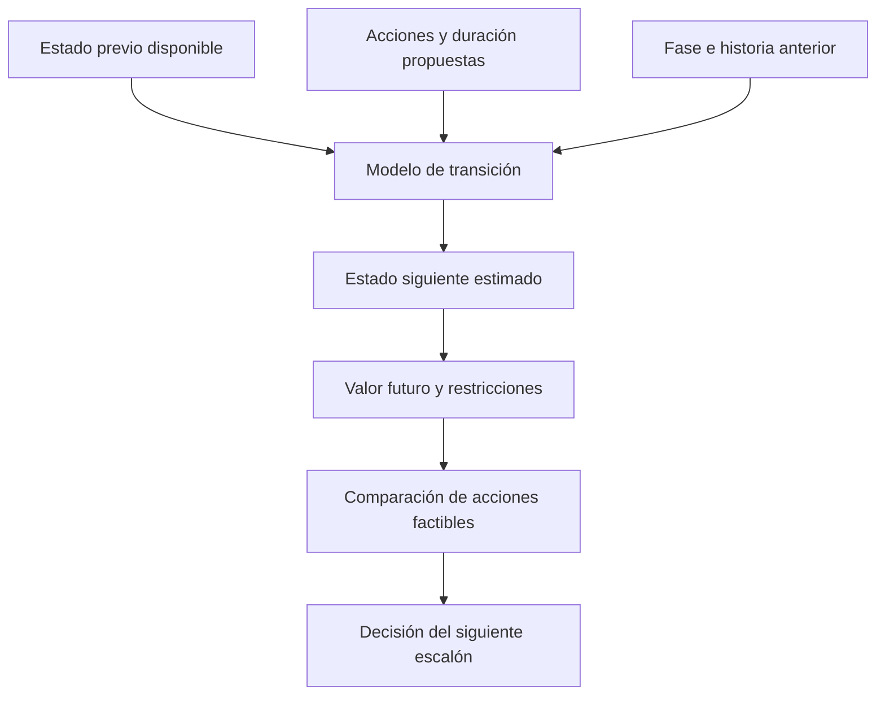

# Horno Ausmelt de estaño: del fenómeno físico a una analítica operativa coherente

**Guía técnica de fusión y reducción, interpretación de variables y diseño de modelos.**  
**Base de trabajo:** diccionario y código proporcionados por el usuario. **Fecha:** 13 de septiembre de 2026.

Este documento explica primero qué ocurre dentro del horno a medida que transcurre el batch; después desarrolla los fundamentos que permiten cuantificarlo, interpreta las 35 variables originales y las tres variables calculadas, y propone una estructura analítica. No se recibió el Excel: las correlaciones, porcentajes de nulos y anomalías mencionados se toman de tus notas, sin presentarlos como verificaciones independientes.

El Ausmelt de este contexto realiza **fundición reductora de concentrados y reducción de escorias** dentro de un complejo de fundición y refinería. El metal obtenido es estaño crudo; no se debe confundir su producción con la obtención final de estaño refinado. Las consignas numéricas de temperatura, gases, lanza y composición requieren datos de diseño y validación metalúrgica de la instalación. Aquí se establecen sus criterios físicos y las relaciones que deben investigarse.

**Lectura y notación.** Las ecuaciones usan LaTeX compatible con KaTeX y los diagramas usan Mermaid. Se adjunta una versión HTML con ambos ya renderizados para lectura sin depender del soporte del editor Markdown. Las ecuaciones identificadas como aproximaciones, escenarios o modelos conceptuales no son calibraciones de tu horno. Las fuentes primarias se enlazan junto al punto específico que respaldan; la construcción de features y los ejemplos son desarrollos analíticos de esta guía.

## 1. Qué ocurre durante un batch, explicado en orden temporal

### 1.1 Antes de alimentar: el horno ya tiene una historia

Imagina un recipiente refractario con un baño de escoria caliente y, según el momento operativo, metal en el fondo. Por arriba entra una lanza; su punta se sumerge normalmente en la escoria. Por la lanza ingresan combustible y gases oxidantes. La alimentación sólida cae desde arriba y se incorpora al baño por calentamiento, reacción y movimiento del líquido.

El baño no es una mezcla homogénea de todo. Hay, como mínimo, **una fase de escoria, una fase metálica, gases y sólidos transitorios**. La escoria es principalmente una solución fundida de óxidos; puede contener partículas todavía sin disolver, cristales y gotas de metal. El metal es una aleación rica en Sn con cantidades variables de Fe y otras impurezas. La agitación dispersa temporalmente unas fases dentro de otras.

La tecnología TSL utiliza la inyección sumergida para intensificar el contacto entre gases y baño. El fabricante describe la alimentación de combustible y aire enriquecido con oxígeno a través de la lanza, con control del aporte térmico y del potencial de oxígeno. Esa posibilidad tecnológica no implica que ambas variables sean independientes en tu dataset: comparten actuadores, combustión y restricciones de mezcla. [Metso, descripción del proceso Ausmelt TSL](https://www.metso.com/portfolio/ausmelt-tsl-process/).

Un nuevo identificador `Batch` **no hace que desaparezcan** la escoria residual, el metal retenido, las acreciones, el calor almacenado en el refractario ni la historia de desgaste. El estado inicial debe representarse como:

$$
\mathbf{x}_{b,0}=\left(M_{s,0},M_{m,0},\mathbf{w}_{s,0},\mathbf{w}_{m,0},T_0,\text{geometría efectiva},\text{estado de lanza}\right).
$$

Aquí $M_s$ y $M_m$ son masas de escoria y metal; $\mathbf{w}$ representa sus composiciones. Varias de estas cantidades no están medidas. Dos batches con las mismas adiciones pueden responder de manera diferente porque comenzaron con estados distintos.

### 1.2 Primer contacto del concentrado con el baño

Al caer una partícula húmeda de concentrado suceden procesos superpuestos:

1. **Se calienta el agua y se evapora.** Consume calor y aumenta el gas que debe evacuar el sistema.
2. **Se calienta la partícula mineral.** Su superficie se aproxima antes que su núcleo a la temperatura del entorno.
3. **La ganga se incorpora a la escoria.** Disolución y formación de líquido dependen de composición, temperatura y tamaño de partícula.
4. **Los óxidos de Sn reaccionan con reductores.** Pueden transformarse primero en especies de Sn(II) y luego en Sn metálico.
5. **El producto metálico se separa progresivamente.** Se forman gotas, crecen, chocan, pueden unirse o romperse, y finalmente se integran al metal del fondo si las condiciones lo permiten.

**Fundir no es reducir.** Fundir cambia el estado físico; reducir cambia el estado de oxidación. La casiterita no necesita transformarse primero en un baño de $\mathrm{SnO_2}$ puro líquido para producir metal: puede reaccionar en interfaces sólido–gas, sólido–escoria y escoria–reductor mientras se incorpora al sistema.

El estaño metálico puro funde aproximadamente a 232 °C, pero eso no permite operar la fundición de concentrados a esa temperatura. El horno debe sostener una escoria procesable y velocidades de reacción suficientes. La temperatura necesaria la condicionan la mezcla de óxidos, sus fases sólidas, la transferencia de calor y la química de reducción.

### 1.3 Fusión: alimentar, generar líquido y reducir selectivamente

Durante la fase denominada **Fusión** entran concentrado, retornos y fundentes, junto con carbón. Simultáneamente se aporta energía mediante la combustión. El nombre de la fase **no significa que no haya reducción**. Una parte sustancial del Sn puede metalizarse y producir metal crudo ya en esta etapa.

La situación dinámica es una competencia:

$$
\text{incorporación de Sn a la escoria}
\quad\text{frente a}\quad
\text{reducción y separación de Sn hacia el metal}.
$$

En cada instante se introducen nuevos óxidos y se consumen otros. Por eso, incluso si la reducción funciona bien, la masa de Sn contenida en la escoria puede crecer mientras la alimentación continúa. La **ley** puede subir, bajar o estabilizarse dependiendo además de cuánto crezca la masa total de escoria.

El objetivo selectivo es recuperar Sn sin llevar innecesariamente mucho Fe al metal. En términos prácticos, se busca una combinación de temperatura, disponibilidad de reductor, estado de la escoria y agitación que permita producir metal y mantener la escoria tratable. Llevar todas las reacciones al extremo reductor desde el principio puede aumentar el hierro del metal y la carga de separación posterior.

La temperatura puede caer después de una adición por su carga térmica, aunque haya combustión. Más tarde puede recuperarse por aporte de calor y disminución de la carga fría. Una lectura al cierre del escalón resume el resultado de esa trayectoria; no revela sus máximos, mínimos ni tiempos de respuesta internos.

### 1.4 Fusión avanzada: crecen los inventarios y cambian las condiciones de la lanza

Conforme crece la escoria:

- Cambia el nivel del baño y, por tanto, la inmersión real de una lanza que no se haya movido.
- Cambian la presión hidrostática que vence el gas y la circulación inducida.
- Aumenta o cambia la capacidad térmica del contenido del horno.
- Se modifican composición, viscosidad, cantidad de sólidos y distribución de gotas metálicas.
- Una sangría de metal cambia la masa y la geometría sin necesariamente quedar registrada en tus variables.

Así, el mismo valor de `posicion_vertical_lanza_mm` al principio y al final puede representar inmersiones distintas. El mismo caudal puede generar una potencia de agitación por tonelada de baño diferente.

Una descripción histórica de Minsur reporta alimentación de concentrado y retornos durante fusión, sangrías de metal y acumulación de escoria; al iniciar reducción se interrumpía aquella alimentación y continuaba el carbón. También describe extracción inicial de metal con bajo Fe durante reducción y retención de metal final rico en Fe para el ciclo siguiente. Es un precedente útil para entender inventarios, **no una confirmación del procedimiento actual de tu horno**. [Robilliard, Lightfoot y Ng, operación de Minsur, 2000](https://studylib.net/doc/27451519/the-use-of-ausmelt-technology-at-the-minsur-tin-smelter-a...).

### 1.5 Transición a reducción: cambia la misión del horno

En reducción se intenta retirar el Sn que permanece en la escoria. Normalmente disminuye o cesa la entrada de concentrado, pero eso debe verificarse en los datos: las etiquetas operativas, los tiempos de transporte y la agregación por escalón pueden generar alimentación registrada después del cambio de fase.

La disminución de carga fría puede elevar la temperatura aun sin incrementar combustible. Al mismo tiempo, sostener reacciones de reducción consume energía y cambia la composición del baño. Si se reduce más FeO a Fe, disminuye uno de los componentes que contribuyen a la estructura y fluidez de la escoria. Por tanto, **una química más reductora puede mejorar la extracción química y empeorar la separación física**.

La transición no ocurre instantáneamente en toda la masa. Persisten sólidos, carbón, gases y material alimentado antes del cambio. Conviene distinguir `fase_proceso` del **tiempo desde la transición**, e incluir el estado terminal de fusión como condición inicial de reducción.

### 1.6 Reducción inicial y media: metalización y separación deben avanzar juntas

En una simplificación útil, una especie de estaño disuelta en la escoria pierde oxígeno y produce metal:

$$
\mathrm{SnO_{(escoria)}+CO_{(g)}\rightleftharpoons Sn_{(metal)}+CO_{2(g)}}.
$$

Esto no garantiza que el Sn llegue inmediatamente a una sangría. Primero puede quedar como gota suspendida. Hay dos problemas diferentes:

**Problema químico:** transformar el Sn oxidado en Sn metálico.  
**Problema físico:** sacar las gotas de la escoria y reunirlas en una fase metálica recuperable.

Si se mantiene una agitación intensa, mejora el transporte de especies pero también puede mantenerse una emulsión de gotas. Si se reduce demasiado pronto la agitación, puede faltar contacto entre reductores y escoria. La trayectoria operativa debe compatibilizar ambos mecanismos, posiblemente con etapas diferenciadas de reacción y separación según el diseño de planta.

### 1.7 Reducción tardía: baja fuerza impulsora y mayor competencia del hierro

Cuando queda menos Sn oxidado, su actividad y su concentración disponible disminuyen. La velocidad puede caer por menor fuerza impulsora, peor transferencia de masa, crecimiento de fases sólidas o aproximación al equilibrio. Continuar agregando carbón no asegura un aumento proporcional de Sn recuperado.

En condiciones suficientemente reductoras también se metaliza hierro:

$$
\mathrm{FeO_{(escoria)}+CO_{(g)}\rightleftharpoons Fe_{(metal)}+CO_{2(g)}}.
$$

El Fe se incorpora a la fase metálica y modifica sus propiedades. Al enfriar o cambiar composición pueden aparecer intermetálicos Fe–Sn. **Hardhead** designa material metálico rico en Fe–Sn; **dross de Fe** designa una corriente operativa que puede contener esos intermetálicos y metal atrapado. No deben equipararse sin conocer la procedencia y composición de cada corriente.

La literatura termodinámica de fundición de casiterita estudia precisamente el compromiso entre reducción de Sn, metalización de Fe y recirculación de hardhead. Sus composiciones y óptimos corresponden al sistema modelado; no deben importarse como consignas universales. [Moosavi-Khoonsari y Mostaghel, estudio termodinámico de fundición de casiterita](https://doi.org/10.1080/00084433.2023.2266209).

### 1.8 Cierre, separación, sangría y herencia del siguiente batch

El cierre no es simplemente obtener la menor ley posible de Sn en una muestra. Deben considerarse masa de escoria descartada, metal arrastrado, Sn enviado a polvo o dross, consumo adicional y tiempo de ocupación del horno.

Las gotas necesitan alcanzar una fase metálica que efectivamente se extraiga. El material que permanece en el horno se convierte en inventario del siguiente batch. Además, el polvo recogido en el BHF puede tener tiempos de transporte y descarga distintos de la reacción que lo originó.

Por ello, el momento de contabilización de una salida puede no coincidir con el momento de formación de ese material. Esta diferencia es decisiva para interpretar las tres masas finales de Sn y cualquier target construido con ellas.

### 1.9 Mapa de transformación y recirculación



El diagrama es conceptual: no implica que todas las corrientes se pesen por separado ni que cada instalación recircule por la misma ruta.

## 2. Qué materia existe y qué significa químicamente cada fase

### 2.1 Fase, especie, elemento y corriente no son lo mismo

| Concepto | Ejemplo | Consecuencia analítica |
|---|---|---|
| Elemento | Sn total | Puede estar repartido entre metal, óxidos, vapor y partículas. |
| Especie o componente químico | SnO, SnO₂, FeO | Determina oxígeno asociado, equilibrio y demanda de reductor. |
| Fase | Escoria líquida, aleación líquida, cristal | Tiene composición y propiedades propias. |
| Corriente operativa | Dross, polvo, metal crudo | Puede contener varias fases. |
| Ensayo global de una muestra | `%Sn` en escoria | Puede incluir Sn químicamente disuelto y gotas metálicas atrapadas. |

Una muestra enfriada puede cristalizar fases que no existían como cristales durante la operación. XRD de la muestra sólida no identifica automáticamente la fracción sólida del baño caliente. Para interpretarla se necesita historia de enfriamiento, microscopía y, cuando corresponda, equilibrio de fases.

### 2.2 Reducción y oxidación desde la química básica

Reducir significa disminuir el estado de oxidación mediante ganancia formal de electrones; oxidar significa aumentarlo. Para el estaño:

$$
\mathrm{Sn^{4+}+2e^-\rightarrow Sn^{2+}},
\qquad
\mathrm{Sn^{2+}+2e^-\rightarrow Sn^0}.
$$

No se están inyectando electrones libres al horno. El carbón, CO, H₂ u otra especie reductora se oxida mientras el estaño se reduce. El balance de electrones se materializa en reacciones acopladas de transferencia de oxígeno.

El oxígeno inyectado no tiene que oxidar directamente todo el metal. Puede consumirse cerca de la punta por combustible y carbón, mientras otras zonas son reductoras. Por eso pueden coexistir combustión y reducción dentro del mismo reactor.

### 2.3 Catálogo de las principales reacciones: estaño y carbón

Las siguientes son ecuaciones balanceadas de rutas relevantes, no una afirmación de que todas sean pasos elementales ni igualmente dominantes.

**Reducción escalonada por CO:**

$$
\mathrm{SnO_2+CO\rightleftharpoons SnO+CO_2}
$$

$$
\mathrm{SnO+CO\rightleftharpoons Sn+CO_2}
$$

**Balance global de ambas:**

$$
\mathrm{SnO_2+2CO\rightleftharpoons Sn+2CO_2}.
$$

**Rutas globales con carbono sólido:**

$$
\mathrm{SnO_2+2C\rightarrow Sn+2CO}
$$

$$
\mathrm{SnO_2+C\rightarrow Sn+CO_2}
$$

$$
\mathrm{SnO+C\rightarrow Sn+CO}.
$$

**Corrección del diccionario:** la expresión `SnO2 + 2C -> Sn + 2CO2` no conserva oxígeno: tiene dos átomos de O a la izquierda y cuatro a la derecha. Debe reemplazarse por una de las rutas balanceadas anteriores según el gas considerado. No se puede usar la expresión original para calcular demanda estequiométrica.

**Generación y consumo de gases reductores:**

$$
\mathrm{C+CO_2\rightleftharpoons 2CO}
\qquad\text{(Boudouard)}
$$

$$
\mathrm{C+H_2O\rightleftharpoons CO+H_2}
\qquad\text{(gasificación con vapor)}
$$

$$
\mathrm{CO+H_2O\rightleftharpoons CO_2+H_2}
\qquad\text{(desplazamiento agua–gas)}.
$$

Estas reacciones explican por qué una masa de carbón agregada no equivale a una masa de carbón que ya redujo Sn: puede quemarse, gasificarse, reaccionar con Fe, permanecer en el baño o salir en polvo.

**Reducción con hidrógeno cuando está disponible:**

$$
\mathrm{SnO_2+2H_2\rightleftharpoons Sn+2H_2O},
\qquad
\mathrm{SnO+H_2\rightleftharpoons Sn+H_2O}.
$$

El H₂ puede proceder de reacciones del combustible; no está medido en la lista. Su contribución no se identifica solamente con el volumen de gas natural.

### 2.4 Combustión del gas natural y del carbono

Para un ejemplo de gas natural representado por metano:

$$
\mathrm{CH_4+2O_2\rightarrow CO_2+2H_2O}
\qquad\text{(combustión completa)}
$$

$$
\mathrm{CH_4+\tfrac12 O_2\rightarrow CO+2H_2}
\qquad\text{(oxidación parcial idealizada)}
$$

$$
\mathrm{CH_4+H_2O\rightleftharpoons CO+3H_2}
\qquad\text{(reformado con vapor)}
$$

$$
\mathrm{CH_4+CO_2\rightleftharpoons 2CO+2H_2}
\qquad\text{(reformado seco)}.
$$

Para carbón y postcombustión:

$$
\mathrm{C+\tfrac12 O_2\rightarrow CO},
\qquad
\mathrm{C+O_2\rightarrow CO_2}
$$

$$
\mathrm{CO+\tfrac12 O_2\rightarrow CO_2},
\qquad
\mathrm{H_2+\tfrac12 O_2\rightarrow H_2O}.
$$

La ubicación de la combustión importa. Calor liberado dentro del baño puede transferirse al material; calor liberado lejos del baño puede abandonar el sistema en los gases. Más temperatura en el ducto no equivale necesariamente a mejor calentamiento de la escoria.

### 2.5 Hierro: fundente, competidor y reductor metálico

Si el material de hierro incluye hematita o magnetita, pueden ocurrir:

$$
\mathrm{3Fe_2O_3+CO\rightleftharpoons 2Fe_3O_4+CO_2}
$$

$$
\mathrm{Fe_3O_4+CO\rightleftharpoons 3FeO+CO_2}
$$

$$
\mathrm{FeO+CO\rightleftharpoons Fe+CO_2},
\qquad
\mathrm{FeO+C\rightarrow Fe+CO}.
$$

El Fe metálico puede transferir oxígeno desde el Sn oxidado:

$$
\mathrm{SnO+Fe\rightleftharpoons Sn+FeO}
$$

$$
\mathrm{SnO_2+2Fe\rightleftharpoons Sn+2FeO}.
$$

Por tanto, el dross Fe alimentado puede aportar simultáneamente Sn recuperable y Fe con capacidad reductora. No equivale a añadir mineral de hierro oxidado. Su efecto depende de cuánta parte del Fe esté metálica, cuánto Sn contenga, su temperatura y su accesibilidad al baño.

Representaciones de asociación intermetálica, sujetas a equilibrio Fe–Sn y temperatura:

$$
\mathrm{Fe+Sn\rightleftharpoons FeSn},
\qquad
\mathrm{Fe+2Sn\rightleftharpoons FeSn_2}.
$$

No significan que todo el Fe que se reduce forme instantáneamente un sólido FeSn₂ dentro del horno. A temperatura de operación puede existir aleación líquida; la solidificación posterior cambia las fases.

### 2.6 Reoxidación, volatilización y polvo

El metal puede reoxidarse si encuentra un medio suficientemente oxidante:

$$
\mathrm{Sn+\tfrac12 O_2\rightleftharpoons SnO},
\qquad
\mathrm{SnO+\tfrac12 O_2\rightleftharpoons SnO_2}.
$$

Entre las rutas de volatilización de Sn que deben considerarse:

$$
\mathrm{SnO_{(escoria)}\rightleftharpoons SnO_{(g)}}
$$

$$
\mathrm{SnO_2+Sn\rightleftharpoons 2SnO_{(g)}}
$$

$$
\mathrm{SnO_2+C\rightleftharpoons SnO_{(g)}+CO_{(g)}}.
$$

Una especie volátil puede oxidarse y condensar posteriormente como partículas. El polvo del BHF puede incluir, además, concentrado fino arrastrado, carbón/ceniza y microgotas o fragmentos de escoria. **Polvo capturado no significa exclusivamente Sn volatilizado.**

Si hubiera azufre suficiente, también habría que considerar fases sulfuradas y volatilización como SnS; por ejemplo, el balance idealizado $\mathrm{SnO+FeS\rightleftharpoons SnS_{(g)}+FeO}$. Esa ruta pertenece a un sistema con S disponible y no se asume dominante: tu lista no contiene azufre ni alimentación sulfurante.

### 2.7 Impurezas menores y fundentes

Ejemplos formales de reducción de óxidos de Sb y As, si esas especies están presentes:

$$
\mathrm{Sb_2O_3+3CO\rightleftharpoons 2Sb+3CO_2}
$$

$$
\mathrm{As_2O_3+3CO\rightleftharpoons 2As+3CO_2}.
$$

El estado físico de los productos y su reparto dependen de temperatura, composición y potencial químico; As y sus óxidos pueden involucrar especies gaseosas moleculares. Las ecuaciones anteriores son balances globales, no una descripción completa de especiación.

Para Cr hay que considerar disolución en óxidos, distintas valencias y formación de fases resistentes, como espinelas. Un ejemplo de asociación es:

$$
\mathrm{MgO+Cr_2O_3\rightleftharpoons MgCr_2O_4}.
$$

Si se alimentara carbonato en lugar de CaO puro, se añadiría la carga térmica de calcinación:

$$
\mathrm{CaCO_3\rightarrow CaO+CO_2}.
$$

Tu variable declara CaO; no se debe introducir esa reacción como consumo real sin comprobar la composición del fundente. La pureza, humedad, ceniza y reactividad de materiales son variables faltantes relevantes.

## 3. Termodinámica: qué reacciones son posibles y hasta dónde avanzan

### 3.1 Energía libre, equilibrio y actividad

Para una reacción, la energía libre de Gibbs es:

$$
\Delta G=\Delta G^\circ(T)+RT\ln Q,
\qquad
K(T)=\exp\left(-\frac{\Delta G^\circ(T)}{RT}\right).
$$

- $\Delta G<0$: la reacción directa tiene fuerza impulsora bajo las condiciones consideradas.
- $\Delta G=0$: equilibrio químico para esa reacción.
- $\Delta G>0$: se favorece el sentido inverso.

$R=8.314\ \mathrm{J\,mol^{-1}\,K^{-1}}$ si $\Delta G^\circ$ está en J/mol de reacción. Siempre se utiliza temperatura absoluta:

$$
T[\mathrm{K}]=T[{}^\circ\mathrm{C}]+273.15.
$$

**Que una reacción sea favorable no significa que sea rápida.** Puede existir una gran fuerza impulsora y poca producción de metal por escasa área de contacto, una capa sólida o mala circulación.

La actividad $a_i$ es la concentración efectiva termodinámica de un componente:

$$
a_i=\gamma_i x_i,
$$

donde $x_i$ es fracción molar y $\gamma_i$ un coeficiente de actividad respecto de un estado estándar especificado. En escorias no ideales, dos muestras con igual `%Sn` y diferente SiO₂/CaO/Fe pueden tener distintas actividades de SnO y distinta reducibilidad.

El ensayo total de Sn tampoco proporciona directamente $x_{\mathrm{SnO}}$: hay que conocer cuánto Sn está como Sn(II), Sn(IV) o metal atrapado. Utilizar `%Sn` como sustituto de actividad puede ser útil localmente, pero es una aproximación que cambia con la química.

### 3.2 Potencial de oxígeno: no es el porcentaje de O₂ inyectado

Definamos $\hat p_i=p_i/p^\circ$, presión parcial adimensional respecto del estándar. Para:

$$
\mathrm{CO+\tfrac12 O_2\rightleftharpoons CO_2},
$$

el equilibrio implica:

$$
K_{CO}(T)=\frac{\hat p_{CO_2}}{\hat p_{CO}\hat p_{O_2}^{1/2}},
$$

por lo que:

$$
\hat p_{O_2}=\left(\frac{\hat p_{CO_2}}{K_{CO}(T)\hat p_{CO}}\right)^2.
$$

Si gas y baño se aproximan al equilibrio y la temperatura es conocida, el ratio CO₂/CO permite estimar un potencial de oxígeno. Es una propiedad de la **condición química local**, no una lectura equivalente al oxígeno de la alimentación.

En la escoria puede hablarse de potencial de oxígeno equivalente incluso si no existe una burbuja con esa concentración de O₂ libre. Se expresa una capacidad de oxidar/reducir mediante un estado termodinámico de referencia.

Con tus datos no están disponibles CO, CO₂, H₂/H₂O ni la especiación Fe²⁺/Fe³⁺. En consecuencia, **no es identificable un valor único de $p_{O_2}$** a partir de O₂, aire, gas natural, carbón y Fe total. Sí se pueden construir indicadores de oferta de oxidante y reductor y calibrar su relación con la respuesta del baño.

### 3.3 Ventana selectiva entre Sn y Fe

Para la oxidación de un metal divalente:

$$
\mathrm{M+\tfrac12 O_2\rightleftharpoons MO},
\qquad
\hat p_{O_2,eq}=\left(\frac{a_{MO}}{K_M(T)a_M}\right)^2.
$$

Cuando existe una ventana selectiva adecuada:

$$
\hat p_{O_2,eq}^{Fe/FeO}
<\hat p_{O_2}
<\hat p_{O_2,eq}^{Sn/SnO},
$$

se puede favorecer Sn metálico mientras se conserva una proporción importante del Fe como óxido. **La existencia y anchura de la ventana deben calcularse para las actividades y temperatura reales**; no constituyen una separación perfecta de reacciones.

A medida que baja $a_{SnO}$, cambia la frontera del Sn. A medida que Fe entra a la aleación, cambia $a_{Fe}$. El propio avance del batch modifica la selectividad. Esto explica por qué el carbón óptimo por kilogramo de material no puede ser una constante aplicable desde el inicio hasta el final.

Para la reducción por CO:

$$
Q_{Sn}=\frac{a_{Sn}\hat p_{CO_2}}{a_{SnO}\hat p_{CO}},
$$

y una fuerza impulsora adimensional útil es:

$$
\mathcal{A}_{Sn}=\ln\left(\frac{K_{Sn}}{Q_{Sn}}\right)
=-\frac{\Delta G_{Sn}}{RT}.
$$

Si $Q_{Sn}$ se aproxima a $K_{Sn}$, se reduce la fuerza impulsora. Si baja $a_{SnO}$ manteniendo todo lo demás, $Q_{Sn}$ aumenta: cuesta más seguir reduciendo el último Sn oxidado.

### 3.4 Temperatura y selectividad

La variación de la constante de equilibrio obedece a:

$$
\frac{d\ln K}{dT}=\frac{\Delta H^\circ}{RT^2}.
$$

Para una reacción endotérmica, aumentar temperatura favorece su constante de equilibrio; para una exotérmica ocurre lo contrario en ese intervalo. Como hay múltiples reacciones simultáneas, no corresponde decir que «más temperatura siempre mejora toda la reducción».

Además, la temperatura cambia la viscosidad, la solubilidad, las fases sólidas, las velocidades, la volatilización y el desgaste. La mejor temperatura es una **ventana dependiente del estado**, no un máximo térmico.

### 3.5 Por qué la volatilización no tiene una relación universal monótona con el carbón

Para $\mathrm{SnO_{(escoria)}\rightleftharpoons SnO_{(g)}}$:

$$
\hat p_{SnO}=K_v(T)a_{SnO}.
$$

Y para $\mathrm{SnO_2+Sn\rightleftharpoons 2SnO_{(g)}}$:

$$
\hat p_{SnO}^2=K_r(T)a_{SnO_2}a_{Sn}.
$$

Estas relaciones muestran que intervienen actividad, temperatura y coexistencia de especies. Incrementar reductor puede reducir la cantidad de óxido disponible o favorecer rutas intermedias que formen SnO gaseoso; también modifica el calor y el gas generado. El signo neto necesita un modelo de equilibrio multicomponente y transferencia o evidencia de planta.

El arrastre de vapor puede aproximarse por:

$$
\dot n_{SnO}\approx k_g A_g\left(c_{SnO}^{*}-c_{SnO,gas}\right),
$$

con $k_g$ coeficiente de transferencia gaseosa, $A_g$ área y $c^*$ concentración interfacial de equilibrio. Más renovación de gas puede mantener baja la concentración del gas que rodea el baño y sostener la salida de vapor. No obstante, el volumen de gases inyectados no es el caudal total de gases de salida.

## 4. Cinética, transferencia de masa y separación de gotas

### 4.1 Una reacción global incluye varias resistencias

Para que una especie oxidada se reduzca puede ser necesario:

1. Transportar el reductor hasta la zona reactiva.
2. Transportar Sn oxidado desde la escoria hacia una interfaz.
3. Reaccionar químicamente en esa interfaz.
4. Retirar CO₂/H₂O u otros productos.
5. Desprender y separar el Sn metálico formado.

Una aproximación de primer orden es:

$$
\dot n_{Sn}=K_{ov}A_{int}(c_{SnO}-c_{SnO}^{*}).
$$

Si las resistencias se expresan sobre una misma base de concentración y se incorporan los factores de reparto necesarios:

$$
\frac{1}{K_{ov}}\approx\frac{1}{k_{escoria}}+\frac{1}{k_{reaccion}}+\frac{1}{k_{gas,eq}}.
$$

$K_{ov}$ tiene unidades de velocidad y $A_{int}$ de área; el producto por una diferencia de concentración da cantidad por tiempo. No se deben sumar coeficientes de transferencia de fases diferentes sin convertir sus bases.

Una tasa intrínseca suele representarse localmente mediante Arrhenius:

$$
k(T)=k_0\exp\left(-\frac{E_a}{RT}\right).
$$

El parámetro ajustado con datos industriales puede ser **aparente**: combina reacción, transporte y área interfacial variable. Su $E_a$ no debe interpretarse como energía de una reacción elemental sin evidencia.

### 4.2 Qué hace la agitación sobre el transporte

El gas forma burbujas y una pluma ascendente. Estas arrastran líquido hacia arriba y producen circulación de retorno. La mezcla reduce diferencias de concentración y temperatura, renueva superficies y aumenta el contacto entre fases.

Los modelos de TSL validados con observación de burbujas muestran que posición de la lanza y propiedades del líquido cambian las trayectorias del gas y los patrones de recirculación. La transferencia a un horno industrial requiere respetar sus diferencias de escala, geometría y propiedades. [Obiso y colaboradores, validación experimental y CFD de inyección TSL, 2020](https://doi.org/10.1007/s11663-020-01864-2).

Grupos adimensionales de utilidad:

$$
Re=\frac{\rho uL}{\mu},
\qquad
We=\frac{\rho u^2L}{\sigma},
\qquad
Fr=\frac{u}{\sqrt{gL}}.
$$

- **Reynolds:** importancia relativa de inercia frente a viscosidad.
- **Weber:** facilidad de deformación/ruptura frente a tensión interfacial.
- **Froude:** inercia frente a gravedad.

La fase y la escala de $\rho$, $u$, $L$ y $\sigma$ deben especificarse en cada correlación; no es correcto combinar velocidad del chorro con densidad de escoria sin justificar la definición.

Para transferencia de masa:

$$
Sh=\frac{k_mL}{D},
\qquad
Sc=\frac{\mu}{\rho D},
\qquad
Sh=C_0Re^aSc^b.
$$

Los coeficientes dependen de la configuración. Tus variables permiten indicadores indirectos de intensidad gaseosa, pero no calcular rigurosamente estos números sin geometría, propiedades y caudales locales.

### 4.3 Nucleación: aparece una nueva fase metálica

Cuando el sistema favorece Sn metálico, este puede crecer sobre metal ya existente o formar nuevos núcleos. En nucleación homogénea ideal:

$$
\Delta G(r)=4\pi r^2\gamma-\frac{4\pi r^3}{3}|\Delta g_v|,
$$

$$
r^*=\frac{2\gamma}{|\Delta g_v|},
\qquad
\Delta G^*=\frac{16\pi\gamma^3}{3|\Delta g_v|^2}.
$$

$\gamma$ es energía interfacial y $\Delta g_v$ fuerza impulsora por unidad de volumen. Los núcleos pequeños pagan un costo elevado de superficie. En el horno es importante la nucleación heterogénea sobre superficies existentes, que puede reducir la barrera; no se asume que la nucleación homogénea controle la velocidad global.

### 4.4 Crecimiento, coalescencia, ruptura y emulsificación

**Crecimiento:** la gota incorpora más Sn por reacción o transferencia.  
**Coalescencia:** dos gotas chocan, drena la película que las separa y se unen.  
**Ruptura:** esfuerzos del líquido vencen la tensión interfacial y fragmentan una gota.  
**Emulsificación:** quedan muchas gotas dispersas en otra fase líquida.

Para gotas esféricas monodispersas de diámetro $d$ y fracción volumétrica $\phi_m$:

$$
a_{int}\approx\frac{6\phi_m}{d}.
$$

Disminuir $d$ aumenta el área por volumen y puede mejorar el intercambio; pero reduce drásticamente la velocidad de sedimentación. Por eso un baño muy bien mezclado no necesariamente produce la mejor separación final.

Una representación conceptual del balance poblacional es:

$$
\frac{\partial n(v,t)}{\partial t}
+\frac{\partial\left[G(v,t)n(v,t)\right]}{\partial v}
=B_{coal}-D_{coal}+B_{rot}-D_{rot}+B_{nuc}-D_{salida}.
$$

$n(v,t)$ describe gotas según volumen, $G$ su crecimiento y los términos $B,D$ nacimientos/desapariciones por cada mecanismo. No es estimable directamente con tu tabla, pero explica por qué la hidrodinámica puede modificar el target aunque la química media parezca igual.

### 4.5 Sedimentación: cuantificación con límites claros

Para una esfera aislada a bajo Reynolds, líquido quieto y comportamiento equivalente a una esfera rígida:

$$
v_t=\frac{(\rho_m-\rho_s)g d^2}{18\mu_s},
\qquad
\tau_{sed}=\frac{H}{v_t}.
$$

La ley de Stokes es aquí una aproximación ilustrativa; gotas deformables, circulación interna, concentración alta de gotas, sólidos y turbulencia alteran su validez.

**Ejemplo calculado, no dato de planta:** $\rho_m-\rho_s=3500\ \mathrm{kg/m^3}$, $\mu_s=0.5\ \mathrm{Pa\,s}$ y $H=1\ \mathrm{m}$.

| Diámetro de gota | Velocidad aproximada | Tiempo para recorrer 1 m |
|---|---:|---:|
| 0.1 mm | 0.038 mm/s | 7.28 h |
| 0.5 mm | 0.954 mm/s | 17.5 min |
| 1.0 mm | 3.82 mm/s | 4.37 min |

Duplicar el diámetro multiplica la velocidad por cuatro; duplicar la viscosidad reduce la velocidad a la mitad. Esto muestra por qué una diferencia de coalescencia puede importar tanto como una diferencia de velocidad química.

Un índice conceptual de separación es:

$$
\Pi_{sep}=\frac{v_t\,t_{disponible}}{H}.
$$

Si $\Pi_{sep}\ll1$, la gota no recorre la altura característica en el tiempo disponible. Si $\Pi_{sep}\gtrsim1$, la separación es posible bajo las simplificaciones del cálculo; la turbulencia todavía puede impedirla.

### 4.6 Escalas temporales que una ventana de 20–35 min no resuelve

No deben asignarse duraciones universales, pero conviene distinguir:

| Escala | Fenómeno | Qué queda oculto en un valor de cierre |
|---|---|---|
| Fluctuaciones rápidas | Burbujeo, pulsos de presión, salpicaduras | Inestabilidad y extremos de presión. |
| Mezcla y contacto | Circulación, dispersión de partículas, respuesta del gas | Orden real de reacción y adición. |
| Evolución de estado | Calentamiento, cambio de ley, inventarios | Retardos y superposición de acciones. |
| Batch y campaña | Sangrías, transferencia de inventarios, desgaste | Dependencia entre batches y deriva de geometría. |

Un escalón largo puede contener una adición, una respuesta correctiva y otra adición. Usar su promedio como una única acción constante es una simplificación del control real.

## 5. Química de escorias: estructura, viscosidad y fases sólidas

### 5.1 Una escoria no es solo «material de descarte»

Es el medio donde se disuelven óxidos, se transportan especies y se forman/separan gotas. Su composición condiciona actividades químicas y propiedades físicas. La ley final de Sn depende de ambas dimensiones.

### 5.2 Tetraedros, oxígeno puente y modificadores de red

El Si puede estar coordinado con cuatro oxígenos en un tetraedro. Si un oxígeno conecta dos unidades con Si, es un **oxígeno puente**. Una red con muchas conexiones dificulta el reordenamiento necesario para fluir.

Un **oxígeno no puente** queda asociado a una sola unidad formadora de red y su carga se compensa con cationes como Ca²⁺ o Fe²⁺. De manera esquemática:

$$
\mathrm{Si{-}O{-}Si+O^{2-}\rightleftharpoons 2(Si{-}O^-)}.
$$

Es un balance estructural idealizado: representa ruptura de una conexión mediante incorporación de oxígeno, no la existencia de dos moléculas aisladas con la composición escrita.

- **SiO₂:** formador de red habitual.
- **CaO, FeO y parte del MgO:** pueden actuar como modificadores de red en una escoria silicatada líquida.
- **Al₂O₃:** su papel depende de composición y coordinación; Al tetraédrico puede incorporarse a la red y necesita compensación de carga.
- **Fe³⁺ y Cr:** introducen complejidad de coordinación y posibilidad de fases sólidas; no equivalen al efecto de Fe²⁺.



Experimentos con escorias sintéticas FeO–SiO₂–Al₂O₃–CaO–MgO–Cr₂O₃ relacionaron estructura medida por Raman y viscosidad: las composiciones más polimerizadas presentaron mayor viscosidad. Es evidencia del mecanismo en escorias de base silicatada; no aporta una función de viscosidad ya validada para tu escoria de Sn. [Isaksson y colaboradores, 2025](https://doi.org/10.1007/s11663-025-03510-1).

### 5.3 Basicidad, composición molar y límites de los ratios

Una definición explícita de basicidad binaria es:

$$
B_2=\frac{w_{CaO}}{w_{SiO_2}}.
$$

Una definición posible de basicidad cuaternaria, que debe quedar documentada, es:

$$
B_4=\frac{w_{CaO}+w_{MgO}}{w_{SiO_2}+w_{Al_2O_3}}.
$$

La nomenclatura no es universal. Un número de basicidad resume composición; no mide directamente pH, actividad de oxígeno libre, temperatura de liquidus ni viscosidad.

Para un ratio fayalítico basado en FeO:

$$
B_f=\frac{w_{FeO}}{w_{SiO_2}}.
$$

**Tu tabla contiene Fe total, no FeO medido.** Si todo ese Fe se expresara estequiométricamente como FeO:

$$
w_{FeO,eq}=\frac{71.844}{55.845}w_{Fe,total}
\approx1.2865w_{Fe,total}.
$$

Es **FeO equivalente**, no una medición de Fe²⁺. No permite saber cuánto Fe es ferroso, férrico o metálico. El ratio correspondiente debe llamarse `feo_equivalente_div_sio2`, no «FeO real».

Para comparar unidades molares de óxidos, sobre una base de 100 kg de muestra:

$$
n_i^{(100kg)}=\frac{m_i^{(100kg)}}{M_i},
$$

con $M_i$ en kg/kmol. Un ratio de masas no coincide con un ratio molar.

Un indicador estructural deliberadamente simplificado puede ser:

$$
I_{mod}=
\frac{w_{CaO}/56.077+w_{MgO}/40.304+w_{FeO,eq}/71.844}
{w_{SiO_2}/60.084+w_{Al_2O_3}/101.961}.
$$

Los $w_i$ deben expresarse sobre la misma base. Este índice compara unidades molares formales; **no es NBO/T medido ni una basicidad termodinámica**. Omite la especiación de Fe, SnO, compensación de Al y otros óxidos.

### 5.4 NBO/T: cuándo tiene sentido y por qué aquí sería parcial

NBO/T es el número de oxígenos no puente por unidad tetraédrica. En una idealización con Si y Al tetraédricos y todos los modificadores como óxidos divalentes:

$$
\left(\frac{NBO}{T}\right)_{ideal}
=\frac{2\left(n_{MO}-n_{Al_2O_3}\right)}
{n_{SiO_2}+2n_{Al_2O_3}}.
$$

$n_{MO}$ suma moles de los óxidos divalentes considerados. La resta representa modificadores utilizados para compensar la carga del Al tetraédrico.

En tu caso faltan especies y valencias, y el Sn puede contribuir a la estructura. Si se calcula con FeO equivalente, debe etiquetarse como **índice estructural bajo supuestos**, analizar sensibilidad y evitar interpretar valores no físicos como propiedades reales. Un resultado negativo indica que la simplificación no representa adecuadamente esa composición; no se arregla científicamente truncándolo a cero.

### 5.5 Viscosidad del líquido frente a viscosidad de una suspensión

En un intervalo donde la composición y las fases sean comparables:

$$
\mu_l(T)\approx A_\mu\exp\left(\frac{E_\mu}{RT}\right).
$$

La viscosidad aparente con sólidos puede crecer mucho más:

$$
\mu_{ef}\approx\mu_l
\left(1-\frac{\phi_s}{\phi_{max}}\right)^{-[\eta]\phi_{max}}.
$$

Es la forma de Krieger–Dougherty, una aproximación para suspensiones que requiere calibrar fracción máxima de empaquetamiento, forma e interacción de partículas. No es una ley universal de escorias espumosas reactivas.

Consecuencia práctica: agregar CaO puede despolimerizar el líquido y, a la vez, favorecer sólidos si se abandona la región líquida. La viscosidad efectiva puede terminar aumentando. «Más basicidad = más fluidez» solo puede valer localmente.

### 5.6 Liquidus, sobrecalentamiento y desgaste

La temperatura de liquidus es la frontera por encima de la cual la composición de equilibrio considerada es completamente líquida. Depende de composición, presión y estado redox:

$$
T_{liq}=f(\mathbf{w},p_{O_2}),
\qquad
\Delta T_{sup}=T_{baño}-T_{liq}.
$$

La variable realmente útil para procesabilidad puede ser $\Delta T_{sup}$ o la fracción líquida, más que la temperatura absoluta. No puede calcularse rigurosamente con un simple ratio de CaO/SiO₂.

Posibles asociaciones de óxidos incluyen:

$$
\mathrm{2FeO+SiO_2\rightleftharpoons Fe_2SiO_4},
\qquad
\mathrm{CaO+SiO_2\rightleftharpoons CaSiO_3}
$$

$$
\mathrm{MgO+Al_2O_3\rightleftharpoons MgAl_2O_4},
\qquad
\mathrm{FeO+Al_2O_3\rightleftharpoons FeAl_2O_4}.
$$

Son componentes/fases posibles según el estado; no todo el FeO y SiO₂ del líquido están necesariamente formando cristales de fayalita. La aproximación a saturación de determinados óxidos también condiciona la disolución del refractario.

Ensayos específicos de fundición de Sn a saturación de Al₂O₃ estudiaron la interacción de escorias sintéticas con refractario aluminoso a 1300 °C. Respaldan que la composición del baño y el refractario deben tratarse conjuntamente; ese valor experimental no es una recomendación de temperatura para esta planta. [Iksan y colaboradores, 2024](https://doi.org/10.1021/acsomega.4c07621).

## 6. Lanza, presiones, espuma y extracción de gases

### 6.1 Posición vertical no equivale a profundidad de inmersión

Definiendo las alturas con el mismo origen y sentido:

$$
h_{inm}=z_{superficie}-z_{punta}.
$$

Para conocer $h_{inm}$ faltan nivel del baño, longitud real de la lanza, desgaste y calibración de posición. Si el instrumento aumenta cuando la lanza sube, una lectura mayor corresponde a menor inmersión con nivel constante; si su escala es inversa, cambia el signo.

**Muy superficial:** puede reducir el contacto efectivo con el volumen profundo y dejar zonas con poca circulación; la interacción con la superficie puede generar inestabilidad y salpicaduras. **Muy profunda:** aumenta carga hidrostática, puede alcanzar zonas metálicas, intensificar emulsificación y desgaste, y exigir más presión para sostener caudal. La intensidad exacta de salpicadura no es monótona universalmente con profundidad: intervienen geometría y régimen de burbujeo.

El criterio óptimo es **mezclar suficiente volumen reactivo con estabilidad y transferencia útil, respetando distancias y límites del equipo**, sin mantener metal innecesariamente disperso ni perder estabilidad de inyección.

### 6.2 Presiones de suministro, contrapresión y punta

Un balance orientativo de presión en la descarga es:

$$
P_{gas,punta}-P_{horno}
\approx\rho_sgh_{inm}+\Delta P_{capilar}+\Delta P_{dinamica}.
$$

Para una burbuja esférica ideal:

$$
\Delta P_{capilar}\approx\frac{2\sigma}{r_b}.
$$

La presión de suministro debe además vencer pérdidas de la línea, válvulas, anillos y boquillas. Una contrapresión medida aguas arriba puede incluir varias de esas resistencias. Un tag denominado `Tip Pressure` podría ser una medición en un circuito asociado a la punta y no un sensor expuesto directamente al baño: hay que verificar el esquema de instrumentación.

**Ejemplo:** con $\rho_s=3500\ \mathrm{kg/m^3}$, profundizar 0.10 m añade aproximadamente:

$$
\Delta P=3500(9.81)(0.10)\approx3434\ \mathrm{Pa}=3.43\ \mathrm{kPa}.
$$

La misma subida observada podría deberse a una restricción en la boquilla. Sin nivel, caudal y estado de lanza, no se puede atribuir exclusivamente a profundidad.

Diferencias como $P_{suministro,GN}-P_{contrapresion,GN}$ solo son interpretables si ambas presiones comparten referencia y están situadas a lados físicamente relevantes de una restricción. Si existe flujo compresible o estrangulado, la ecuación simple $Q\propto\sqrt{\Delta P}$ deja de ser suficiente.

### 6.3 Caudal normalizado frente a volumen real del gas

Para un gas ideal con cantidad de sustancia conservada entre dos estados:

$$
Q_{real}=Q_N\frac{T_{real}}{T_N}\frac{P_N}{P_{real}}.
$$

Todas las temperaturas son absolutas y las presiones absolutas. En el horno cambian además los moles por reacción y se incorpora vapor de agua; por ello convertir el caudal de entrada no reconstruye por sí solo el caudal de salida.

Para burbujas en régimen idealizado, la expansión aporta una escala de potencia:

$$
\dot W_{exp}\approx\dot n_g RT\ln\left(\frac{P_{punta}}{P_{superficie}}\right).
$$

Es un orden de magnitud termodinámico, no toda la potencia real de agitación. La potencia específica requeriría dividir entre masa de baño, ausente en el dataset.

### 6.4 Espuma, splashing y sloshing

**Espumación:** burbujas quedan retenidas y elevan el volumen aparente del baño. La estabilidad depende de viscosidad, tamaño de burbuja, partículas, interfaces y tasas de generación de gas.  
**Splashing:** expulsión de gotas o fragmentos por ruptura de burbujas, chorros e interacción con la superficie.  
**Sloshing:** oscilación de gran escala de la superficie libre; puede acoplarse a la excitación por gas.

Un índice de espuma usado como descripción es:

$$
\Sigma=\frac{H_{espuma}}{j_g},
$$

con unidades de tiempo. No puede calcularse con tus columnas porque faltan altura de espuma, sección y caudal real. El gas total inyectado por hora es solo un candidato a predictor indirecto.

Estudios hidrodinámicos de TSL muestran que viscosidad y fuerzas interfaciales modifican la dinámica del baño; una analogía de agua–aire sin similitud adecuada puede representar mal un sistema metal–escoria. [Obiso y colaboradores, fuerzas viscosas e interfaciales en TSL, 2019](https://doi.org/10.1007/s11663-019-01630-z).

### 6.5 Recubrimiento protector de lanza y acreciones

El contacto entre una lanza refrigerada y escoria caliente puede formar una capa solidificada que protege el acero. Su espesor resulta de un balance entre aporte de calor, extracción por refrigeración, solidificación, fusión y erosión.

Una representación local es:

$$
q''\approx\frac{T_{baño}-T_{refrigerante}}
{1/h_{baño}+\delta_{capa}/k_{capa}+\delta_{metal}/k_{metal}+1/h_{interno}}.
$$

La capa modifica geometría y transferencia; demasiado poca protección puede elevar desgaste y una acreción excesiva puede alterar descarga e inyección. La ecuación supone conducción unidimensional estacionaria; una lanza real requiere geometría y balance transitorio. Tus presiones y posición pueden detectar cambios indirectos, pero no medir espesor.

### 6.6 Tiro y BHF: cómo afectan al baño

El tiro proviene de una diferencia de presión que transporta gases hacia la extracción. **Una señal en % no es una presión física por sí misma**: puede ser mando del ventilador, apertura de compuerta, salida de controlador o presión escalada.

La extracción se acopla al horno mediante:

- Renovación de gases y evacuación de humo.
- Entrada de aire por aberturas cuando existe depresión.
- Transporte de calor y partículas.
- Restricciones del circuito de gases, que pueden limitar el procesamiento.

Si aumenta la succión efectiva, puede aumentar el aire falso, enfriar determinadas zonas o modificar la postcombustión. No necesariamente incrementa la velocidad de la misma manera en todos los puntos: depende de resistencias y control.

En el BHF las partículas quedan retenidas en el medio filtrante y en la torta de polvo. La acumulación eleva la caída de presión y requiere limpieza. Temperaturas bajas pueden causar condensación y obstrucción; temperaturas excesivas deterioran el material filtrante. Las ventanas admisibles dependen de composición gaseosa y diseño. [EPA, funcionamiento y monitoreo de filtros de mangas](https://www.epa.gov/air-emissions-monitoring-knowledge-base/monitoring-control-technique-fabric-filters).

La ecuación conceptual de Darcy para el filtro es:

$$
\Delta P_{filtro}\approx\mu_gv_f(R_{medio}+R_{torta}).
$$

No tienes $\Delta P_{filtro}$ ni el caudal de extracción. Las dos temperaturas aguas abajo no permiten inferirlo ni separar por sí solas fuga de aire, postcombustión y enfriamiento.

## 7. Balances que conectan la operación con las mediciones

### 7.1 Balance elemental de estaño

Para el sistema delimitado como horno, en un intervalo:

$$
M_{Sn,in}+I_{Sn,inicial}
=M_{Sn,metal}+M_{Sn,escoria}+M_{Sn,gas/polvo}
+I_{Sn,final}+M_{Sn,otras\ salidas}.
$$

No se suma dross como salida independiente del horno si se genera después a partir del mismo metal que ya se contó. La frontera del balance debe coincidir con la frontera contable de los datos. Si `sn_en_metal_crudo_batch_t` representa Sn antes de retirar dross y ese dross también aparece como salida, sumarlos duplicaría Sn. El diccionario dice que son salidas; es imprescindible confirmar que sean **mutuamente excluyentes**.

Para una fase de escoria:

$$
M_{Sn,s}=M_s w_{Sn,s},
$$

$$
\frac{d(M_sw_{Sn,s})}{dt}
=\dot M_{Sn,entrada\ a\ escoria}
-\dot M_{Sn,s\rightarrow m}
-\dot M_{Sn,s\rightarrow g}
-\dot M_{Sn,salida\ de\ escoria}.
$$

Por la regla del producto:

$$
M_s\frac{dw_{Sn,s}}{dt}
=\frac{dM_{Sn,s}}{dt}-w_{Sn,s}\frac{dM_s}{dt}.
$$

El segundo término es la clave: **una ley puede bajar por crecimiento de masa de escoria sin disminuir la masa de Sn que contiene**.

### 7.2 Ejemplo de dilución sin recuperación

Una escoria de 10 000 kg contiene 500 kg de Sn: ley de 5 %. Si se incorporan 2 500 kg de material libre de Sn que efectivamente permanece en esa fase:

$$
w_{Sn,nuevo}=\frac{500}{12500}=4\%.
$$

La ley bajó un punto porcentual y la masa de Sn no cambió. Ese descenso no prueba reducción ni recuperación.

También puede ocurrir lo contrario: se reduce FeO, el Fe pasa a metal y el oxígeno sale en gases. Disminuye masa de escoria y la ley de Sn puede concentrarse aun si parte del Sn se recupera. Por eso debes estudiar Sn junto con evolución de la matriz y eventos de alimentación/sangría.

### 7.3 ¿Se puede usar SiO₂ como trazador de masa de escoria?

Si se conociera el inventario de SiO₂ en la escoria, se podría estimar:

$$
\widehat M_s(t)=\frac{\widehat I_{SiO_2,s}(t)}{w_{SiO_2,s}(t)}.
$$

Pero el inventario debe incluir lo que ya había y todo lo incorporado o retirado:

$$
\widehat I_{SiO_2,s}(t)=I_{SiO_2,s}(0)
+\sum m_{SiO_2,entrada\ efectiva}
-\sum m_{SiO_2,salida}.
$$

También importan cenizas, retornos, disolución de refractario y pérdidas en polvo. **No se puede dividir solo el SiO₂ agregado en el escalón entre su ley y llamarlo masa de escoria.** Tampoco hay una variable de masa de SiO₂ alimentada en tu lista.

Con las variables presentes sí puede usarse el ratio $w_{Sn}/w_{SiO_2}$ como indicador relativo de Sn respecto de una matriz. Puede atenuar una dilución por CaO si SiO₂ se comporta como trazador conservativo y la muestra es representativa. No es una masa, una recuperación ni un trazador válido cuando entra/sale SiO₂ de forma relevante.

### 7.4 Balance de hierro y vínculo con dross

El hierro de mineral, concentrado, retornos y refractario se distribuye entre escoria, metal, partículas e inventarios. No existe una relación directa entre kilogramos de mineral de hierro y kilogramos de Fe metálico producido.

Para la reacción ideal de reducción de FeO:

$$
1\ \mathrm{kg\ FeO}\rightarrow0.7773\ \mathrm{kg\ Fe}
+0.2227\ \mathrm{kg\ O\ retirado}.
$$

Si todo ese Fe se incorporara a FeSn₂, por pura estequiometría:

$$
\frac{M_{Sn}}{M_{Fe}}=\frac{2(118.710)}{55.845}\approx4.252.
$$

Eso ilustra la cantidad de Sn asociable por kilogramo de Fe en **esa fase específica**. No es un factor para predecir dross real: hay otras fases, aleación líquida, metal atrapado y diferentes eficiencias de separación.

### 7.5 Balance de energía

Una forma global, usando entalpías consistentes, es:

$$
\frac{dU_{sistema}}{dt}
=\sum_{entradas}\dot m_i h_i
-\sum_{salidas}\dot m_jh_j
+\dot Q_{externo}-\dot Q_{perdidas}+\dot W.
$$

Si las entalpías incluyen formación química, no se vuelven a agregar las mismas reacciones como calor de reacción. Una forma operativa equivalente separa explícitamente contribuciones:

$$
C_{ef}\frac{dT}{dt}
\approx\dot Q_{comb,al\ baño}
-\dot Q_{carga\ fria}
-\dot Q_{reaccion,endotermica}
-\dot Q_{gases}
-\dot Q_{paredes}
-\dot Q_{sangrias},
$$

con una convención que evite contar dos veces calor sensible y de reacción. $C_{ef}$ cambia con inventarios, composición y refractario acoplado; la ecuación reducida no sustituye el balance completo de un sistema abierto.

Para la carga fría:

$$
Q_{calentamiento}=m\int_{T_0}^{T_f}c_p(T)\,dT+mL_{transicion}.
$$

El agua agrega calentamiento, vaporización y sobrecalentamiento del vapor. Por eso una masa húmeda no se puede tratar como masa seca de óxidos. La temperatura de la cara interior tampoco es necesariamente la del baño:

$$
T_{medido}=g(T_{baño},T_{gas},\text{radiación},\text{posición},\text{recubrimiento},\text{retardo})+\epsilon_T.
$$

Su diferencia entre cierres es una respuesta observada, **no un gradiente térmico causalmente atribuible solo al consumo del escalón**.

### 7.6 Estequiometría cuantitativa del carbón

Para 1 kg de Sn originalmente como SnO₂, con masas molares aproximadas $M_{Sn}=118.710$ y $M_C=12.011$:

$$
\left(\frac{m_C}{m_{Sn}}\right)_{CO}
=\frac{2M_C}{M_{Sn}}\approx0.2024,
$$

$$
\left(\frac{m_C}{m_{Sn}}\right)_{CO_2}
=\frac{M_C}{M_{Sn}}\approx0.1012.
$$

Son consumos estequiométricos de dos balances globales ideales, no una banda de dosis industrial recomendada. Si el Sn ya es SnO, o entra metálico en dross, cambia su demanda de oxígeno removible.

El carbón comercial contiene carbono fijo, volátiles, cenizas y humedad. Una contabilidad simplificada es:

$$
m_{C,fijo}=m_{carbon,seco}x_{C,fijo},
$$

$$
m_{C,fijo}=m_{C,reductor\ Sn}+m_{C,reductor\ Fe}
+m_{C,combustion}+m_{C,otros}+\Delta I_C+m_{C,salidas}.
$$

Sin análisis de carbón y sin especiación de entradas, `feed_Carbon_kgh/feed_Sn_kgf` es una **dosis relativa de carbón comercial**, no exceso estequiométrico exacto.

## 8. Qué mide tu target y qué incentivos introduce

### 8.1 Definición y nombre recomendado

Definamos, en toneladas de Sn contenido y una vez por batch:

$$
M=\texttt{sn\_en\_metal\_crudo\_batch\_t},\quad
D=\texttt{sn\_en\_dross\_fe\_batch\_t},\quad
P=\texttt{sn\_en\_polvo\_fundicion\_batch\_t}.
$$

Tu cálculo es:

$$
Y=100\frac{M}{M+D+P}.
$$

Un nombre más preciso es **participación del Sn en metal crudo entre las tres salidas contabilizadas**, por ejemplo `sn_metal_share_3_salidas_batch_pct`. Se puede conservar `rendimiento_proxy_batch` como alias, dejando visible su definición.

No mide directamente:

- Recuperación respecto de todo el Sn alimentado.
- Pérdida de Sn en la escoria final.
- Producción de toneladas de aleación cruda.
- Pureza de ese metal.
- Productividad por hora o costo por tonelada.

### 8.2 Sensibilidad exacta del target

Con $S=M+D+P>0$:

$$
\frac{\partial Y}{\partial M}=100\frac{D+P}{S^2},
\qquad
\frac{\partial Y}{\partial D}=
\frac{\partial Y}{\partial P}=-100\frac{M}{S^2}.
$$

Para cambios simultáneos:

$$
dY=100\frac{(D+P)dM-M(dD+dP)}{S^2}.
$$

Si $M$ aumenta pero $D+P$ aumenta proporcionalmente más, $Y$ baja. Eso puede ocurrir durante una recuperación adicional tardía. A la inversa, una operación que deje más Sn sin contabilizar en escoria puede mostrar un $Y$ alto.

**Ejemplo ilustrativo con 100 unidades de Sn disponible y sin cambio de inventario:**

| Caso | Sn a metal | Sn a dross | Sn a polvo | Sn a escoria | Target $Y$ | Sn a metal / Sn disponible |
|---|---:|---:|---:|---:|---:|---:|
| A | 80 | 5 | 5 | 10 | 88.89 % | 80 % |
| B | 70 | 2 | 2 | 26 | 94.59 % | 70 % |

El caso B obtiene un mejor proxy y una menor recuperación a metal. Esta diferencia debe resolverse antes de convertir el predictor en un prescriptor.

### 8.3 Qué objetivo metalúrgico sería más completo

Si se dispone de un balance consistente:

$$
R_{Sn\rightarrow metal}=100\frac{M_{Sn,metal\ neto}}
{M_{Sn,entrada}+I_{Sn,inicial}-I_{Sn,final}}.
$$

Esta expresión solo es útil si numerador, entradas, inventarios y corrientes corresponden a la misma frontera y periodo; no se deben descontar inventarios o retornos de forma selectiva. Para recuperación de una alimentación específica, los inventarios mezclados pueden exigir reconciliación temporal o trazabilidad adicional.

El polvo y dross recirculados son pérdidas de recuperación directa y generan costo/inventario, pero no necesariamente pérdidas definitivas del complejo. Una función económica podría ser:

$$
J=v_mM+v_dD+v_pP-C_{energia}-C_{reactivos}
-C_{reproceso}-C_{desgaste}-C_{tiempo}-C_{otras\ perdidas}.
$$

Los valores $v_d,v_p$ deben representar recuperación futura, descuentos y costos de sus rutas sin doble conteo. No se asignan pesos numéricos arbitrarios: deben proceder de contabilidad y capacidad de planta.

### 8.4 Qué hacer con el target que sí tienes

Se puede modelar $Y$ como objetivo contable, acompañándolo de:

- Predicción separada de $M,D,P$ o de sus participaciones.
- Estado final de escoria y velocidad de agotamiento como indicadores auxiliares.
- Consumos, duración y Sn a metal por hora.
- Incertidumbre sobre inventarios y atribución temporal de polvo/dross.

**Nunca utilizar $M,D,P$ como entradas de un predictor de $Y$**: el modelo reconstruiría su fórmula. Tampoco tratarlas como observaciones independientes cada vez que se repiten en un escalón.

## 9. Interpretación de cada variable: fusión, reducción, efecto esperado y óptimo

Las relaciones siguientes son **hipótesis mecanísticas condicionadas**, no correlaciones demostradas con tu Excel. Un signo positivo indica mejora potencial de $Y$ solo cuando el Sn adicional llega a metal y el resto de salidas no crece proporcionalmente más. Las variables de estado pueden explicar el resultado sin ser palancas directamente manipulables.

### 9.1 Identificación y tiempo

| Variable | Papel en fusión y reducción | Relación con el target y criterio de uso |
|---|---|---|
| `Batch` | Delimita una corrida contable y una secuencia de estados. Puede compartir inventarios con corridas vecinas. | No tiene un óptimo físico. Usarlo para agrupación, controles de integridad y validación; evitar memorizar el identificador como predictor. |
| `fase_proceso` | Distingue alimentación/fusión reductora de tratamiento más profundo de escoria, sujeto al procedimiento real. | Modifica los efectos de casi todas las palancas. El cambio de fase depende del estado y no tiene un efecto causal aislado universal. Modelar interacciones o dinámica diferenciada. |
| `fecha_inicio` | Define qué información existía antes de las acciones del escalón. En la transición determina qué estado heredó reducción. | No es una palanca. Permite ordenar, vincular turnos/campañas y construir entrenamiento cronológico. Fecha exacta puede capturar deriva sin explicar metalurgia. |
| `fecha_final` | Marca el cierre del intervalo y, según diccionario, la lectura de estados. | No es una variable conocida de antemano si el operador decide terminar según la respuesta. Verificar tiempo de toma de muestra y hora de disponibilidad del resultado, que pueden ser diferentes. |

### 9.2 Alimentaciones: primero confirmar que todas son cantidades por escalón

Los sufijos `kgh` **no representan kg/h en este diccionario**. Son kg consumidos durante cada escalón. Conviene renombrarlos como `_kg_escalon` y crear por separado los flujos `_kg_h`. `feed_Sn_kgf` significa masa de Sn fino contenido, no kilogramo-fuerza ni masa total de casiterita.

| Variable | Mecanismo en fusión | Mecanismo en reducción | Relación esperada con $Y$ y óptimo fenomenológico |
|---|---|---|---|
| `feed_Sn_kgf` | Aporta Sn contenido, óxidos que reducir y una carga térmica/mineralógica asociada. Aumenta inventario y potencial de producción. | Si se alimenta realmente, repone Sn mientras se intenta agotar la escoria; puede prolongar la etapa. Revisar desfase de transporte o etiqueta. | Más Sn aumenta capacidad de producción, no necesariamente participación a metal. El óptimo de tasa está limitado por calor, reducción, gases y separación. Confirmar si el cálculo incluye Sn de retornos para no contarlo dos veces. |
| `feed_total_kgh` | Carga húmeda total: energía de calentamiento/evaporación, sólidos a disolver, crecimiento de inventario. Puede englobar varias corrientes. | Cambia carga fría y composición si continúa entrando; no equivale a masa de escoria formada. | A tasa excesiva puede deteriorar incorporación/reducción y elevar arrastre; a tasa muy baja puede perder productividad. No sumar automáticamente esta masa a sus componentes. El ratio Sn/total es fracción respecto de mezcla húmeda, no ley seca del concentrado. |
| `feed_Fe_kgh` | Mineral de hierro WF: según mineralogía, aporta óxidos y ganga, modifica matriz de escoria y demanda de reducción. El nombre no informa ley de Fe ni valencia. | Puede modificar fluidez y amortiguar condiciones reductoras, pero también introduce Fe reducible y carga térmica. | Efecto no monótono: composición tratable frente a Fe al metal y dross. El óptimo depende de Fe²⁺/Fe³⁺, SiO₂, CaO, temperatura y destino del Fe. No usar kg de mineral como kg de Fe puro. |
| `feed_dross_Fe_kgh` | Retorno que puede aportar Sn metálico, Fe metálico/intermetálico y óxidos. El Fe metálico puede reducir SnO; también incorpora carga fría. | Puede aportar Sn/Fe a un baño ya reductor y alterar separación o condiciones locales. Su uso real debe distinguir retorno programado de corrección operativa. | Puede elevar Sn a metal o aumentar Fe y reproceso. El óptimo exige composición y valorización del retorno. No interpretar que «más dross alimentado» es igual a «más dross producido»; son corrientes distintas y pueden tener causalidad inversa por inventario. |
| `feed_CaO_kgh` | Fundente que cambia conectividad, actividades y composición de escoria; necesita calentarse y disolverse. | Puede compensar cambios de matriz al reducir óxidos, pero en exceso diluye la ley de Sn, aumenta masa a tratar o favorece sólidos. | Potencial mejora hasta una ventana de composición; más allá puede perder beneficio. El óptimo requiere fracción líquida, viscosidad, disolución y desgaste. Usar CaO agregado por carga y CaO ya presente al inicio, no solo la dosis instantánea. |
| `feed_Carbon_kgh` | Aporta reductor y, cuando se oxida, energía; cenizas y volátiles alteran gases y escoria. Determina parte del equilibrio entre Sn y Fe. | Sostiene extracción de Sn residual; al final puede destinarse crecientemente a Fe, gasificación o remanente. | Esperar saturación o máximo condicionado, sin imponerlo sobre $Y$ por definición. Óptimo por beneficio marginal de Sn a metal frente a Fe/dross, polvo, tiempo y consumo. El ratio carbón/Sn alimentado falla cuando en reducción casi no se alimenta Sn. |

**Correlación reportada.** Tus notas indican $r=0.9988$ entre `feed_total_kgh` y `feed_Sn_kgf`. Ambas cantidades pueden compartir una fuerte dependencia con duración y tamaño del escalón. Antes de concluir redundancia metalúrgica, revisar también los flujos, fases y ratio de composición. Para un modelo parsimonioso, elegir una medida de escala y una de composición suele ser más interpretable que dos cantidades casi duplicadas.

### 9.3 Temperatura del horno y tiro

| Variable | Mecanismo en fusión | Mecanismo en reducción | Relación esperada con $Y$ y óptimo fenomenológico |
|---|---|---|---|
| `temperatura_horno_celsius` | Responde a combustión, carga fría, transferencia y calor acumulado. Influye indirectamente en disolución y reacción si sigue la temperatura del baño. | Condiciona velocidad, líquido disponible y separación de gotas; puede subir por cese de alimentación. | Ventana útil: suficiente procesabilidad sin volatilización/desgaste innecesarios. La medición de cara interior es un proxy térmico, no $T_{baño}$ validada. Un gradiente negativo puede ser respuesta normal a alimentación, no prueba de mala operación. |
| `tiro_horno_pct` | Representa una señal del sistema de extracción aún por identificar; afecta evacuación, aire falso y transporte de polvo/calor. | Interactúa con gases de reducción y postcombustión; la resistencia del circuito puede cambiar a lo largo del batch. | No hay signo universal ni equivalencia «99 % = máxima depresión medida». Óptimo: extracción suficiente y estable dentro de la ventana de diseño, con poca infiltración y arrastre evitable. Para prescribir, obtener escala del tag, presión real y estado de ventilador/compuerta. |

### 9.4 Volúmenes de gases inyectados

| Variable | Mecanismo en fusión | Mecanismo en reducción | Relación esperada con $Y$ y óptimo fenomenológico |
|---|---|---|---|
| `volumen_gas_natural_inyectado_lanza_escalon_nm3` | Fuente de energía; según mezcla y contacto también genera especies reductoras. Ayuda a procesar carga fría. | Sostiene temperatura y atmósfera mientras se consume Sn oxidado; una fracción puede quemarse fuera del baño. | Más GN ayuda si falta calor útil; puede perjudicar por gases, costo o calor perdido. Óptimo condicionado por O₂ equivalente, carga y estado. Volumen es energía potencial del intervalo; volumen/h es intensidad. |
| `volumen_o2_inyectado_lanza_escalon_nm3` | Permite combustión y enriquecimiento sin el N₂ correspondiente al aire; puede elevar intensidad térmica y modificar química local. | Debe sostener energía sin agotar indebidamente la capacidad reductora; influencia fuerte en selectividad y oxidación local. | No es $p_{O_2}$. Aumentar O₂ a GN fijo difiere de sustituir aire por O₂ manteniendo el mismo oxidante. Óptimo conjunto con GN, carbón, aire, temperatura y restricciones de lanza. |
| `volumen_aire_inyectado_lanza_escalon_nm3` | Aporta aproximadamente 20.95 % molar de O₂ en aire seco y mucho gas acompañante, principalmente N₂; contribuye a mezcla y al funcionamiento térmico/mecánico de la lanza según diseño. | Mantiene parte de la hidrodinámica y oxidante disponible, con carga de calentamiento de gas inerte. | Puede favorecer contacto hasta un régimen de arrastre o enfriamiento excesivo. No reducirlo solo por ahorro térmico: puede estar sujeto a mínimos de diseño. Comparar a O₂ equivalente constante para separar oxidación de dilución gaseosa. |

**Interacción crucial:** sustituir aire por oxígeno puede disminuir caudal volumétrico manteniendo oferta de O₂. Eso cambia simultáneamente energía del gas inerte y agitación; no es el mismo experimento que «subir el oxígeno» dejando todo lo demás fijo.

### 9.5 Presiones y posición de lanza

| Variable | Papel en ambas fases y diferencia relevante | Relación esperada con $Y$ y criterio de óptimo |
|---|---|---|
| `presion_suministro_gn_lanza_kpa` | Capacidad aguas arriba de sostener entrega de combustible. En fusión se relaciona con potencia de carga; en reducción con sostener entrega estable bajo otra resistencia de baño. | Una presión mayor puede no cambiar nada si un regulador mantiene caudal. No maximizarla. Buscar margen suficiente y estabilidad del caudal dentro del diseño; interpretar junto con GN/h y contrapresión. |
| `presion_suministro_o2_lanza_kpa` | Condiciona entrega de oxidante y respuesta de válvulas. Puede reflejar suministro externo, control o demanda. | No implica más oxidación sin más flujo. Óptimo de disponibilidad y estabilidad, no de presión máxima. Falta una contrapresión O₂ explícita para construir un diferencial específico validado. |
| `contrapresion_gn_lanza_kpa` | Resistencia del circuito GN: punta, geometría, presión del baño, restricciones y régimen de descarga según ubicación de sensor. Cambia con nivel en fusión y composición durante reducción. | Una subida puede indicar mayor inmersión o restricción; una bajada puede acompañar menor nivel, cambio de flujo o daño. Efecto diagnóstico, no monotónico sobre $Y$. Evaluar residual respecto a flujo/posición y eventos de lanza. |
| `contrapresion_aire_lanza_kpa` | Resistencia del circuito de aire y estado de inyección. Puede ayudar a distinguir cambios comunes del baño de restricciones de un solo circuito. | El valor solo no mide mezcla efectiva. Óptimo: presión compatible con caudal y estabilidad. Comparar respuestas conjuntas de aire, GN y punta, respetando referencias de presión. |
| `presion_punta_lanza_kpa` | Indicador cercano a la descarga si la instrumentación lo confirma; combina hidrostática y dinámica. Sensible a nivel, burbujeo y estado del conducto. | Puede informar inmersión o inestabilidad, pero no convertirlo directamente a profundidad. Tus notas reportan 13.6 % de nulos: analizar cuándo faltan y evitar imputación que borre cambios de régimen. No tiene máximo deseable aislado. |
| `posicion_vertical_lanza_mm` | Determina posición mecánica, no inmersión sin nivel. En fusión cambia su relación con baño creciente; en reducción importan capa metálica, escoria remanente y necesidad de separación. | Esperar una ventana dependiente de estado, no signo fijo. Óptimo: contacto útil y mezcla suficiente con márgenes geométricos, estabilidad y separación. Conocer primero sentido del tag y referencia de altura. |

### 9.6 Leyes de escoria: estado químico y matriz física

Todas las leyes están medidas al cierre según el diccionario. Para recomendar acciones desde el inicio del escalón deben entrar como **estado anterior disponible**, no como resultado futuro.

| Variable | Papel durante fusión | Papel durante reducción | Relación con $Y$ y criterio de interpretación/óptimo |
|---|---|---|---|
| `ley_sn_escoria_pct` | Estado de carga de Sn en escoria: balance de incorporación, metalización, arrastre y masa de matriz. No tiene por qué subir siempre. | Señal de agotamiento, pero puede contener gotas metálicas y responder a dilución/concentración. | Una menor ley final suele ser deseable en un balance completo a masa comparable; no garantiza mejor $Y$. Buscar extracción y separación reales, no mínima concentración por dilución. El 241.5 % reportado debe marcarse inválido y auditarse. |
| `ley_fe_total_escoria_pct` | Describe inventario relativo de Fe en la matriz, influido por entradas y oxidación de retornos. Puede relacionarse con fluidez, sin identificar valencia. | Puede bajar por metalización, aunque cambie también el denominador. La pérdida de FeO puede alterar viscosidad y favorecer Fe en metal. | Efecto mixto: Fe oxidado contribuye a matriz; Fe reducido puede incrementar dross. No existe máximo/minimo aislado. Usar Fe/SiO₂ y FeO equivalente con etiquetas honestas y, cuando se obtenga, especiación real. |
| `ley_sio2_escoria_pct` | Principal indicador de componente formador de red; depende de ganga, retornos e inventarios. | Puede concentrarse al retirar óxidos reducibles y dificultar fluidez. | Mayor valor puede elevar viscosidad dentro de una familia comparable, pero también cambiar actividades y liquidus. Óptimo de composición conjunta. Cerca de cero vuelve inestables ratios: no ocultarlo con un epsilon arbitrario. |
| `ley_cao_escoria_pct` | Estado resultante de CaO entrante, disolución y dilución. Modifica estructura y equilibrio. | Condiciona fluidez de la escoria que pierde Sn/Fe y su aproximación a saturaciones. | Puede favorecer separación en una ventana y perjudicar por sólidos o cambios de actividad fuera de ella. CaO en escoria y CaO agregado no son intercambiables: uno es estado y otro acción. |
| `ley_al2o3_escoria_pct` | Aporta información de ganga, retornos y posible interacción con refractario. Puede aumentar conectividad de red en composiciones relevantes. | Puede concentrarse y participar en fases de alta temperatura/espinelas, afectando separación. | Un aumento puede ser señal de matriz más difícil o desgaste, no causalidad demostrada. Óptimo conjunto con bases y temperatura; no «cero alúmina». El 549.1 % reportado es inválido; revisar el contexto completo de AP0263. |
| `ley_mgo_escoria_pct` | Puede proceder de alimentación o refractario; actúa como modificador cuando está disuelto. | Puede concentrarse y alcanzar saturación de fases sólidas, según sistema. | Efecto no monotónico entre estructura líquida y precipitación. Óptimo de fase y compatibilidad refractaria. Un valor creciente no prueba por sí solo desgaste de magnesia. |
| `ley_sb_escoria_pct` | Traza carga de Sb y reparto hacia escoria frente a metal/gases. | Cambiar potencial redox puede redistribuir Sb; bajar su ley puede significar transferencia al metal, volatilización o dilución. | No hay signo universal sobre el proxy, que no penaliza directamente pureza por Sb. Óptimo depende de especificación del metal y ruta de impurezas. El 8.3 % de nulos reportado requiere distinguir no medido de bajo detección. |
| `ley_cr_escoria_pct` | Puede indicar carga de Cr o material refractario si este contiene Cr; la procedencia debe confirmarse. | La especiación y posibles espinelas pueden afectar sólidos/viscosidad, aun a leyes menores. | Más Cr puede asociarse a dificultad de separación o desgaste, sin demostrarlo. No recomendar modificar Cr directamente. Evaluar junto con MgO, Al₂O₃, Fe, temperatura y campaña. |
| `ley_as_escoria_pct` | Indica As en la muestra, sujeto a aporte y reparto químico. No mide todo el As que entra. | Condiciones reductoras y temperatura cambian reparto entre escoria, metal y gases. | Una ley baja no demuestra limpieza del metal: podría haber más As en él o en polvo. Óptimo por control de impureza del circuito, no maximización aislada del proxy. |

**Cierre composicional.** Sn, Fe, Sb, As y Cr se reportan como elementos, mientras SiO₂, CaO, Al₂O₃ y MgO se reportan como óxidos. La suma directa de estas columnas no es necesariamente 100 %. No deben normalizarse todas a 100 % sin reconciliar base analítica y especiación.

### 9.7 Temperaturas del sistema de gases

| Variable | Papel en fusión y reducción | Relación esperada con $Y$ y óptimo |
|---|---|---|
| `temperatura_gas_pre_bhf_celsius` | Refleja estado gaseoso después de transporte/enfriamiento y posible postcombustión, según ubicación. En fusión responde además a humedad/carga; en reducción a gases generados y atmósfera. | Es estado aguas abajo, no temperatura de baño ni medición de polvo. Un valor elevado puede señalar calor que sale o menor enfriamiento; bajo puede significar más aire falso o enfriamiento eficaz. Óptimo: ventana del BHF y estabilidad, confirmando retardo y sensor. |
| `temperatura_gas_pre_cuchilla_celsius` | Otro punto del circuito cuya posición respecto de cooler, compuerta/cuchilla y BHF debe verificarse en P&ID. | Su diferencia con la otra temperatura puede describir un tramo solo si se conoce orden, mezcla intermedia y desfase. No presupone una etapa de reacción particular. Criterio: operación compatible con el circuito térmico y de extracción, no maximizar/minimizar la diferencia. |

### 9.8 Tres salidas por batch

| Variable | Significado físico/contable | Efecto en $Y$ y uso analítico |
|---|---|---|
| `sn_en_metal_crudo_batch_t` | Toneladas de Sn contenido en la corriente metálica definida. No son automáticamente toneladas totales de aleación. Resume aportes de ambas fases y posibles inventarios. | Aumentarla con $D,P$ fijos eleva $Y$; es componente del target y salida a predecir. El óptimo práctico considera producción, pureza, balance y tiempo. Excluirla de features predictivas de $Y$. |
| `sn_en_dross_fe_batch_t` | Toneladas de Sn que se contabilizan en el dross Fe. No mide por sí sola masa total de dross ni Fe reducido dentro del Ausmelt. Puede depender de separación posterior. | Aumentarla con $M,P$ fijos reduce $Y$. Minimizarla a producción y calidad comparables, considerando recuperación futura. Es salida y diagnóstico; no una acción ni un predictor válido del target derivado. |
| `sn_en_polvo_fundicion_batch_t` | Toneladas de Sn en polvo contabilizado/capturado; combina generación, captura y asignación temporal. No equivale a emisiones a chimenea. | Aumentarla con $M,D$ fijos reduce $Y$. Menor captura podría reducir esta cifra sin mejorar metalurgia: la integridad de medición y el circuito deben mantenerse. Predecirla como salida, no usarla para reconstruir $Y$. |

### 9.9 Variables creadas por tu código

| Variable | Significado | Uso y limitación |
|---|---|---|
| `delta_tiempo` | Duración del escalón en minutos. | Convierte cantidades a flujos y pondera exposiciones. Mayor duración no es por sí misma peor; puede reflejar una fase más difícil o la decisión de esperar un ensayo. |
| `tiempo` | Minutos desde el inicio del batch hasta el cierre del escalón. | Representa progreso cronológico; para una decisión al inicio usar tiempo al inicio. No contiene por sí mismo inventario ni avance químico. |
| `rendimiento_proxy_batch` | $100M/(M+D+P)$, repetido en cada fila del batch. | Etiqueta final única. No existe una nueva observación de rendimiento cada escalón. El óptimo debe reconocer exclusiones del balance descritas en la sección 8. |

## 10. Variables derivadas con mayor sentido físico

### 10.1 Convenciones temporales y unidades

Para el escalón $k$ del batch $b$:

$$
\Delta t_{b,k}=\frac{fecha\_final-fecha\_inicio}{3600}
\quad[\mathrm{h}],
$$

entendiendo el numerador como diferencia en segundos. Para evitar ambigüedad conviene almacenar `duracion_escalon_h`, `tiempo_batch_inicio_h` y `tiempo_fase_inicio_h`.

Una cantidad $m_k$ y un flujo promedio $\bar q_k$ aportan información distinta:

$$
\bar q_k=\frac{m_k}{\Delta t_k},
\qquad
m_k=\int_{t_{inicio}}^{t_{final}}q(t)\,dt.
$$

**Cantidad:** exposición total de materia o energía.  
**Flujo:** intensidad que condiciona mezcla, velocidad de carga y respuesta térmica.  
**Duración:** tiempo para reaccionar y separar.

Si entran 500 kg en 20 min o en 35 min, la masa es la misma, pero los flujos son 1500 y 857 kg/h. El balance estequiométrico usa cantidad; la respuesta transitoria también necesita intensidad y tiempo. Conviene conservar los tres conceptos con una parametrización parsimoniosa.

### 10.2 Grupo A: carga, composición y memoria material

| Feature propuesta | Fórmula o construcción | Interpretación y cautela |
|---|---|---|
| `feed_total_kg_h` | Masa húmeda / duración h | Tasa de carga fría y capacidad de incorporación. |
| `sn_feed_kg_h` | Sn fino del escalón / duración h | Intensidad de alimentación de Sn, sin identificar estado de oxidación. |
| `carbon_kg_h`, `cao_kg_h`, `dross_kg_h`, `hierro_wf_kg_h` | Masa de cada material / duración h | Acciones medias comparables entre ventanas irregulares. |
| `sn_sobre_feed_humedo` | Sn fino / feed total | Composición aparente de mezcla registrada, no ley seca certificada. |
| `carbon_sobre_feed` | Carbón / feed total | Intensidad reductora relativa a la carga contemporánea; excluir denominadores bajos. |
| `cao_sobre_feed` | CaO / feed total | Modificación relativa de matriz; no basicidad del baño. |
| `dross_sobre_feed` | Dross / feed total | Peso del retorno en la carga si el total incluye esa corriente. |
| `sn_alimentado_acum_pre` | Suma hasta antes del escalón | Escala de Sn introducido, no inventario de Sn restante. |
| `carbon_acum_pre` y `cao_acum_pre` | Sumas hasta antes del escalón | Memoria de adiciones; no cantidades aún activas en el baño. |
| `carbon_reduccion_sobre_sn_cargado_pre` | Carbón del escalón / Sn ya alimentado | Dosis relativa a la escala del batch cuando casi no hay nueva alimentación de Sn. No es dosis por Sn residual. |
| `estado_inicio_reduccion` | Último estado disponible antes de la fase | Condición heredada que explica distinta dificultad en reducción. |

No sumes `feed_total_kgh` con sus posibles componentes para construir «masa total real». Hay que reconstruir el alcance de las tolvas. La base de Sn fino también puede incluir Sn de retornos; debe documentarse antes de calcular rendimiento sobre alimentación.

### 10.3 Grupo B: oxidante, enriquecimiento y combustible

Sea $V_{O_2}$ volumen de la corriente de oxígeno, $x_{O_2,p}$ su pureza, $V_{air}$ aire seco y $V_{GN}$ gas natural, todos en la misma base normal:

$$
V_{O_2,eq}=x_{O_2,p}V_{O_2}+0.2095V_{air}.
$$

La fracción de O₂ de la mezcla oxidante es:

$$
x_{O_2,oxidante}=
\frac{x_{O_2,p}V_{O_2}+0.2095V_{air}}
{V_{O_2}+V_{air}}.
$$

No debe incluirse GN en ese denominador si se quiere llamar enriquecimiento **del oxidante**. Si el volumen del tag de O₂ ya es equivalente a oxígeno puro, no se aplica otra vez una corrección de pureza.

Para gas natural representado como CH₄ puro:

$$
\lambda_{GN}=\frac{V_{O_2,eq}}{2V_{GN}}.
$$

Es una relación de oxidante a demanda de **combustión completa del GN solamente**. No considera carbón, volátiles, oxígeno transferido desde óxidos, aire falso ni postcombustión fuera de la lanza. No se debe llamar estequiometría global del horno ni convertirla directamente en $p_{O_2}$.

Si se conoce composición del GN, para cada hidrocarburo $\mathrm{C_xH_y}$:

$$
\mathrm{C_xH_y+\left(x+\frac y4\right)O_2
\rightarrow xCO_2+\frac y2H_2O}.
$$

La demanda de O₂ es la suma por fracción molar de los componentes combustibles; también se consideran CO o H₂ si están presentes.

A 0 °C y 1 atm, el volumen molar ideal es aproximadamente $22.414\ \mathrm{Nm^3/kmol}$. A otra definición normal cambia el factor. Un índice de oxidación completa que **además** contabilice carbono fijo sería:

$$
\lambda_{GN+C,completa}=
\frac{V_{O_2,eq}}
{2V_{GN}+22.414\,m_{C,fijo}/12.011}.
$$

Este cociente compara con combustión completa de todo ese carbono; no describe el reparto real entre combustión y reducción, y solo se calcula si se conoce $m_{C,fijo}$ sobre una base consistente. No se sustituye por masa de carbón húmedo sin avisar.

**Features prioritarias:** O₂ equivalente/h, GN/h, aire/h, enriquecimiento, $\lambda_{GN}$ e interacción con carbón/h y estado térmico previo. Evitar introducir todas las combinaciones redundantes de volúmenes, ratios y flujos sin selección.

### 10.4 Grupo C: energía y carga térmica

Si el poder calorífico inferior del GN es $PCI_{GN}$ en MJ/Nm³:

$$
E_{GN}=PCI_{GN}V_{GN},
\qquad
\dot Q_{GN,potencial}=\frac{E_{GN}}{\Delta t_h}quad[\mathrm{MJ/h}].
$$

Se puede expresar como energía potencial por tonelada de alimentación húmeda o por tonelada de Sn alimentado. No equivale a calor transferido al baño ni incluye todas las fuentes de energía.

Un índice conceptual de carga térmica relativa:

$$
I_{termico}=\frac{E_{GN}}{m_{feed,humedo}}
$$

requiere interpretar humedad, carbón y temperatura previa. En reducción, si no entra alimentación, el cociente se vuelve indefinido; usar una escala acumulada disponible o energía por hora en lugar de añadir un epsilon.

Un modelo exploratorio de respuesta térmica puede ser:

$$
\frac{T_k-T_{k-1}}{\Delta t_k}
=f_T\left(T_{k-1},\dot Q_{GN},\bar q_{feed},
\bar q_C,\lambda_{GN},\text{fase},\text{historia}\right)+\epsilon_k.
$$

La dependencia del sensor y el inventario oculto hacen que $f_T$ sea una respuesta térmica observada, no calorimetría directa.

### 10.5 Grupo D: estructura y evolución de escoria

Candidatos con interpretación clara:

$$
B_2,\quad B_4,\quad
\frac{Fe_{total}}{SiO_2},\quad
\frac{FeO_{eq}}{SiO_2},\quad
\frac{Al_2O_3}{SiO_2},\quad
\frac{MgO}{SiO_2},\quad I_{mod}.
$$

Los ratios deben partir de leyes disponibles antes de actuar. Para evitar señales creadas por denominadores pequeños, fijar umbrales basados en límite de cuantificación y calidad del laboratorio; marcarlos como no definidos cuando corresponda.

Un ratio logarítmico de Sn respecto de matriz:

$$
z_{Sn/Si}=\ln\left(\frac{w_{Sn}}{w_{SiO_2}}\right),
\qquad
\Delta z_{Sn/Si}=z_{Sn/Si,k}-z_{Sn/Si,k-1}.
$$

Solo existe para valores positivos y bases comparables. Los ceros censurados por detección requieren un tratamiento explícito, no reemplazo automático por una constante ínfima.

Si posteriormente se incorpora un cálculo termodinámico validado, resultan más directas las features `fraccion_liquida_estimada`, `liquidus_estimado`, `sobrecalentamiento_estimado`, `actividad_sno_estimada` y `viscosidad_estimada`. Hoy son variables **potenciales que requieren información adicional**, no derivaciones exactas de las 35 columnas.

### 10.6 Grupo E: hidrodinámica y entrega de gases

$$
Q_{N,iny}=
\frac{V_{GN}+V_{O_2}+V_{air}}{\Delta t_h}.
$$

Es flujo normal de corrientes inyectadas conocidas; no flujo de burbujas después de reacción ni extracción total. Puede servir como escala de agitación al interactuar con posición y propiedades del baño.

Features candidatas:

- Flujo normal total conocido y enriquecimiento de oxidante.
- Posición previa de lanza y su cambio, si la lectura representa el momento correcto.
- Diferencial suministro–contrapresión GN, únicamente tras validación de instrumentación.
- Cambios conjuntos de presión de aire, GN y punta.
- Residual de presión respecto de flujo, posición, fase y tiempo transcurrido.

El último puede escribirse:

$$
r_{P,k}=P_k-\widehat P(Q_{N,k},z_k,\text{fase},\text{estado previo}).
$$

Un residual positivo persistente podría señalar una resistencia no explicada; sigue sin identificar por sí solo obstrucción. El modelo de referencia se entrena solo con datos del periodo de entrenamiento y condiciones comparables.

Si solo existen lecturas finales, `diff` no es variabilidad de presión. Para detectar pulsaciones reales se necesita la señal de mayor frecuencia, con desviación robusta, percentiles o espectro dentro del escalón.

### 10.7 Grupo F: respuesta dinámica por escalón

Para una ley expresada en porcentaje:

$$
v_{Sn,k}=\frac{w_{Sn,k}-w_{Sn,k-1}}{\Delta t_k}
\quad[\text{puntos porcentuales/h}].
$$

Una respuesta alternativa positiva para agotamiento aparente es:

$$
r_{agotamiento,k}=-v_{Sn,k}.
$$

Debe llamarse **tasa de disminución de ley de Sn**, no tasa de recuperación metálica. Si se dispusiera de masa de escoria, se podría trabajar con cambio de masa de Sn.

Una tasa aparente logarítmica es:

$$
k_{app,k}=-\frac{\ln(w_{Sn,k}/w_{Sn,k-1})}{\Delta t_k}.
$$

Representaría una constante de agotamiento de primer orden solo si la masa de escoria, la ausencia de nuevas entradas y las demás hipótesis fueran razonables. Una variante basada en Sn/SiO₂ podría atenuar determinados efectos de dilución, manteniendo las limitaciones del trazador.

**Ruido de diferencias:** si dos ensayos independientes tienen varianza $\sigma^2$, la diferencia tiene varianza $2\sigma^2$. Al dividir por una duración corta aumenta la variabilidad de la tasa. Además, error en el estado inicial y su presencia con signo negativo en la diferencia pueden crear regresión a la media. Es útil modelar conjuntamente estado siguiente y error de medición, no interpretar toda pendiente como química.

### 10.8 Grupo G: agregados por fase y batch

Para cantidades aditivas:

$$
M_{j,b,f}=\sum_{k\in(b,f)}m_{j,k},
\qquad
\bar q_{j,b,f}=\frac{\sum m_{j,k}}{\sum\Delta t_k}.
$$

La media de ratios de escalón generalmente no coincide con el ratio de sumas. Para estados, una media temporal necesita trayectoria. Con solo cierres, puede aproximarse por retención del último valor o trapecios, **declarando la interpolación**; no debe presentarse como integral medida.

Agregados retrospectivos útiles:

- Duración de fusión y reducción, masas/volúmenes por fase y flujos medios.
- Estado inicial y terminal de cada fase.
- Cambio global de Sn y Sn/SiO₂ durante reducción.
- Carbón total de reducción relativo a escala de Sn cargada.
- Temperatura aproximada y exposición fuera de una banda de operación validada.
- Cambios de posición/presión y eventos anómalos registrados.

Estos agregados finales sirven para explicar o predecir al cierre. **No se utilizan como si fueran conocidos al inicio del batch.** Para un pronóstico online se calculan sus versiones acumuladas hasta el instante de decisión.

### 10.9 Un ejemplo conjunto de gases y tiempo

Escalón ficticio de 30 min con 100 Nm³ de GN representado como metano, 100 Nm³ de O₂ puro y 500 Nm³ de aire seco:

$$
V_{O_2,eq}=100+0.2095(500)=204.75\ \mathrm{Nm^3},
$$

$$
\lambda_{GN}=\frac{204.75}{200}=1.024,
\qquad
x_{O_2,oxidante}=\frac{204.75}{600}=34.13\%.
$$

Los flujos son 200 Nm³/h de GN, 200 Nm³/h de O₂ y 1000 Nm³/h de aire. La oferta de oxidante apenas supera la demanda de combustión completa del GN bajo esos supuestos; **no indica una atmósfera global oxidante**, porque falta contabilizar carbón, óxidos y distribución espacial.

Si esos mismos volúmenes se inyectan en 20 min, permanecen $\lambda_{GN}$ y enriquecimiento, pero todos los flujos aumentan 50 %. La química global alimentada puede parecer igual y la hidrodinámica/intensidad térmica ser distintas.

## 11. Cómo se reconoce un óptimo operativo real

### 11.1 El óptimo es un conjunto de acciones condicionado al estado

No hay una temperatura óptima, una profundidad óptima y un carbón óptimo independientes. Sea:

$$
\mathbf{u}=(q_{GN},q_{O_2},q_{air},q_C,q_{CaO},q_{feed},z_{lanza},u_{extraccion}),
$$

$$
\mathbf{u}^{*}(\mathbf{x})=
\underset{\mathbf{u}\in\mathcal U(\mathbf{x})}{\operatorname{argmax}}
\;\mathbb{E}[J\mid\mathbf{x},\mathbf{u}].
$$

$\mathcal U$ incorpora combinaciones físicamente realizables, estabilidad de entrega, límites de equipo, composición, tiempos y cambios máximos de actuadores. Presión de suministro puede ser una restricción o consecuencia del control, no un grado de libertad independiente.

Si la función es diferenciable y el óptimo está en el interior:

$$
\nabla_{\mathbf u}J=0.
$$

Una Hessiana negativa definida es condición suficiente de máximo local estricto en ese punto. No prueba un máximo global sin propiedades adicionales, como concavidad sobre un dominio convexo. En límites operativos, el óptimo puede estar en una frontera y no satisfacer gradiente cero; corresponde optimización restringida. Sin funciones constitutivas calibradas no existe una solución numérica defendible para tu horno.

### 11.2 Los principales compromisos

| Acción o estado | Beneficio potencial | Costo o mecanismo adverso | Criterio de óptimo |
|---|---|---|---|
| Más reductor efectivo | Reducir Sn oxidado residual | Fe al metal, reductor remanente, gases, costo | Ganancia marginal de Sn útil mayor que costo y penalizaciones. |
| Más temperatura útil | Disolución, cinética y menor viscosidad líquida | Volatilización, desgaste, energía | Procesabilidad suficiente con margen térmico justificable. |
| Más mezcla | Más contacto y menor resistencia de transporte | Ruptura de gotas, emulsión, arrastre | Reacción suficiente y separación compatible con la etapa. |
| Más CaO | Ajuste de estructura y actividades | Dilución, carga térmica, masa de escoria o sólidos | Región de composición favorable, no basicidad máxima. |
| Más enriquecimiento O₂ | Menor lastre de N₂ a oxidante comparable | Cambios de hidrodinámica y condiciones de lanza | Balance térmico/redox con mínimos y capacidad del equipo. |
| Más extracción efectiva | Captura de humos y estabilidad de presión | Aire falso, calor perdido, transporte de partículas | Depresión controlada y circuito dentro de capacidad. |
| Más tiempo de reducción | Extraer Sn remanente | Rendimientos decrecientes, Fe, energía y menor disponibilidad | Beneficio marginal por tiempo frente a costo de oportunidad. |

### 11.3 Criterio de corte de reducción

Para una función de valor simplificada en el tiempo:

$$
\frac{dJ}{dt}=v_{Sn}\frac{dM_{Sn,util}}{dt}
-\frac{dC_{operacion}}{dt}
-\frac{dC_{reproceso}}{dt}
-\frac{dC_{oportunidad}}{dt}.
$$

Un corte económico candidato ocurre cuando la ganancia marginal esperada deja de superar el costo marginal, sujeto a restricciones metalúrgicas y a incertidumbre. No basta con que $d(\%Sn)/dt$ se aproxime a cero: podría haber dilución, error analítico o metal atrapado.

Para tu proxy, la condición de mejora instantánea sería:

$$
(D+P)\dot M>M(\dot D+\dot P).
$$

Pero hoy no tienes esas tres tasas por escalón. Diferenciar sus valores finales repetidos produciría ceros dentro del batch y no información de producción temporal.

### 11.4 Patrones de datos y explicaciones que deben competir

| Patrón observado | Interpretación posible | Qué lo distinguiría de otras causas |
|---|---|---|
| Baja Sn en escoria después de CaO | Reducción/separación o simple dilución | Masa de escoria, Sn/SiO₂, balance y adiciones de matriz. |
| Más carbón y peor $Y$ | Exceso de reducción/Fe, o carbón correctivo en un batch difícil | Estado previo, política operativa, dross y cronología. |
| Más O₂ y mejor $Y$ | Mejor aporte térmico o menor lastre de aire | GN, aire, carbón, temperatura previa y régimen de carga. |
| Menor Fe de escoria y más dross | Mayor metalización de Fe | Fe del metal, masa de escoria y origen/etapa del dross. |
| Alta temperatura de gases y polvo | Postcombustión, arrastre, volatilización o menor enfriamiento | Composición/tamaño del polvo, caudal de gases, cooler y baño. |
| Alta presión de punta a flujo similar | Más nivel/inmersión o restricción | Nivel, posición calibrada, estado/vida de lanza y otros circuitos. |
| Reducción muy larga y mal resultado | Baja cinética, mala separación o respuesta a una mala condición inicial | Estado de entrada, trayectoria térmica y decisiones anteriores. |
| Sn final alto con aparente reducción fuerte | Equilibrio, sólidos, gotas atrapadas, nuevas entradas o muestreo | Mineralogía/microscopía, especiación, masas y repetición de muestra. |

Estas hipótesis permiten organizar el EDA sin transformar una asociación en una instrucción operacional.

## 12. Enfoque analítico recomendado para esta estructura de datos

### 12.1 Separar explicación retrospectiva, predicción y prescripción

Son tres preguntas distintas:

1. **Explicación retrospectiva:** ¿qué condiciones y trayectorias acompañaron un resultado ya conocido?
2. **Predicción:** con la información disponible ahora, ¿qué resultado es probable?
3. **Prescripción:** si cambio una acción factible ahora, ¿cómo cambia el resultado esperado?

Un modelo puede resolver bien la segunda y fallar en la tercera. El operador adapta carbón, temperatura y gases a la dificultad del baño. Si no representas el estado que motivó esa decisión, el modelo puede aprender que la acción correctiva causa el problema.

### 12.2 La unidad estadística efectiva es el batch para el target final

Con $B$ batches y $K_b$ escalones por batch hay $\sum_bK_b$ filas, pero solo $B$ resultados finales independientes en el mejor de los casos. Inventarios compartidos pueden reducir aún más la independencia.

No hacer una división aleatoria por filas: permitiría que escalones del mismo batch aparezcan en entrenamiento y prueba. Usar separación cronológica por batches completos y, si existe continuidad de inventarios o campaña, bloques temporales y un margen de separación justificado.

La métrica del target final se calcula una vez por batch. Si se entrenan predicciones parciales en varios momentos, reportar error por horizonte y ponderar para que los batches largos no dominen. Ponderar filas no convierte esas etiquetas repetidas en nuevas observaciones independientes.

### 12.3 Alineación correcta de un modelo de transición

Definamos $\mathbf{x}_{k-1}$ como último estado disponible antes del intervalo, $\mathbf{u}_k$ como acciones aplicadas durante él y $\mathbf{x}_k$ como estado posterior:

$$
\mathbf{x}_k=F(\mathbf{x}_{k-1},\mathbf{u}_k,\Delta t_k,\mathbf{c}_k)+\boldsymbol\epsilon_k.
$$

$\mathbf{c}_k$ incluye fase, tiempo e historia. Para una acción propuesta, los flujos y duración se introducen como candidatos; no se supone que ya se conocen los consumos futuros realizados.



Si el ensayo tomado al cierre llega 15 min después, no estaba disponible justo al empezar el intervalo siguiente. Se debe incorporar `fecha_disponibilidad_ensayo`, o reproducir explícitamente el último dato que habría conocido el operador. Un simple `shift(1)` no resuelve retardos de laboratorio desconocidos.

### 12.4 Primera capa: un modelo batch interpretable como referencia

Con un número moderado de batches, comenzar por una tabla de una fila por batch con:

- Escala de alimentación y fracciones de retorno.
- Condición inicial disponible y estado de transición Fusión–Reducción.
- Consumos y duración por fase.
- Ratios oxidante/combustible, enriquecimiento y carga térmica.
- Composición y cambios de escoria.
- Indicadores de trayectoria de lanza y presiones.

Comparar una referencia simple por periodo/condición con regresión regularizada, un modelo aditivo flexible y árboles de boosting con complejidad controlada. Evaluar si la mejora se mantiene en batches posteriores y campañas diferentes. Los agregados terminales se reservan para evaluación al cierre; se necesitan versiones parciales para predicción anticipada.

Modelar $M,D,P$ por separado puede aclarar si una mejora de $Y$ viene de más metal o de menor denominador. Si se usan participaciones que suman uno, una parametrización coherente es:

$$
(p_M,p_D,p_P)=\operatorname{softmax}(\mathbf{z}),
\qquad
Y=100p_M.
$$

Esto impone consistencia composicional, pero no corrige por sí solo las salidas faltantes del balance.

### 12.5 Segunda capa: dinámica observable por escalón

Targets auxiliares que sí corresponden a mediciones por escalón:

- Temperatura siguiente y su cambio.
- Ley de Sn siguiente y cambio de Sn/SiO₂.
- Fe total y ratios de matriz siguientes.
- Presiones/temperaturas de gases como respuestas diagnósticas cuando su momento está validado.

Un modelo conjunto puede vincular esas transiciones con el resultado final mediante una pérdida:

$$
\mathcal L=
\sum_b\mathcal L_{batch}(Y_b,\widehat Y_b)
+\alpha\sum_{b,k}\mathcal L_{estado}(\mathbf{x}_{b,k},\widehat{\mathbf{x}}_{b,k}).
$$

$\alpha$ se selecciona en validación y requiere normalizar los términos para que unidades, cantidad de escalones y precisión de laboratorio no impongan pesos accidentales. No representa un peso económico.

Esta arquitectura aprovecha las observaciones de estado sin inventar un rendimiento real por escalón. La calidad de predicción de estado debe evaluarse también en trayectorias de varios pasos, donde los errores se acumulan.

### 12.6 Modelo híbrido de balances: cuándo aporta valor

Cuando se disponga de suficiente información, una estructura físicamente coherente puede tener estados latentes:

$$
\frac{dM_{Sn,s}}{dt}=F_{Sn,s}-r_{red}-r_{vol}-F_{Sn,salida},
$$

$$
\frac{dM_{Sn,gotas}}{dt}=r_{red}-r_{sep}-r_{reox}-F_{gotas,salida},
$$

$$
\frac{dM_{Sn,metal}}{dt}=r_{sep}+F_{Sn,metal,in}-F_{Sn,metal,out}.
$$

La observación del laboratorio podría representarse como:

$$
w_{Sn,obs}\approx
\frac{M_{Sn,s}+\beta_{muestra}M_{Sn,gotas}}
{M_{muestra\ equivalente}}+\epsilon_{lab},
$$

si se define cuidadosamente cómo representa la muestra al baño. $\beta_{muestra}$ expresa sesgo/representatividad; no es conocido ni necesariamente constante.

El problema central es **identificabilidad**: con solo una ley global y sin masa de escoria, diversas combinaciones de reducción, dilución y separación pueden reproducir las mismas observaciones. Agregar una red neuronal o una ODE no crea información nueva. Primero debe evaluarse qué parámetros se pueden identificar, fijar supuestos verificables y limitar la complejidad.

### 12.7 Interpretabilidad que respete la física y los datos

Para cada efecto estimado, preguntar:

- ¿Se mantiene dentro de la misma fase y con estado inicial comparable?
- ¿Se está variando una palanca real o una variable que es consecuencia del control?
- ¿La combinación consultada existe en los datos y es realizable?
- ¿El signo cambia cuando se controla duración, escala y dificultad inicial?
- ¿La relación se sostiene en fechas posteriores?

SHAP asigna contribuciones a una predicción respecto de una referencia. [Lundberg y Lee, formulación de SHAP](https://arxiv.org/abs/1705.07874). Esa descomposición no mide por sí sola el efecto causal de cambiar una palanca. Con colinealidad fuerte puede repartir importancia entre variables sustitutas. Un PDP puede consultar combinaciones inviables de GN/O₂/aire o alimentación/Sn. Efectos locales, curvas condicionadas y ALE pueden reducir determinadas extrapolaciones, pero tampoco eliminan confusión causal. La motivación original de ALE aborda la extrapolación de la dependencia parcial con predictores dependientes. [Apley y Zhu, formulación de ALE](https://arxiv.org/abs/1612.08468).

Para prescripción, explorar acciones dentro del soporte operativo observado, con incertidumbre y restricciones. Las restricciones monótonas deben reservarse a relaciones justificadas: por ejemplo, no imponer «más carbón siempre mejora $Y$» ni «menor Sn en escoria siempre mejora este proxy».

### 12.8 Validación orientada a decisiones

Una validación suficiente debe informar:

| Evaluación | Pregunta que resuelve |
|---|---|
| Error por batch y cronología | ¿Generaliza el resultado final? |
| Error por momento de predicción | ¿Qué tan útil es al inicio, transición y reducción tardía? |
| Error de estado siguiente | ¿Reproduce la respuesta observada a escala de escalón? |
| Consistencia de varias transiciones | ¿Se deteriora al simular una trayectoria completa? |
| Desempeño por composición y régimen | ¿Falla en ciertos retornos, leyes o fases? |
| Calibración de intervalos | ¿Su incertidumbre corresponde al error real? |
| Evaluación operativa prospectiva | ¿Cambiar acciones mejora el resultado relevante? |

Los intervalos de incertidumbre y remuestreos deben respetar batches/bloques, no tratar filas repetidas como independientes. Una buena métrica retrospectiva no reemplaza una prueba prospectiva de las recomendaciones.

## 13. Ajustes concretos al pipeline proporcionado

### 13.1 Orden de fechas y estructura de secuencia

En tu función se ordena antes de convertir a datetime. Si Excel ya entrega fechas reales puede funcionar, pero para texto el orden lexicográfico puede ser incorrecto. La secuencia robusta es:

1. Renombrar columnas.
2. Convertir fechas con control de errores.
3. Ordenar por `Batch`, `fecha_inicio` y un criterio explícito para empates.
4. Validar duraciones positivas, duplicados, solapes y continuidad.
5. Construir acumulados, estados anteriores y transiciones.

La igualdad entre cierre previo e inicio siguiente debe verificarse, no solo asumirse. Si falta un escalón, la diferencia entre estados cubre más tiempo que la cantidad registrada en la fila actual. Esa transición debe excluirse del entrenamiento correspondiente o reconstruirse con datos completos.

### 13.2 Mantener columnas con semántica verificable

Conservar los nombres originales para trazabilidad, pero documentar alias:

| Nombre actual | Alias sugerido |
|---|---|
| `feed_Sn_kgf` | `sn_contenido_alimentado_kg_escalon` |
| `feed_total_kgh` | `alimentacion_humeda_kg_escalon` |
| `feed_Fe_kgh` | `mineral_hierro_wf_kg_escalon` |
| `feed_dross_Fe_kgh` | `dross_fe_alimentado_kg_escalon` |
| `feed_CaO_kgh` | `cao_alimentado_kg_escalon` |
| `feed_Carbon_kgh` | `carbon_alimentado_kg_escalon` |

No llamarlos «flujo» hasta dividir por la duración. El combustible sólido se llama carbón, y la masa química de carbono fijo es otra cantidad.

### 13.3 Limpieza sin destruir evidencia

El patrón de reemplazar datos físicamente imposibles por NaN y devolver un reporte es razonable. Conviene añadir:

- Conversión controlada de columnas numéricas antes de comparar rangos.
- Distinción entre imposible, fuera de rango habitual, censurado y no medido.
- Indicador de valor inválido conservando copia cruda y causa.
- Revisión de las demás columnas de AP0263 ante las anomalías extremas de Sn y Al₂O₃ reportadas.
- Reglas para masas y volúmenes no negativos, sin imponer positividad: cero alimentación en reducción puede ser real.
- Reglas de presiones basadas en referencia manométrica/absoluta y ubicación; no asumir que cualquier valor negativo es imposible.

El YAML no fue suministrado, por lo que no se verificaron sus rangos. La imputación debe ajustarse dentro de entrenamiento y respetar orden temporal; interpolar usando el futuro puede filtrar información.

### 13.4 Integridad del target

Antes de calcularlo, verificar una vez por batch:

- Que $M,D,P$ sean consistentes entre filas y correspondan a la misma definición de cierre.
- Que las masas sean finitas, no negativas y estén en toneladas de Sn.
- Que las tres corrientes sean excluyentes y su asignación temporal esté reconciliada.
- Que $S>0$ y sus tres componentes estén disponibles.

El código `.where(sn_total_salidas_batch_t.ne(0))` evita denominador exactamente cero, pero no valida negativos ni infinitos. Un criterio conceptual más completo es:

```python
salidas = [
    "sn_en_metal_crudo_batch_t",
    "sn_en_dross_fe_batch_t",
    "sn_en_polvo_fundicion_batch_t",
]
a = df[salidas]
valido = np.isfinite(a).all(axis=1) & a.ge(0).all(axis=1)
suma = a.sum(axis=1, min_count=3)
valido &= suma.gt(0)
df["rendimiento_proxy_batch"] = (
    100 * a["sn_en_metal_crudo_batch_t"] / suma.where(valido)
)
```

Este fragmento no sustituye la verificación de exclusividad contable ni la consistencia entre filas. Evitar `sum` que ignore silenciosamente un componente faltante: convertiría un dato incompleto en un rendimiento artificialmente válido.

### 13.5 Diferencias y acumulados con horizonte correcto

- El primer escalón del batch no tiene estado inicial medido por el mero hecho de tener una primera lectura final. No rellenarlo automáticamente con esa lectura futura.
- Una diferencia en la transición de fase pertenece al intervalo transcurrido, no a una supuesta reacción instantánea de cambio de etiqueta.
- Para acciones de reducción, conservar el estado heredado de fusión; reiniciar todas las diferencias por fase perdería esa información.
- Acumulados para una decisión al inicio excluyen la fila actual; acumulados al cierre la incluyen.
- `tiempo` actual es tiempo al cierre. Si se usa como tiempo conocido al inicio se introduce duración futura.
- Sangrías, pausas y cambios de lanza deben marcarse cuando existan registros; una discontinuidad sin marca puede confundirse con una reacción extraordinaria.

## 14. Información adicional que más aumentaría la capacidad de interpretación

| Prioridad | Información | Qué ambigüedad resuelve |
|---|---|---|
| Muy alta | Masa, ley y hora de sangrías de metal y escoria; inventarios inicial/final | Separa recuperación, dilución e inventario entre batches. |
| Muy alta | Fe y otras impurezas en metal; definición/origen del dross | Distingue metalización de Fe y separación posterior. |
| Muy alta | Hora de toma y disponibilidad de ensayos | Permite reproducir decisiones sin información futura. |
| Alta | Nivel de baño, inmersión real y registros de lanza | Da significado físico a posición y presiones. |
| Alta | Fe²⁺/Fe³⁺, Sn oxidado frente a metálico en escoria; microscopía de gotas | Separa reducción química de atrapamiento mecánico. |
| Alta | Carbono fijo, humedad, ceniza y granulometría del carbón | Mejora demanda efectiva y cinética del reductor. |
| Alta | Composición y humedad de concentrado, mineral WF y dross alimentado | Permite balances de oxígeno, Sn, Fe y matriz. |
| Alta | CO/CO₂ y O₂ de gases en ubicación representativa, con temperatura | Acota estado redox y combustión; requiere evaluar equilibrio y aire falso. |
| Alta | Presión real del horno, caudal de extracción y ΔP del BHF | Distingue tiro, resistencia del filtro y generación de gases. |
| Media | Señales de mayor frecuencia y consignas/posiciones de válvulas | Distingue mando, respuesta, inestabilidad y correcciones dentro del escalón. |
| Media | Composición, tamaño y asignación temporal del polvo | Distingue arrastre mecánico, vapor condensado y desfase de captura. |
| Media | Campaña refractaria, desgaste, mantenimiento y pausas | Explica deriva térmica y geométrica de largo plazo. |

No es necesario esperar a tenerlo todo para hacer EDA y modelos predictivos útiles. Sí conviene hacer explícito cuáles conclusiones permanecen no identificables con las columnas actuales.

## 15. Conceptos complementarios y ecuaciones de escala

### 15.1 Tamaño de partículas y resistencia difusional

La granulometría no está en tu lista, pero puede explicar diferencias que el modelo atribuya erróneamente al carbón o a la temperatura. Para una distancia difusional característica $L$:

$$
\tau_{dif}\sim\frac{L^2}{D}.
$$

En partículas geométricamente semejantes, duplicar tamaño puede multiplicar por cuatro el tiempo característico de difusión. El calentamiento también tiene una escala $\tau_{term}\sim L^2/\alpha$, con $\alpha$ difusividad térmica.

Un modelo de núcleo decreciente ideal para conversión $X$ puede producir formas distintas según control:

$$
\frac{t}{\tau_{quim}}=1-(1-X)^{1/3},
$$

$$
\frac{t}{\tau_{dif}}=1-3(1-X)^{2/3}+2(1-X).
$$

Estas ecuaciones presuponen partículas y mecanismos idealizados. El baño de escoria, la disolución y la fragmentación pueden invalidarlas. No debe ajustarse directamente $X=1-w_{Sn}/w_{Sn,0}$ sin demostrar balance de masa y ausencia de nuevas entradas.

### 15.2 Mezcla frente a reacción

Una comparación de tiempos es:

$$
Da_{mezcla}=\frac{\tau_{mezcla}}{\tau_{reaccion}}.
$$

Con esta definición, valores grandes indican que la química local puede avanzar antes de homogeneizarse el baño. Valores pequeños favorecen una aproximación de mezcla rápida respecto de la reacción. Hay otras definiciones de Damköhler; siempre declarar la empleada.

Un mismo promedio de O₂/combustible puede producir zonas oxidantes y reductoras cuando el tiempo de mezcla no es pequeño. Esto justifica que la posición, presión y patrón de inyección interactúen con los ratios químicos.

### 15.3 Propagación de incertidumbre de un ratio

Para $z=x/y$, con errores pequeños:

$$
\operatorname{Var}(z)\approx
\frac{\operatorname{Var}(x)}{y^2}
+\frac{x^2\operatorname{Var}(y)}{y^4}
-\frac{2x\operatorname{Cov}(x,y)}{y^3}.
$$

Un denominador pequeño amplifica incertidumbre. Más ratios no siempre significan más información; pueden ser transformaciones ruidosas de las mismas mediciones.

### 15.4 Glosario operativo

| Término | Definición de trabajo |
|---|---|
| Escoria | Fase de óxidos, principalmente líquida a condiciones de proceso, que puede contener sólidos y gotas metálicas. |
| Metal crudo | Corriente metálica rica en Sn antes de completar refinación; su masa total difiere del Sn contenido. |
| Hardhead | Material metálico rico en Fe–Sn, con fases dependientes de composición y temperatura. |
| Dross Fe | Corriente retirada en una operación de separación, potencialmente rica en intermetálicos Fe–Sn y metal atrapado. |
| Sn fino | Masa de elemento Sn contenido, independientemente de masa total del portador. |
| Actividad | Medida termodinámica efectiva de un componente respecto de un estado estándar. |
| Potencial de oxígeno | Condición química de oxidación/reducción expresable mediante una fugacidad/presión equivalente de O₂. |
| Liquidus | Frontera de temperatura de equilibrio por encima de la cual no quedan sólidos para el sistema considerado. |
| Viscosidad | Resistencia al flujo; debe distinguirse líquido de suspensión de sólidos/burbujas. |
| Coalescencia | Unión de gotas luego de contacto y drenaje de la película intermedia. |
| Arrastre mecánico | Transporte de partículas/gotas sin requerir su vaporización química. |
| Volatilización | Transferencia de una especie al gas por su equilibrio y cinética. |
| Tiro | Diferencia de presión que impulsa extracción; su señal en % necesita escala y definición. |
| Contrapresión | Presión resistente observada en un circuito, dependiente de ubicación del sensor y régimen de flujo. |
| BHF | Bag house filter: filtro de mangas para partículas, distinto de una medición o eliminación universal de gases. |
| Recuperación directa | Proporción del metal alimentado/disponible que llega a la corriente objetivo bajo una frontera definida. |
| Participación contable | Proporción de una salida respecto de un subconjunto de salidas; corresponde al proxy actual. |

### 15.5 Transferencia de calor: convección, conducción y radiación

El combustible libera energía, pero para procesar material esa energía debe llegar a él. Tres mecanismos básicos son:

$$
\dot Q_{conv}=hA(T_{fluido}-T_{superficie}),
$$

$$
\dot Q_{cond}=kA\frac{T_1-T_2}{L},
$$

$$
\dot Q_{rad}=\varepsilon\sigma_{SB}A(T_1^4-T_2^4).
$$

La última es una forma ideal para intercambio radiativo con un entorno grande, usando temperaturas absolutas; una geometría real incorpora factores de vista, emisividades y gases participantes. $\sigma_{SB}$ es la constante de Stefan–Boltzmann, distinta de la tensión superficial $\sigma$ usada antes.

La convección se intensifica con circulación; la conducción limita el calentamiento interno de sólidos y el flujo por refractario/acreciones; la radiación importa entre superficies calientes y en el espacio sobre el baño. La dependencia de cuarta potencia muestra por qué pequeños cambios de temperatura a alta temperatura pueden cambiar fuertemente el intercambio radiativo y la lectura de un sensor expuesto.

El número de Biot compara resistencias internas y externas de una partícula:

$$
Bi=\frac{hL_c}{k_s}.
$$

Si es suficientemente pequeño, puede aproximarse una temperatura uniforme dentro del sólido; si no, superficie y núcleo evolucionan diferente. La temperatura promedio de un escalón no informa esa distribución interna. Las capacidades térmicas y entalpías de reacción deben usarse como funciones de temperatura cuando se busque un balance cuantitativo riguroso.

### 15.6 Fuerzas que mueven el baño

La conservación de masa de una fase continua sin fuente se escribe:

$$
\frac{\partial\rho}{\partial t}+\nabla\cdot(\rho\mathbf v)=0.
$$

Una ecuación de cantidad de movimiento de un fluido newtoniano es:

$$
\rho\left(\frac{\partial\mathbf v}{\partial t}
+\mathbf v\cdot\nabla\mathbf v\right)
=-\nabla p+\nabla\cdot\boldsymbol\tau+\rho\mathbf g+\mathbf f_{interfaz}.
$$

La izquierda representa aceleración; la derecha, fuerzas de presión, esfuerzos viscosos, gravedad e interacción entre fases. Un baño reactivo multifásico necesita además fracciones de fase, intercambio de masa y energía, tensión interfacial y un tratamiento de turbulencia. La ecuación explica los mecanismos; no se pretende resolver CFD con los promedios disponibles.

La fuerza de flotación de una burbuja de volumen $V_b$ es aproximadamente:

$$
F_B=(\rho_l-\rho_g)gV_b.
$$

El gas sale inicialmente con momento impuesto por la boquilla, pero al ascender transfiere impulso al líquido y se expande. La profundidad cambia el recorrido, la resistencia y el volumen movilizado. El movimiento de superficie depende también de las dimensiones del recipiente, de modo que una profundidad óptima obtenida en un modelo reducido no escala solo multiplicando milímetros.

### 15.7 Flujo compresible: por qué más presión no siempre cambia el caudal como se espera

Para un gas ideal en una boquilla isentrópica, el flujo puede alcanzar condición sónica cuando la relación entre presión aguas abajo y presión de remanso aguas arriba satisface:

$$
\frac{P_{down}}{P_0}\leq
\left(\frac{2}{\kappa+1}\right)^{\kappa/(\kappa-1)}.
$$

$\kappa=c_p/c_v$. En esa condición ideal, reducir más la presión aguas abajo no aumenta el caudal másico si se mantienen área, presión y temperatura aguas arriba. El caudal crítico ideal tiene la forma:

$$
\dot m=C_dAP_0\sqrt{\frac{\kappa}{R_sT_0}}
\left(\frac{2}{\kappa+1}\right)^{(\kappa+1)/(2(\kappa-1))}.
$$

$R_s$ es la constante específica del gas y $C_d$ un coeficiente de descarga. Se usan presiones absolutas. No se afirma que tus circuitos estén estrangulados: esta posibilidad explica por qué debe verificarse el régimen y la regulación antes de inferir caudal, velocidad o oxidación a partir de presiones.

## 16. Fuentes primarias, alcance y trazabilidad

La teoría de balances, las derivaciones matemáticas y las propuestas analíticas están desarrolladas para el diccionario suministrado. Los artículos siguientes respaldan aspectos específicos del proceso; sus resultados particulares no se trasladan como leyes calibradas a la instalación.

1. **Metso. Ausmelt TSL process.** Descripción del fabricante sobre inyección sumergida, combustible, enriquecimiento y control del proceso. [Página técnica](https://www.metso.com/portfolio/ausmelt-tsl-process/).
2. **Robilliard, K. R.; Lightfoot, B. W.; Ng, C. M. (2000). The Use of Ausmelt Technology at the Minsur Tin Smelter and Refinery.** Trabajo de operación y desarrollo; consultado en una reproducción del artículo. Útil para flujo histórico y continuidad de inventario, no para asumir consignas actuales. [Texto consultado](https://studylib.net/doc/27451519/the-use-of-ausmelt-technology-at-the-minsur-tin-smelter-a...).
3. **Moosavi-Khoonsari, E.; Mostaghel, S. (publicación online 2023; volumen 2024). Thermodynamic assessment of tin-smelting from cassiterite concentrates. Canadian Metallurgical Quarterly, 63(3), 901–914.** Estudio de reducción primaria/secundaria y variables de equilibrio. [DOI](https://doi.org/10.1080/00084433.2023.2266209); [manuscrito de los autores consultado](https://www.researchgate.net/publication/374579579_Thermodynamic_assessment_of_tin-smelting_from_cassiterite_concentrates).
4. **Iksan, A. N.; Saragih, K.; Santoso, I.; Zulhan, Z.; Hidayat, T. (2024). Thermodynamic Simulation and Laboratory-Scale Experiments of Tin Smelting at Al₂O₃ Saturation. ACS Omega, 9, 48607–48617.** Estudio específico de escorias de Sn e interacción con alúmina; se consultaron la información bibliográfica y los resultados accesibles en la indexación, no se reprodujeron sus tablas experimentales. [DOI](https://doi.org/10.1021/acsomega.4c07621); [registro y texto depositado](https://pmc.ncbi.nlm.nih.gov/articles/PMC11635511/).
5. **Obiso y colaboradores (2020). CFD Modeling and Experimental Validation of Top-Submerged-Lance Gas Injection in Liquid Metal. Metallurgical and Materials Transactions B.** Evidencia experimental/modelada de burbujeo y circulación, con limitaciones de similitud y escala. [DOI y artículo](https://doi.org/10.1007/s11663-020-01864-2).
6. **Obiso y colaboradores (2019). The Importance of Viscous and Interfacial Forces in the Hydrodynamics of the Top-Submerged-Lance Furnace. Metallurgical and Materials Transactions B.** Influencia de propiedades físicas en hidrodinámica TSL. [DOI y artículo](https://doi.org/10.1007/s11663-019-01630-z).
7. **Isaksson, J.; Andersson, A.; Lennartsson, A.; Gyakwaa, F.; Shu, Q.; Samuelsson, C. (2025). Effect of FeO/SiO₂ Ratio, Al₂O₃, and CaO Content on Viscosity and Ionic Structure in FeO–SiO₂–Al₂O₃–CaO–MgO–Cr₂O₃ Melts. Metallurgical and Materials Transactions B, 56, 2573–2586.** Ensayos de viscosidad/Raman en un sistema relacionado con escorias de cobre; su uso aquí es evidencia mecanística de escorias silicatadas, sin trasladar parámetros a Sn. [DOI y artículo](https://doi.org/10.1007/s11663-025-03510-1).
8. **US EPA. Monitoring by Control Technique — Fabric Filters.** Fundamentos de filtración, caída de presión y condicionantes térmicos; no se emplea como norma ni especificación de operación de esta planta. [Documento técnico](https://www.epa.gov/air-emissions-monitoring-knowledge-base/monitoring-control-technique-fabric-filters).

9. **Lundberg, S.; Lee, S.-I. (2017). A Unified Approach to Interpreting Model Predictions.** Formulación original de SHAP. [Artículo](https://arxiv.org/abs/1705.07874).
10. **Apley, D. W.; Zhu, J. (preprint 2016, revisión 2019). Visualizing the Effects of Predictor Variables in Black Box Supervised Learning Models.** Formulación de efectos locales acumulados y limitaciones de dependencia parcial. [Artículo](https://arxiv.org/abs/1612.08468).

**Trazabilidad del documento.** Las 35 columnas base y tres derivadas están cubiertas en la sección 9. Las anomalías y correlaciones son las reportadas por el usuario. Las cifras de Stokes, hidrostática, dilución y gases son ejemplos calculados bajo supuestos explícitos. No se ha estimado recuperación real, $p_{O_2}$, viscosidad, masa de escoria ni una consigna óptima a partir de un Excel no disponible.
