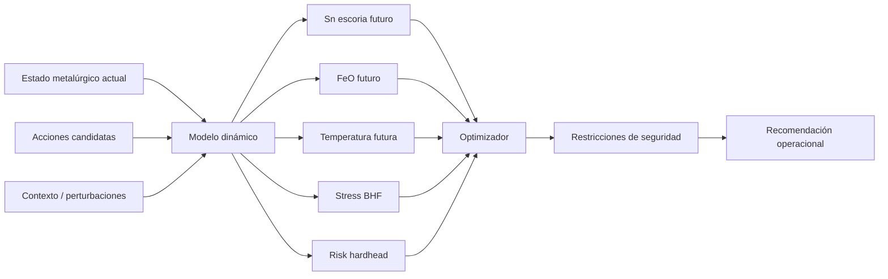
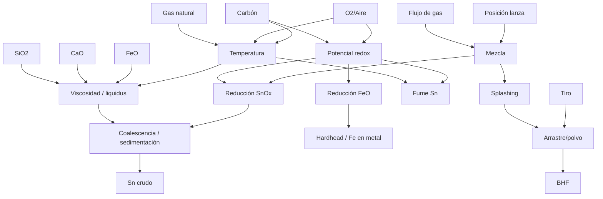

# Guía integral de pirometalurgia, operación y analítica del horno Ausmelt para estaño (Sn)

> **Objetivo del documento.** Construir un marco físico-químico, metalúrgico, mecánico y operacional suficientemente completo para diseñar posteriormente modelos predictivos, modelos de dinámica de proceso y algoritmos de recomendación/prescripción operacional sobre un horno Ausmelt/TSL de estaño.
>
> **Orientación.** El documento está escrito pensando específicamente en un dataset por *batch* y por *escalón* que contiene alimentación, carbón, CaO, gas natural, aire, O₂, posición y presiones de lanza, tiro de horno, temperatura, composición de escoria y resultados finales de Sn en metal crudo, dross y polvo.
>
> **Advertencia importante sobre Pisco/Minsur.** Los datos operacionales publicados de la Fundición y Refinería de Pisco que se citan aquí son referencias históricas o divulgativas. Sirven para comprender la física y la filosofía de operación del proceso, pero **no deben asumirse como los setpoints, límites ni SOP vigentes de la planta actual**.

---

## 0. La idea central: qué está intentando hacer realmente el horno

Un Ausmelt de Sn no debe entenderse simplemente como:

> "alimentar casiterita + carbón y producir estaño".

La operación real es un **problema dinámico multivariable y multiobjetivo**. En cada momento se intenta mantener simultáneamente:

1. suficiente **temperatura** para que la escoria permanezca líquida y las reacciones sean rápidas;
2. un **potencial de oxígeno** suficientemente reductor para transformar los óxidos de Sn en Sn metálico;
3. pero **no tan reductor** como para reducir excesivamente FeO a Fe metálico y generar demasiado Fe-Sn (*hardhead*);
4. una **escoria suficientemente fluida** para permitir transferencia de masa, coalescencia y sedimentación/separación del metal;
5. suficiente **agitación** por la lanza para aumentar transferencia de calor y masa;
6. pero no tanta agitación/splashing como para incrementar arrastre, polvo, acreciones o desgaste;
7. suficiente combustión para aportar calor;
8. sin exceder la capacidad térmica/hidráulica del **tren de gases**;
9. mantener presión negativa adecuada en el horno para evitar emisiones fugitivas;
10. maximizar la recuperación de Sn hacia metal crudo, minimizando Sn en:
    - escoria descartada,
    - dross de hierro,
    - polvo/fume;
11. preservar la vida de:
    - refractario,
    - lanza,
    - tapholes,
    - gas cooler,
    - baghouse.

Por ello, la variable que conceptualmente gobierna el proceso no es una única columna, sino un **estado metalúrgico latente**:

\[
z_t =
\{
T_t,\,
pO_{2,t},\,
\mu_{\text{slag},t},\,
\text{liquidus margin}_t,\,
M_{\text{slag},t},\,
M_{\text{metal},t},\,
x_{\mathrm{SnO_x}},\,
x_{\mathrm{FeO}},\,
\text{mixing}_t,\,
\text{bath depth}_t,\,
\text{fume tendency}_t,\ldots
\}
\]

Tus sensores y análisis de laboratorio observan solo una parte de ese estado.

La tarea futura del modelo será inferir ese estado y responder:

\[
\text{estado actual} + \text{acción operacional}
\rightarrow
\text{estado futuro}
\rightarrow
\text{resultado metalúrgico}
\]

---

# 1. Qué es la tecnología Ausmelt / TSL

**TSL** significa *Top Submerged Lance*. La tecnología Ausmelt utiliza una lanza vertical introducida desde la parte superior cuya punta opera sumergida en el baño fundido.

De forma simplificada:

```text
                OFF-GAS → gas cooler → ductos → BHF → ID fan → chimenea
                              ↑
                    freeboard / splash zone
               ┌──────────────────────────┐
Feed ─────────→│   gotas / polvo / gases  │
               │       ↑  ↑  ↑            │
               │        │ LANZA            │
               │        │                  │
               │    ↓ aire/O2/GN           │
               │       [TIP]               │
               │   ○○○ burbujas ○○○        │
               │~~~~~~~~~~~~~~~~~~~~~~~~~~│ ← escoria fuertemente agitada
               │ ↺    ↺    ↺    ↺         │
               │--------------------------│
               │       Sn líquido          │
               │     / Fe-Sn metal         │
               └──────────────────────────┘
                    ↓             ↓
                  metal         escoria
                  tap           tap
```

La combustión y expansión de gases debajo de la superficie generan:

- burbujas grandes y pequeñas;
- turbulencia;
- recirculación;
- *splashing*;
- elevada área interfacial gas–escoria;
- elevada área interfacial escoria–metal;
- transferencia rápida de calor;
- transferencia rápida de masa;
- cinética de reacción elevada.

La lanza no es únicamente un quemador. Es simultáneamente:

- inyector de gases;
- fuente de calor;
- agitador;
- controlador de potencial redox;
- elemento hidrodinámico;
- componente cuya posición modifica la penetración del jet y la estructura del flujo.

Metso describe precisamente que la inyección de combustible por la lanza permite desacoplar, dentro de ciertos límites, el control de **temperatura** del control del **potencial de oxígeno**, una de las ventajas más importantes del TSL.

---

# 2. Referencia industrial: Fundición y Refinería de Pisco de Minsur

La planta de Pisco inició operaciones en 1996. Minsur ha reportado públicamente que fue una de las primeras —y en algunas publicaciones la primera— aplicaciones comerciales de lanza sumergida para concentrados de estaño.

En documentos corporativos se describe la alimentación histórica como una mezcla de:

- concentrado de Sn;
- caliza;
- mineral de hierro;
- carbón antracítico;
- recirculantes.

El metal crudo producido se reporta alrededor de 98–98.5 % Sn antes de la refinación posterior.

Una publicación técnica de 2000 de la operación de Funsur/Minsur es especialmente valiosa porque describe el ciclo Ausmelt de Pisco como un proceso **batch de dos etapas**:

### Etapa 1 — smelting/fusión

Se alimentaban simultáneamente:

- concentrado;
- fundentes;
- carbón;
- materiales recirculados.

Se producía metal crudo y se acumulaba una escoria todavía rica en Sn.

### Etapa 2 — reducción de la escoria

Se detenía la alimentación principal y continuaba el carbón para llevar el Sn remanente en escoria a niveles bajos.

La publicación histórica reportó además algo fundamental: cuando la reducción se hacía demasiado intensa, empezaba a reducirse más hierro, aumentando Fe en el metal y empeorando la fluidez de la escoria. Este es uno de los compromisos metalúrgicos centrales del proceso.

Una publicación divulgativa posterior de Minsur resume el proceso como:

1. fusión;
2. reducción;
3. granulación de escoria;
4. limpieza;

y señala que la reducción busca llevar el Sn de escoria a aproximadamente 1 % o menos.

## 2.1 Lo importante para analítica

Esto significa que tu batch no es un sistema estacionario. Es una **trayectoria dirigida**:

```text
CARGA / FUSIÓN
   ↓
acumulación de baño + formación de escoria + producción de Sn
   ↓
transición fusión → reducción
   ↓
REDUCCIÓN DE ESCORIA
   ↓
Sn escoria ↓
FeO también puede comenzar a ↓
   ↓
riesgo de Fe metálico / hardhead ↑
   ↓
tap de escoria + heel residual
   ↓
nuevo batch
```

Por eso es peligroso entrenar un único modelo tabular ignorando:

- orden de escalón;
- fase;
- estado previo;
- acumulación de inventario;
- transición de fase;
- historia de acciones.

---

# 3. Qué especies existen físicamente dentro del horno

Conviene separar **fases físicas** y **especies químicas**.

## 3.1 Fase metálica

Principalmente:

\[
Sn_{(l)}
\]

porque el punto de fusión del Sn es solo ~232 °C y el horno opera muy por encima de él.

El metal puede contener:

- Fe;
- Cu;
- As;
- Sb;
- Pb;
- Bi;
- otros elementos minoritarios.

Cuando el Fe reducido aumenta, aparecen aleaciones/intermetálicos Fe–Sn asociados al denominado **hardhead**.

## 3.2 Escoria

La escoria es una fase oxidada líquida compleja que puede contener, entre otros:

- FeO / FeOx;
- SiO₂;
- CaO;
- Al₂O₃;
- MgO;
- SnO / SnO₂ disuelto o asociado a fases complejas;
- óxidos de impurezas;
- posibles sólidos no completamente fundidos si se cruza el liquidus.

No debe imaginarse como "basura líquida". Es un **solvente iónico/silicatado reactivo** en el que ocurren gran parte de las equilibraciones metalúrgicas.

## 3.3 Sólidos

Pueden coexistir temporalmente:

- partículas de concentrado no reaccionado;
- carbón;
- caliza o CaO no disuelto;
- sólidos cristalinos precipitados por composición/temperatura;
- acreciones;
- costras congeladas;
- partículas metálicas atrapadas.

## 3.4 Gases

Posibles especies relevantes:

- N₂;
- O₂ residual;
- CO₂;
- CO;
- H₂O;
- H₂;
- gases de volatilización;
- SnO(g) bajo determinadas condiciones;
- especies volátiles de As/Sb u otros elementos;
- partículas sólidas o gotas arrastradas.

---

# 4. Química fundamental del Sn

## 4.1 Casiterita

El mineral principal es:

\[
SnO_2
\]

El objetivo es quitar oxígeno al Sn.

Una representación global con carbono sólido es:

\[
SnO_2 + 2C \rightarrow Sn + 2CO
\]

o, dependiendo de condiciones:

\[
SnO_2 + C \rightarrow Sn + CO_2
\]

Pero en un horno real el mecanismo es más complejo.

Una ruta útil conceptualmente es:

\[
SnO_2 \rightarrow SnO \rightarrow Sn
\]

y gran parte de la reducción puede ser mediada por CO:

\[
SnO_2 + CO \rightarrow SnO + CO_2
\]

\[
SnO + CO \rightarrow Sn + CO_2
\]

## 4.2 La reacción de Boudouard

El carbón no actúa solamente por contacto directo sólido–óxido.

Una reacción clave es:

\[
C + CO_2 \rightleftharpoons 2CO
\]

El CO generado puede reducir óxidos.

Por ello:

> **kg de carbón alimentado ≠ poder reductor efectivo instantáneo.**

La efectividad depende de:

- temperatura;
- reactividad del carbón;
- tamaño de partícula;
- contacto;
- CO/CO₂;
- tiempo de residencia;
- mezcla;
- oxígeno aportado por la lanza;
- demanda de oxígeno de otros óxidos.

## 4.3 Volatilización de Sn

En condiciones reductoras puede formarse SnO y una fracción puede volatilizarse:

\[
SnO_{(cond)} \rightarrow SnO_{(g)}
\]

Por tanto, "reducir más fuerte" no garantiza mayor Sn en metal.

Una reducción demasiado intensa o una combinación desfavorable de:

- temperatura;
- potencial redox;
- gas;
- turbulencia;
- tiempo;

puede desplazar Sn hacia fume/polvo.

Esto explica por qué `sn_en_polvo_fundicion_batch_t` es un resultado metalúrgico real, no solo un indicador ambiental.

---

# 5. El hierro: el gran antagonista y a la vez parte útil del sistema

El hierro es uno de los elementos más importantes para entender la fundición de Sn.

## 5.1 Estados del Fe

Puede pasar aproximadamente por:

\[
Fe_2O_3
\rightarrow
Fe_3O_4
\rightarrow
FeO
\rightarrow
Fe
\]

El objetivo operacional no suele ser llevar todo el Fe a metal.

De hecho, se necesita una cantidad adecuada de hierro oxidado en escoria.

## 5.2 Competencia Sn–Fe

La reacción conceptual más importante es:

\[
FeO_{slag} + Sn_{metal}
\rightleftharpoons
SnO_{slag} + Fe_{metal}
\]

Esta ecuación resume un compromiso esencial:

- condiciones más reductoras favorecen recuperar Sn de la escoria;
- pero eventualmente también favorecen reducir FeO;
- Fe entra entonces en el metal;
- aparecen Sn–Fe / hardhead;
- se puede perder calidad de metal;
- cambia la química y fluidez de la escoria.

El equilibrio depende de actividades, no solamente de porcentajes:

\[
K =
\frac{a_{SnO}\,a_{Fe}}
     {a_{FeO}\,a_{Sn}}
\]

Por ello CaO, SiO₂, Al₂O₃, MgO, temperatura y estructura de la escoria modifican indirectamente la distribución Sn–Fe.

## 5.3 Sobre-reducción

Una firma operacional típica de sobre-reducción sería:

```text
Sn escoria ↓
FeO escoria ↓↓
Fe metal / hardhead ↑
dross Fe ↑
viscosidad o comportamiento de tap empeora
```

No significa que todo descenso de FeO sea malo. El problema es cruzar hacia una región donde el beneficio marginal de recuperar Sn es menor que el costo de reducir Fe.

---

# 6. Hardhead y dross de Fe: no son exactamente lo mismo

Conviene evitar usar ambos términos como sinónimos.

## 6.1 Hardhead

En la metalurgia clásica del Sn, *hardhead* suele referirse a una fase metálica/aleación Fe–Sn producida bajo condiciones fuertemente reductoras.

Puede contener fases/intermetálicos Fe–Sn.

Es consecuencia del acoplamiento:

\[
\text{reducción de SnO}_x
+
\text{reducción de FeO}
\]

## 6.2 Dross de hierro

El dross de Fe es un producto/recirculante generado típicamente durante tratamiento o refinación del metal, rico en Fe y Sn.

En Pisco históricamente se ha reportado que el dross se recicla al Ausmelt y que puede:

- aportar Fe al sistema;
- actuar como reductor metalúrgico;
- ayudar a desestabilizar espuma;
- recuperar Sn contenido.

Por eso tu variable:

`feed_dross_Fe_kgh`

no debe interpretarse solo como "más hierro".

Es un **material recirculado multicomponente**, probablemente con:

- Fe;
- Sn;
- entalpía química diferente a un mineral de Fe;
- función redox;
- efecto sobre escoria;
- efecto sobre espuma.

En modelado no conviene fusionar `feed_Fe_kgh` y `feed_dross_Fe_kgh` sin antes probar sus efectos por separado.

---

# 7. Escoria: el corazón termodinámico del proceso

## 7.1 Por qué existe

Una escoria adecuada permite:

- disolver ganga;
- alojar óxidos de Fe;
- capturar impurezas;
- controlar actividad de SnO/FeO;
- separar metal;
- permitir el tap;
- proteger parcialmente al sistema;
- transferir calor.

## 7.2 SiO₂ como *network former*

En un fundido silicatado, SiO₂ genera unidades estructurales tipo:

\[
SiO_4^{4-}
\]

que pueden conectarse mediante oxígenos puente:

```text
Si — O — Si
```

Un mayor grado de polimerización tiende a producir una red más conectada y mayor viscosidad.

## 7.3 CaO como *network modifier*

CaO aporta:

\[
CaO \rightarrow Ca^{2+} + O^{2-}
\]

El oxígeno adicional puede romper enlaces puente:

```text
Si—O—Si  + O²⁻
      ↓
Si—O⁻    ⁻O—Si
```

generando **non-bridging oxygens (NBO)**.

En una región apropiada de composición:

\[
CaO \uparrow
\Rightarrow
\text{despolimerización}
\Rightarrow
\mu_{slag} \downarrow
\]

pero esta relación **no es monotónica universalmente**: demasiado CaO puede acercar el sistema a regiones de precipitación de sólidos cálcicos y elevar el liquidus.

## 7.4 FeO

FeO suele actuar también como modificador de red y puede disminuir la viscosidad en determinados sistemas.

Pero su función es doble:

### función física
mantener una escoria líquida/fluida;

### función redox
es una reserva de Fe oxidado que puede reducirse a Fe metálico.

Por eso existe un rango útil de FeO.

## 7.5 Al₂O₃

Al₂O₃ puede actuar de forma anfótera y modificar significativamente:

- estructura;
- viscosidad;
- liquidus.

Su efecto depende de composición.

En muchas escorias silicatadas, incrementos de Al₂O₃ pueden aumentar viscosidad o liquidus.

## 7.6 MgO

MgO puede actuar como modificador, pero también participa en fases sólidas de alto punto de fusión dependiendo de composición.

## 7.7 Basicidad

Tus dos proxies son:

\[
B_2 =
\frac{\%CaO}{\%SiO_2}
\]

y:

\[
B_4 =
\frac{\%CaO+\%MgO}
     {\%SiO_2+\%Al_2O_3}
\]

Son útiles, pero **no son una ecuación de viscosidad**.

La viscosidad real es:

\[
\mu =
f(T,\,
FeO,\,
CaO,\,
SiO_2,\,
Al_2O_3,\,
MgO,\,
SnO_x,\,
\text{solid fraction},\ldots)
\]

Dos escorias con igual B₂ pueden tener viscosidades muy distintas.

---

# 8. Liquidus, superheat y margen térmico

El **liquidus** es la temperatura por encima de la cual la composición correspondiente es completamente líquida en equilibrio.

Define:

\[
\Delta T_{superheat}
=
T_{bath}-T_{liquidus}
\]

Si:

\[
\Delta T_{superheat} \gg 0
\]

la escoria es completamente líquida y normalmente menos viscosa.

Si:

\[
\Delta T_{superheat} \rightarrow 0
\]

aparecen cristales.

Entonces la viscosidad efectiva aumenta fuertemente:

\[
\mu_{eff}
>
\mu_{liquid}
\]

Consecuencias:

- peor tap;
- peor sedimentación/coalescencia;
- Sn metálico atrapado;
- regiones muertas;
- mayor dificultad de mezcla;
- acreciones.

Pero un superheat excesivo también es malo:

- mayor energía;
- mayor ataque refractario;
- potencial aumento de volatilización;
- mayor carga térmica del off-gas.

El objetivo no es:

> maximizar temperatura.

Es:

> mantener suficiente margen sobre liquidus con el mínimo costo/daño necesario.

---

# 9. Fase de FUSIÓN: qué ocurre paso a paso

En tu dataset existen 7 escalones de fusión.

La función de esos escalones debe entenderse como la construcción progresiva del baño y del inventario metalúrgico.

## 9.1 Entrada

Pueden entrar:

- Sn contenido en concentrado;
- ganga;
- Fe;
- dross Fe;
- CaO/caliza;
- carbón;
- recirculantes;
- polvo reciclado;
- aire;
- O₂;
- gas natural.

## 9.2 Calentamiento y fusión

El feed frío debe:

1. calentarse;
2. perder humedad;
3. descomponer carbonatos si entra CaCO₃;
4. fundirse/disolverse;
5. reaccionar.

Para caliza:

\[
CaCO_3 \rightarrow CaO + CO_2
\]

Esta reacción consume calor.

## 9.3 Combustión del gas natural

Aproximando GN como CH₄:

\[
CH_4 + 2O_2
\rightarrow
CO_2 + 2H_2O
\]

La combustión genera la mayor parte del calor controlable de la lanza.

Con déficit de oxígeno pueden existir:

\[
CH_4 + \frac{3}{2}O_2
\rightarrow
CO + 2H_2O
\]

y otras rutas parciales.

Por ello el ratio combustible/oxidante influye simultáneamente sobre:

- energía;
- CO;
- potencial redox;
- volumen de off-gas.

## 9.4 Reducción de Sn

Simultáneamente comienza:

\[
SnO_2 \rightarrow SnO \rightarrow Sn
\]

Las gotas de Sn:

- nuclean;
- crecen;
- colisionan;
- coalescen;
- sedimentan por diferencia de densidad.

## 9.5 Formación de escoria

La ganga y fundentes construyen una escoria FeO–SiO₂–CaO–Al₂O₃–MgO–SnOx.

En la etapa de fusión existe un compromiso deliberado:

- no necesariamente se desea reducir todo el Sn instantáneamente;
- se necesita construir un baño de composición y volumen operable;
- se busca producir metal de buena calidad;
- el Fe debe permanecer preferentemente oxidado.

Históricamente, la publicación de Pisco reportó control de Sn en escoria durante fusión mediante ajuste de carbón.

Ese punto es crucial:

> `ley_sn_escoria_pct` durante fusión no es un target aislado que deba minimizarse en cada escalón.

Su valor óptimo depende del momento del batch y del estado del Fe.

---

# 10. Transición FUSIÓN → REDUCCIÓN

Es probablemente uno de los momentos más informativos del proceso.

Al terminar la alimentación principal:

- cae o desaparece el ingreso de concentrado;
- cambia la demanda térmica;
- cambia la demanda química de O₂;
- continúa/aumenta la función reductora del carbón;
- cambia la razón C/carga;
- cambia la composición de gases;
- cambia el inventario de escoria;
- cambia el objetivo operacional.

Por tanto, los mismos valores absolutos de:

- carbón;
- O₂;
- aire;
- GN;

no tienen el mismo significado en ambas fases.

Para ML:

\[
P(y_{t+1}|x_t,\text{fase}=F)
\neq
P(y_{t+1}|x_t,\text{fase}=R)
\]

aunque el vector \(x_t\) sea idéntico.

---

# 11. Fase de REDUCCIÓN: qué ocurre realmente

En tu dataset existen 4 escalones de reducción.

## 11.1 Objetivo principal

Eliminar Sn recuperable que todavía está en la escoria:

\[
SnO_x^{slag}
\rightarrow
Sn^{metal}
\]

## 11.2 El problema

A medida que disminuye SnOx, la reducción empieza a competir cada vez más con:

\[
FeO \rightarrow Fe
\]

Por eso la reducción tiene rendimientos marginales decrecientes.

Una visión conceptual:

```text
severidad reductora →
│
│   recuperación Sn
│  /
│ /
│/___________   beneficio marginal ↓
│
│                Fe reducido ↑↑
│              /
│            /
└────────────────────────────
```

Existe una región de compromiso.

## 11.3 Hardhead como señal de exceso de severidad

Si el Fe se reduce:

\[
FeO + C \rightarrow Fe + CO
\]

el Fe puede disolverse/reaccionar con Sn y formar metal Fe–Sn.

Esto puede manifestarse posteriormente como:

- mayor hardhead;
- mayor dross Fe;
- peor calidad del crudo;
- mayor recirculación interna;
- pérdida de rendimiento efectivo.

## 11.4 Por qué puede convenir dejar metal Fe-rich en el horno

La literatura histórica de Pisco describe una estrategia interesante:

- metal de la parte temprana de reducción todavía podía extraerse;
- metal producido cuando Sn de escoria ya era bajo tendía a ser más rico en Fe;
- una fracción podía dejarse en el horno;
- al comenzar la nueva fusión, bajo condiciones menos reductoras, Fe podía reoxidarse hacia la escoria.

Conceptualmente:

\[
Fe_{metal}+SnO_{slag}
\rightarrow
FeO_{slag}+Sn_{metal}
\]

Esto convierte parte del hardhead/Fe metálico en un **reductor interno reciclable**.

---

# 12. El significado real de potencial de oxígeno \(pO_2\)

El potencial de oxígeno controla qué especies son termodinámicamente estables.

No debe confundirse con:

- Nm³ de O₂ inyectados;
- % O₂ en el aire de lanza;
- tiro de horno.

Formalmente:

\[
pO_2
\]

representa la actividad/presión parcial termodinámica efectiva del oxígeno en el sistema.

En el horno real está relacionada con:

- O₂ alimentado;
- aire;
- combustible;
- carbón;
- reacciones del concentrado;
- FeOx;
- CO/CO₂;
- H₂/H₂O;
- temperatura;
- mezcla;
- cinética.

## 12.1 Proxy de estequiometría de combustión

Con tus variables puede definirse:

\[
O_{2,disp}
=
O_{2,puro}
+
0.21\,Aire
\]

y, si GN ≈ CH₄:

\[
O_{2,comb}^{teo}
=
2\,GN
\]

Entonces:

\[
\lambda_{GN}
=
\frac{O_{2,disp}}
     {2\,GN}
\]

Interpretación aproximada:

- \(\lambda > 1\): oxidante respecto a combustión completa del GN;
- \(\lambda = 1\): estequiométrico;
- \(\lambda < 1\): déficit de O₂ respecto al GN.

**Pero esto NO es el pO₂ del baño.**

Porque faltan:

- consumo de O₂ por C;
- oxígeno de óxidos;
- CO/CO₂ real;
- H₂/H₂O;
- reacciones de Fe/Sn;
- fugas de aire;
- postcombustión.

Debe llamarse algo como:

`lambda_combustion_lanza_proxy`

y no `pO2`.

---

# 13. Por qué el carbón y el O₂ deben interpretarse juntos

Un error común en analítica sería concluir:

> "más carbón disminuye Sn en escoria".

La afirmación está incompleta.

El efecto relevante es:

\[
\text{carbón}
\times
\text{O₂}
\times
T
\times
\text{tiempo}
\times
\text{mezcla}
\times
\text{estado de escoria}
\]

Ejemplo:

- carbón ↑
- O₂ ↑↑

puede no hacer el baño más reductor.

Del mismo modo:

- carbón constante;
- O₂ ↓;
- temperatura ↑;

puede producir una reducción mucho más fuerte.

Para modelado se requieren **interacciones**.

Ejemplos:

```text
C_rate × lambda_lanza
C_rate × temperatura
C_rate × FeO_prev
C_rate × Sn_slag_prev
O2_rate × GN_rate
O2_rate × air_rate
lance_position × gas_rate
```

---

# 14. Estequiometría teórica mínima del carbón para Sn

Si `feed_Sn_kgf` representa **kg de Sn fino contenido** y el Sn entra idealmente como SnO₂:

\[
SnO_2 + 2C \rightarrow Sn + 2CO
\]

1 mol Sn requiere 2 mol C.

Por masa:

\[
\frac{m_C}{m_{Sn}}
=
\frac{2(12.011)}
     {118.71}
\approx 0.2024
\]

Entonces el mínimo estequiométrico ideal sería:

\[
C_{stoich,Sn}
\approx
0.2024\,m_{Sn}
\]

Pero este valor **no debe usarse como setpoint operacional** porque el carbón también participa en:

- Boudouard;
- reducción de FeOx;
- reducción de otros óxidos;
- combustión;
- pérdidas;
- carbono no reaccionado;
- formación de gases.

Aun así, puede construirse:

\[
C/Sn =
\frac{m_C}{m_{Sn,fino}}
\]

como feature de severidad de reducción.

---

# 15. Hidrodinámica de la lanza

La TSL obtiene gran parte de su desempeño por la hidrodinámica.

## 15.1 Jet de gas

La fuerza aproximada del jet depende del momentum:

\[
J \sim \rho_g\,v_g^2\,A
\]

o equivalentemente del flujo másico:

\[
J \sim \dot m_g\,v_g
\]

Más flujo o mayor velocidad de salida pueden aumentar:

- penetración;
- turbulencia;
- recirculación;
- fragmentación de burbujas;
- área interfacial.

## 15.2 Formación de burbujas

El gas sale de la punta sumergida:

```text
       LANZA
        ||
        ||
        \/
       (  )  ← cavidad/burbuja
      (    )
~~~~~~~~~~~~~~~ baño
```

La burbuja crece, se separa, asciende y rompe en superficie.

Cada ciclo genera pulsaciones de presión.

## 15.3 Splashing

Cuando las burbujas rompen:

- gotas de escoria salen hacia el freeboard;
- aumenta el contacto gas–líquido;
- mejora transferencia de calor y masa;
- parte de la energía se recupera al volver las gotas al baño.

Pero demasiado splashing causa:

- acreciones;
- ataque de refractario;
- depósitos;
- arrastre;
- mayor carga de sólidos en gases;
- potencial daño de lanza/offtake.

Existe por tanto un **óptimo**, no un máximo.

## 15.4 Sloshing

Es una oscilación macroscópica del baño.

```text
tiempo t1:        tiempo t2:

~~~~~~\_____      _____/~~~~~~
       \___/      \___/
```

Puede inducirse por pulsaciones y flujo rotacional.

Mucho sloshing puede generar:

- fluctuaciones de presión;
- impacto en paredes;
- inestabilidad de nivel;
- tapping irregular;
- splashing.

## 15.5 Foaming

Una escoria puede formar espuma si burbujas quedan estabilizadas por:

- viscosidad;
- partículas;
- tensión interfacial;
- química de la escoria.

Foaming excesivo:

- eleva nivel aparente;
- reduce freeboard;
- aumenta carryover;
- altera presiones;
- puede generar inestabilidad.

La publicación histórica de Pisco reportó que dross de Fe ayudaba a desestabilizar episodios de espuma.

---

# 16. Posición de lanza

Tu variable:

`posicion_vertical_lanza_mm`

puede ser una de las variables mecánicas más relevantes, pero solo si se interpreta correctamente.

Lo físicamente importante es:

\[
h_{immersion}
=
h_{bath}
-
h_{tip}
\]

es decir, la **profundidad real de inmersión**.

Si solo tienes posición absoluta de lanza y no nivel del baño:

\[
\text{posición lanza}
\neq
\text{inmersión real}
\]

porque el nivel cambia con:

- feed acumulado;
- escoria;
- metal;
- tapping;
- espuma.

Aun así, la posición es un proxy.

### Mayor inmersión

Puede producir:

- mayor penetración;
- mejor mezcla del volumen profundo;
- mejor transferencia;
- mayor presión hidrostática contra la lanza;
- diferente patrón de burbujas;
- potencial mayor desgaste.

### Menor inmersión

Puede producir:

- agitación más superficial;
- menor mezcla profunda;
- mayor inestabilidad superficial bajo ciertas condiciones.

Por eso deben modelarse interacciones:

\[
\text{posición}
\times
\text{flujo gas}
\]

y no únicamente posición.

---

# 17. Presión de suministro, contrapresión y presión de punta

Tus variables:

- `presion_suministro_gn_lanza_kpa`
- `presion_suministro_o2_lanza_kpa`
- `contrapresion_gn_lanza_kpa`
- `contrapresion_aire_lanza_kpa`
- `presion_punta_lanza_kpa`

no representan la misma física.

## 17.1 Presión de suministro

Es la presión disponible upstream para vencer:

- pérdidas en tubería;
- válvulas;
- restricciones;
- geometría de lanza;
- presión en punta;
- presión hidrostática del baño.

## 17.2 Contrapresión

La contrapresión es la resistencia vista por el flujo.

Puede variar por:

- flujo;
- obstrucción;
- geometría;
- incrustación;
- inmersión;
- densidad del baño;
- comportamiento pulsante de burbujas.

## 17.3 Presión de punta

Una aproximación conceptual:

\[
P_{tip}
\approx
P_{furnace}
+
\rho_{slag}g h_{immersion}
+
\Delta P_{dynamic}
\]

La componente dinámica contiene la información de burbujeo/turbulencia.

Por ello la presión de punta potencialmente puede actuar como **sensor indirecto de hidrodinámica**.

## 17.4 Features útiles

```text
margin_gn =
presion_suministro_gn - contrapresion_gn

margin_air =
presion_suministro_aire - contrapresion_aire
```

si existe la presión de suministro correspondiente.

También:

```text
backpressure_per_gasflow
tip_pressure / total_gas_rate
rolling_std(tip_pressure)
```

Si únicamente tienes valores de cierre de escalón, pierdes información muy valiosa de pulsaciones. Idealmente deberían capturarse series de alta frecuencia.

---

# 18. Protección de la lanza

Las TSL tradicionales aprovechan el gas frío que circula internamente para enfriar la envolvente de la lanza.

El splashing deposita escoria sobre la superficie:

```text
metal de lanza
│
│  capa congelada de escoria
│████████████
│
```

La capa solidificada funciona como protección frente al baño agresivo.

Entonces:

- demasiado poco splash → menor renovación de capa;
- demasiado splash → mayor erosión/impacto/acreción;
- mayor O₂/intensidad → mayor productividad, pero potencialmente mayor desgaste térmico/mecánico.

La publicación histórica de Pisco destaca la importancia de "splash coating" de la lanza para prolongar la vida de punta.

---

# 19. Balance térmico

Una forma conceptual:

\[
Q_{in}
=
Q_{combustion}
+
Q_{oxidation}
+
Q_{sensible,in}
\]

\[
Q_{out}
=
Q_{heat\,feed}
+
Q_{melting}
+
Q_{reduction}
+
Q_{CaCO_3}
+
Q_{offgas}
+
Q_{walls}
+
Q_{cooling}
+
Q_{tapped}
\]

En cuasi-equilibrio:

\[
\frac{dH_{bath}}{dt}
=
Q_{in}-Q_{out}
\]

## 19.1 Principales entradas de calor

- combustión de GN;
- oxidación de CO/H₂ mediante postcombustión;
- algunas reacciones oxidantes;
- calor de materiales calientes reciclados, si aplica.

## 19.2 Principales consumidores

- calentar sólidos;
- evaporar humedad;
- fundir;
- descomponer CaCO₃;
- reacciones endotérmicas;
- Boudouard;
- pérdidas por pared;
- gases calientes;
- agua de enfriamiento.

## 19.3 Por qué la temperatura sola es insuficiente

Una temperatura igual puede obtenerse mediante:

- mucho combustible + mucho O₂;
- menor feed;
- menor humedad;
- diferente composición;
- menor pérdida térmica.

Los estados metalúrgicos pueden ser muy diferentes.

---

# 20. Enriquecimiento con O₂

A igual energía requerida, enriquecer el gas de proceso con O₂ puede reducir N₂ inerte y, en consecuencia:

- disminuir volumen de gas;
- aumentar intensidad térmica;
- elevar productividad;
- modificar hidrodinámica.

Históricamente Pisco reportó que el enriquecimiento con O₂ permitió elevar throughput y mejorar la fluidez en reducción, pero también generó compromisos con:

- desgaste de punta;
- baghouse;
- reducción más completa de impurezas.

Es un excelente ejemplo de por qué un recomendador no debe optimizar una variable local sin restricciones de equipos downstream.

---

# 21. Tiro de horno

`tiro_horno_pct` representa, según tu definición operativa, la demanda/apertura/señal asociada al sistema que mantiene depresión.

No debe interpretarse como "ventilación" simple.

El tren es conceptualmente:

```text
HORNO
  ↓
offtake
  ↓
gas cooler
  ↓
ductos
  ↓
BHF
  ↓
ID fan
  ↓
chimenea
```

El **ID fan** induce la succión.

La presión del horno debe permanecer ligeramente negativa para evitar que gases y polvo salgan por aberturas.

## 21.1 Muy poco tiro

Riesgo de:

- presión positiva;
- gases fugitivos;
- inestabilidad;
- problemas de seguridad.

## 21.2 Demasiado tiro

Puede aumentar:

- infiltración de aire falso;
- volumen total de gas;
- enfriamiento;
- carga del BHF;
- carryover de partículas;
- consumo de fan.

Por eso tampoco se quiere maximizar tiro.

## 21.3 Por qué 70–99 % no es "70–99 % de presión"

Si tu variable está expresada en %, lo más probable es que sea una señal normalizada de:

- velocidad del fan;
- apertura;
- demanda del lazo de control;

no una depresión física porcentual.

Para modelado sería muy valioso obtener:

- Pa o kPa reales de presión de furnace/freeboard;
- velocidad del ID fan;
- damper position;
- ΔP del baghouse;
- flujo de off-gas.

---

# 22. Off-gas y Bag House Filter (BHF)

El BHF no está aislado de la metalurgia.

## 22.1 Qué puede llegar al BHF

- polvo físico de feed;
- finos de carbón;
- condensados;
- Sn volatilizado/oxidado;
- partículas de escoria;
- productos de As/Sb;
- cenizas.

## 22.2 Dos mecanismos distintos de "polvo"

### arrastre mecánico

Partículas que no reaccionaron o gotas expulsadas.

Aumenta potencialmente con:

- feed fino;
- gas alto;
- splash;
- tiro;
- turbulencia.

### fume metalúrgico

Especies volatilizadas y posteriormente condensadas.

Depende de:

- temperatura;
- pO₂;
- CO;
- química;
- presión de vapor;
- tiempo.

No deberían mezclarse conceptualmente.

## 22.3 Temperaturas pre-BHF

Tus variables:

- `temperatura_gas_pre_bhf_celsius`
- `temperatura_gas_pre_cuchilla_celsius`

son importantes como indicadores de:

- carga térmica;
- estado del gas cooler;
- acumulaciones;
- cambio de flujo;
- postcombustión;
- riesgo térmico al filtro.

Pero son sensores downstream y poseen retardos.

Por ello deben usarse con lags:

\[
T_{BHF,t}
\sim
f(\text{acciones}_{t-\tau})
\]

## 22.4 Restricción operacional

Históricamente Pisco reportó que el sistema de gases y BHF podía limitar capacidad del horno.

Este principio sigue siendo universal:

> **la capacidad real del horno es la capacidad del sistema completo, no únicamente del reactor.**

---

# 23. Refractario

El refractario falla por combinaciones de:

### ataque químico
disolución del ladrillo por escoria;

### ataque térmico
gradientes y ciclos térmicos;

### ataque mecánico
splashing, sloshing, erosión;

### penetración
escoria líquida entra en poros;

### choque térmico
cambios rápidos de temperatura.

Por ello:

\[
\text{refractory damage}
=
f(
T,\Delta T/\Delta t,
\text{slag chemistry},
\mu,
\text{splash},
\text{campaign age}
)
\]

No basta modelar temperatura media.

El reporte 2017 de Minsur señaló específicamente que cambios de impurezas, particularmente sílice, estaban asociados a desgaste de refractario y que se trabajó en control de temperatura y tamaño de caliza para sostener campañas.

---

# 24. Coalescencia y sedimentación de Sn

Cuando se forma Sn líquido inicialmente aparecen pequeñas gotas.

Para separarse de la escoria deben:

1. crecer;
2. colisionar;
3. coalescer;
4. vencer turbulencia;
5. sedimentar.

Para una gota pequeña en régimen de Stokes, de forma orientativa:

\[
v_s
=
\frac{2}{9}
\frac{(\rho_m-\rho_s)g r^2}
{\mu_s}
\]

donde:

- \(v_s\): velocidad de sedimentación;
- \(r\): radio de gota;
- \(\rho_m\): densidad metal;
- \(\rho_s\): densidad escoria;
- \(\mu_s\): viscosidad de escoria.

Consecuencias:

\[
r \uparrow
\Rightarrow
v_s \uparrow\uparrow
\]

\[
\mu_s \uparrow
\Rightarrow
v_s \downarrow
\]

Esto explica por qué una escoria viscosa puede retener Sn aunque la reacción química haya producido metal.

Por tanto existen dos tipos de pérdidas:

### pérdidas químicas

Sn permanece oxidado/disuelto:

\[
SnO_x^{slag}
\]

### pérdidas mecánicas

Sn ya es metálico, pero queda físicamente atrapado como gotas.

Un modelo que use solo `ley_sn_escoria_pct` no distingue ambas.

---

# 25. Variables disponibles y su interpretación física

Según el dataset suministrado, cada batch tiene 7 escalones de fusión y 4 de reducción y los `feed_*` y `volumen_*` corresponden al **consumo del escalón**, no a contadores acumulados.

## 25.1 Identidad y tiempo

| Variable | Tipo | Significado para el modelo |
|---|---|---|
| `Batch` | contexto | unidad de campaña/ciclo |
| `fase_proceso` | régimen | Fusión o Reducción |
| `fecha_inicio`, `fecha_final` | tiempo | límites del escalón |
| `delta_tiempo` | derivada | duración de acción |
| `tiempo` | estado temporal | edad del batch |
| `orden_escalon_fase` | estado | posición relativa dentro de la fase |

## 25.2 Feed

| Variable | Rol físico |
|---|---|
| `feed_Sn_kgf` | Sn fino alimentado; no asumir que es masa total de concentrado |
| `feed_total_kgh` | masa húmeda total |
| `feed_Fe_kgh` | carga de hierro/mineral de Fe |
| `feed_dross_Fe_kgh` | recirculante Fe–Sn; químicamente distinto del mineral de Fe |
| `feed_CaO_kgh` | fundente |
| `feed_Carbon_kgh` | reductor sólido |

## 25.3 Lanza y energía

| Variable | Rol |
|---|---|
| `volumen_gas_natural_inyectado_lanza_escalon_nm3` | combustible integrado del escalón |
| `volumen_o2_inyectado_lanza_escalon_nm3` | O₂ puro integrado |
| `volumen_aire_inyectado_lanza_escalon_nm3` | gas portador + O₂ + momentum |
| `posicion_vertical_lanza_mm` | proxy de inmersión |
| presiones/contrapresiones | hidráulica/neumática de lanza |

## 25.4 Estado metalúrgico

| Variable | Interpretación |
|---|---|
| `temperatura_horno_celsius` | proxy térmico del baño/superficie según ubicación real del sensor |
| `ley_sn_escoria_pct` | Sn total ensayado en escoria |
| `ley_fe_total_escoria_pct` | Fe total |
| `ley_feo_escoria_pct` | FeO reportado — **no es un ensayo independiente**, ver nota abajo |
| `ley_sio2_escoria_pct` | network former / ganga |
| `ley_cao_escoria_pct` | fundente/modificador |
| `ley_al2o3_escoria_pct` | componente estructural |
| `ley_mgo_escoria_pct` | modificador/componente de fase |
| `ley_as/sb/cr` | impurezas y estado de carga |

> **`ley_feo_escoria_pct` es un cálculo estequiométrico, no una medición de laboratorio independiente ni
> una columna del Excel.** El Excel fuente reportaba la columna `FEO` calculada a partir de `%Fe`
> (= `ley_fe_total_escoria_pct`) vía `%FeO = %Fe × 1.2865`, donde 1.2865 es el factor de conversión de
> óxido FeO/Fe (ratio de peso molecular FeO/Fe = 71.844/55.845). Verificado empíricamente contra el
> Excel: pendiente de regresión FEO~%Fe = 1.2865, correlación 0.96. `dataset_lingo_smelter.py` ahora
> ignora esa columna del Excel y `ley_feo_escoria_pct` se recalcula explícitamente con esa fórmula en la
> primera celda de `analisis_lingo_smelter.ipynb`. En consecuencia, `ley_feo_escoria_pct` es
> prácticamente colineal con `ley_fe_total_escoria_pct`: cualquier razonamiento sobre "FeO como
> modificador de red independiente" en este documento debe leerse como aplicable, en la práctica, al
> mismo Fe total ensayado — no a dos especies medidas por separado. Ver `hallazgos.md` sección 5 y
> `diccionario_datos.json`.

## 25.5 Tren de gases

| Variable | Interpretación |
|---|---|
| `tiro_horno_pct` | esfuerzo/señal del sistema de extracción |
| `temperatura_gas_pre_bhf_celsius` | carga térmica downstream |
| `temperatura_gas_pre_cuchilla_celsius` | estado térmico intermedio del sistema |

## 25.6 Resultados batch

| Variable | Interpretación |
|---|---|
| `sn_en_metal_crudo_batch_t` | Sn útil en metal crudo |
| `sn_en_dross_fe_batch_t` | Sn desplazado a dross Fe |
| `sn_en_polvo_fundicion_batch_t` | Sn desplazado a polvo/fume |

---

# 26. Muy importante: datos composicionales cerrados

Las leyes de escoria son porcentajes que aproximadamente suman 100 %.

Entonces:

\[
\sum_i x_i \approx 100
\]

Esto genera una dependencia matemática.

Ejemplo:

si FeO baja manteniéndose constantes las masas de los demás componentes, sus porcentajes relativos pueden subir sin que haya entrado más material.

Por tanto:

> correlación `d_Sn%` vs `d_CaO%` no implica necesariamente transferencia química Sn ↔ CaO.

## 26.1 Mejores transformaciones

Además de porcentajes crudos, probar:

### razones metalúrgicas

\[
\frac{Sn}{FeO}
\]

\[
\frac{Sn}{SiO_2}
\]

\[
\frac{FeO}{SiO_2}
\]

\[
B_2=\frac{CaO}{SiO_2}
\]

### log-ratios composicionales

\[
\log\frac{Sn}{FeO}
\]

\[
\log\frac{CaO}{SiO_2}
\]

\[
\log\frac{FeO}{SiO_2}
\]

Para un enfoque formal de compositional data analysis pueden usarse transformaciones CLR/ILR, teniendo cuidado con ceros.

---

# 27. Feature engineering metalúrgicamente defendible

## 27.1 Tasas: imprescindible

Tus volúmenes y feeds son integrados del escalón.

Para comparar ventanas de duración diferente:

\[
q_x =
\frac{x_{escalon}}{\Delta t}
\]

Ejemplos:

```python
tasa_carbon_kg_min
tasa_feed_sn_kg_min
tasa_cao_kg_min
tasa_gn_nm3_min
tasa_o2_nm3_min
tasa_aire_nm3_min
```

### Por qué conservar también el total

La tasa captura **intensidad**.

El total captura **dosis**.

Ambas importan:

\[
\text{resultado}
=
f(\text{intensidad},\text{dosis},\text{tiempo})
\]

No elijas entre Nm³/h y Nm³ por escalón: usa ambos con significado distinto.

---

# 28. Acumulados dentro del batch

Para materiales:

\[
M_x(t)
=
\sum_{i\le t}m_{x,i}
\]

Crear:

```text
cum_feed_sn
cum_carbon
cum_cao
cum_fe
cum_dross_fe
cum_gn
cum_o2
cum_air
```

Esto aproxima el inventario/progreso de reacción.

Features útiles:

\[
\frac{C_{cum}}{Sn_{cum}}
\]

\[
\frac{CaO_{cum}}{SiO_{2,\ proxy}}
\]

\[
\frac{Fe_{cum}}{Sn_{cum}}
\]

---

# 29. Features redox

## 29.1 O₂ disponible nominal

\[
O2_{disp}
=
O2_{puro}+0.21\,Air
\]

## 29.2 Lambda de combustible

\[
\lambda_{GN}
=
\frac{O2_{disp}}{2GN}
\]

## 29.3 Exceso de O₂ nominal

\[
ExcesoO2 =
100
\frac{O2_{disp}-2GN}{2GN}
\]

## 29.4 Intensidad reductora sólida

Por fase:

\[
I_C =
\frac{\dot m_C}
     {\dot m_{Sn}+\epsilon}
\]

o durante reducción:

\[
I_{C,R}=\dot m_C
\]

porque puede no existir feed fresco de Sn.

## 29.5 Índice de competencia O₂–C

Una variable empírica útil:

\[
RCI =
\frac{\dot m_C}
     {\dot V_{O2}+0.21\dot V_{air}+\epsilon}
\]

No tiene interpretación termodinámica exacta, pero puede ser un buen indicador estadístico de severidad reductora.

---

# 30. Features de escoria

Crear al menos:

\[
B_2=CaO/SiO_2
\]

\[
B_4=(CaO+MgO)/(SiO_2+Al_2O_3)
\]

\[
FeO/SiO_2
\]

\[
Sn/FeO
\]

\[
Sn/(FeO+CaO+MgO)
\]

y log-ratios.

Además:

```text
d_ley_sn
d_ley_feo
d_ley_cao
d_basicidad
grad_ley_sn
grad_ley_feo
```

pero recordando que son cambios composicionales, no balances de masa.

---

# 31. Features de estado previo

Para recomendar una acción en escalón \(t\), el predictor no debería utilizar el análisis obtenido después de esa acción si este no estaba disponible al tomar la decisión.

Crear explícitamente:

```python
sn_slag_prev
feo_prev
temp_prev
basicidad_prev
tip_pressure_prev
draft_prev
bhf_temp_prev
```

y luego:

\[
y_{t+1}
=
f(state_t,action_t)
\]

Esta convención es crítica para evitar **leakage temporal**.

---

# 32. Features de respuesta del escalón

Una forma útil:

\[
\Delta Sn_{slag,t}
=
Sn_{slag,t}-Sn_{slag,t-1}
\]

Durante reducción:

\[
-\Delta Sn_{slag,t}>0
\]

puede indicar progreso de limpieza.

Pero por composición cerrada no es una recuperación de masa.

Una señal mucho más informativa es evaluar conjuntamente:

\[
(\Delta Sn,\Delta FeO)
\]

### región deseable conceptual

```text
Sn ↓ fuerte
FeO ≈ estable o ↓ moderado
```

### posible sobre-reducción

```text
Sn ↓ poco
FeO ↓ fuerte
```

Esto sugiere un índice:

\[
SRE_t =
\frac{-\Delta Sn}
     {-\Delta FeO+\epsilon}
\]

solo cuando ambas variaciones tienen sentido y con tratamiento robusto de signos.

Debe verse como **feature empírico**, no como eficiencia termodinámica.

---

# 33. Features de lanza y mezcla

Probar:

```text
total_process_gas_rate =
air_rate + o2_rate + gn_rate

oxygen_enrichment =
(o2_rate + 0.21 air_rate) / (air_rate + o2_rate)

gas_intensity_x_lance_position

tip_pressure / total_process_gas_rate

air_backpressure / air_rate

gn_backpressure / gn_rate

delta_tip_pressure
delta_backpressure
```

La hipótesis es que pueden aproximar:

- inmersión;
- resistencia;
- penetración;
- obstrucción;
- régimen de burbujeo.

---

# 34. Features del sistema de gases

```text
delta_T_gas =
T_pre_cuchilla - T_pre_BHF

T_pre_BHF_lag1
T_pre_BHF_rolling
draft_x_total_gas
draft_x_feed_rate
draft_x_Tgas
```

Interpretaciones potenciales:

- mayor carga térmica;
- ensuciamiento;
- cambios de cooling;
- restricción de flujo;
- mayor generación de gas.

No asignar causalidad hasta verificar instrumentación y ubicación.

---

# 35. Qué significa tu `rendimiento_proxy_batch`

Definiste:

\[
R_{proxy}
=
100
\frac{Sn_{metal\,crudo}}
{Sn_{metal\,crudo}+Sn_{dross}+Sn_{polvo}}
\]

Es una métrica útil de **distribución del Sn contabilizado entre tres salidas**.

Pero no es necesariamente la recuperación metalúrgica absoluta respecto al feed:

\[
Recovery_{true}
=
\frac{Sn_{metal\,producto}}
{Sn_{entrada}}
\]

porque el denominador de tu proxy excluye potencialmente:

- Sn en escoria final;
- Sn en inventario/heel;
- Sn no contabilizado;
- pérdidas;
- variación de inventario;
- otros recirculantes.

Por ello lo denominaría:

> **fracción de Sn de salidas contabilizadas reportada como metal crudo**

y conservaría `rendimiento_proxy_batch` como nombre técnico si ya está desplegado.

---

# 36. Qué target utilizar

No existe un único target perfecto con la data actual.

## 36.1 Target terminal batch

Útil:

\[
R_{proxy,batch}
\]

Ventaja:
- está directamente relacionado con valor.

Problema:
- solo existe una observación independiente por batch.

No debes replicarlo 11 veces y tratar los 11 escalones como targets independientes.

## 36.2 Targets intermedios

### durante reducción

- siguiente `ley_sn_escoria_pct`;
- \(\Delta Sn\);
- `ley_feo_escoria_pct`;
- \(\Delta FeO\);
- temperatura siguiente;
- gas temperatures;
- estabilidad de presiones.

### durante fusión

- Sn escoria siguiente;
- FeO siguiente;
- temperatura;
- estabilidad del sistema;
- terminal batch target.

## 36.3 Multi-task

Una arquitectura superior:

\[
(state_t,action_t)
\rightarrow
\begin{cases}
Sn_{t+1}\\
FeO_{t+1}\\
T_{t+1}\\
Tgas_{t+1}\\
pressure_{t+1}\\
...
\end{cases}
\]

y al final:

\[
trajectory
\rightarrow
R_{proxy,batch}
\]

---

# 37. El enfoque analítico recomendado: modelo dinámico + optimización

Para prescripción operacional, el objetivo final no debería ser un Random Forest que prediga rendimiento batch directamente desde promedios.

El enfoque más defendible es un **surrogate dynamic model / digital twin data-driven**.

## 37.1 Estado

\[
s_t =
[
\text{fase},
\text{escalón},
T_t,
Sn_t,
FeO_t,
SiO2_t,
CaO_t,
Al2O3_t,
MgO_t,
B2_t,
\text{presiones},
\text{historia acumulada}
]
\]

## 37.2 Acción

\[
a_t =
[
\dot C_t,
\dot{GN}_t,
\dot O2_t,
\dot Air_t,
CaO_t,
Fe_t,
\text{posición lanza}_t,
\Delta t_t
]
\]

según cuáles sean realmente manipulables por operador.

## 37.3 Dinámica

\[
s_{t+1}
=
F(s_t,a_t,c_t)
+\epsilon_t
\]

donde \(c_t\) es contexto no manipulable.

## 37.4 Terminal

\[
y_{batch}
=
G(s_{1:T},a_{1:T})
\]

## 37.5 Optimización

\[
a_t^*
=
\arg\max_a
E[J|s_t,a]
\]

sujeto a restricciones metalúrgicas y mecánicas.

---

# 38. Función objetivo para prescripción

Una formulación conceptual:

\[
J=
V_{Sn}\,M_{Sn,crudo}
-\lambda_1M_{Sn,dross}
-\lambda_2M_{Sn,polvo}
-\lambda_3E
-\lambda_4t_{batch}
-\lambda_5Risk_{refractory}
-\lambda_6Risk_{BHF}
-\lambda_7Risk_{hardhead}
\]

Sujeto a:

\[
T_{min}
\le T \le
T_{max}
\]

\[
Sn_{slag,final}
\le
Sn_{limit}
\]

\[
FeO_{final}
\ge
FeO_{safe}
\]

\[
T_{BHF}
\le
T_{BHF,max}
\]

\[
P_{furnace}
<
P_{safe}
\]

\[
a_t
\in
\text{operating envelope histórico seguro}
\]

Los \(\lambda_i\) deben derivarse de:

- costos;
- valor económico;
- límites operacionales;
- política de riesgo;

y no escogerse arbitrariamente.

---

# 39. Prescripción: por qué MPC es una buena filosofía

El proceso es secuencial.

Por ello encaja naturalmente con **Model Predictive Control** o una versión de MPC asistida por ML:

1. inferir estado actual;
2. simular varias acciones;
3. proyectar los siguientes escalones;
4. evaluar utilidad;
5. descartar acciones inseguras;
6. recomendar;
7. observar nuevo estado;
8. recalcular.

```text
     ┌──────────────┐
     │ estado actual│
     └──────┬───────┘
            ↓
     ┌──────────────┐
     │ modelo F     │
     └──────┬───────┘
            ↓
     simular acciones
       ↙    ↓    ↘
      a1    a2    a3
       \    |    /
        \   |   /
         utilidad
            ↓
     restricciones
            ↓
        mejor acción
```

Esto es más defendible que recomendar un setpoint global para todo el batch.

---

# 40. Por qué NO empezar directamente con Reinforcement Learning

Offline RL puede ser útil después, pero es peligroso como primera aproximación porque:

- la data es observacional;
- los operadores eligen acciones según estados que quizá no registras;
- existe confounding;
- el dataset probablemente no cubre acciones extremas;
- extrapolar acciones fuera del soporte histórico es inseguro.

Orden recomendado:

1. EDA fenomenológico;
2. modelo dinámico supervisado;
3. validación temporal;
4. estimación de incertidumbre;
5. optimización restringida;
6. recomendación dentro de soporte;
7. pruebas controladas;
8. recién después evaluar offline RL.

---

# 41. Causalidad: el problema del operador

Supón que observas:

\[
C \uparrow
\Rightarrow
Sn_{final} \uparrow
\]

No significa que carbón adicional aumente Sn.

Puede ocurrir:

```text
escoria difícil
    ↓
operador observa Sn alto
    ↓
agrega más carbón
    ↓
batch sigue siendo difícil
```

Entonces en histórico:

\[
C \uparrow
\leftrightarrow
\text{peor batch}
\]

aunque causalmente el carbón ayudó.

Esto es **confounding by indication**.

Por eso para prescripción deben incluirse en el estado las variables que el operador utilizó para decidir:

- Sn previo;
- FeO previo;
- T;
- fase;
- tiempo;
- composición;
- presiones;
- quizá observaciones no registradas.

Si faltan señales importantes del operador, la causalidad será limitada.

---

# 42. Modelo mínimo recomendado

Un baseline robusto:

### Dataset de transición

Cada fila:

```text
Batch
t
fase
state_t
action_t
state_t+1
terminal_target
```

### Modelos

Probar inicialmente:

- CatBoost;
- LightGBM;
- XGBoost;
- GAM / Explainable Boosting;
- modelos monotónicos donde la física lo permita.

Predecir:

```text
Sn_slag_next
FeO_next
Temperature_next
BHF_temperature_next
```

### Split

Siempre por batch y por tiempo:

```text
train = batches antiguos
validation = posteriores
test = periodo futuro
```

Nunca dividir aleatoriamente escalones del mismo batch entre train/test.

---

# 43. Modelo avanzado recomendado

Una vez validado el baseline:

## 43.1 State-space model

\[
z_{t+1}
=
f(z_t,a_t)
\]

\[
y_t
=
g(z_t)
\]

donde \(z_t\) incluye estados latentes como:

- inventario de Sn;
- potencial redox;
- fluidez;
- volumen de baño.

## 43.2 Neural ODE / recurrent state model

Solo si hay suficiente data.

## 43.3 Physics-informed surrogate

Imponer tendencias razonables, por ejemplo:

- inventario no puede ser negativo;
- masas acumuladas conservan balance;
- estados cambian secuencialmente;
- composición está cerrada;
- acciones deben respetar límites.

---

# 44. Derivados especialmente valiosos para tu dataset

## 44.1 Progreso normalizado del batch

\[
p_t =
\frac{orden\_escalon}
{N_{escalones}-1}
\]

## 44.2 Carga térmica relativa

\[
H_{proxy}
=
\frac{GN}
{feed_{total}+\epsilon}
\]

## 44.3 Oxidante por carga

\[
O_{proxy}
=
\frac{O2+0.21Air}
{feed_{total}+\epsilon}
\]

## 44.4 Reductor por Sn

\[
C_{Sn}
=
\frac{C}{Sn_{fine}+\epsilon}
\]

solo en escalones con feed Sn significativo.

## 44.5 Reductor por inventario

\[
C_{inventory}
=
\frac{C_t}
{Sn_{slag,prev}+\epsilon}
\]

si no existe masa de escoria, usar con prudencia porque el denominador es concentración.

## 44.6 Ventana térmica

```text
temperature_prev
temperature_delta
temperature_gradient
temperature_rolling_mean
```

## 44.7 Severidad lanza

\[
L_{intensity}
=
q_{gas,total}\times f(position)
\]

La forma exacta de \(f\) debe aprenderse/validarse.

---

# 45. Hipótesis metalúrgicas que el EDA debería probar

## H1 — Carbono reduce Sn de escoria durante reducción

Esperado:

\[
\dot C \uparrow
\Rightarrow
-\Delta Sn \uparrow
\]

hasta saturación.

Buscar no linealidad.

## H2 — Existe punto de sobre-reducción

Después de cierto nivel:

\[
-\Delta FeO \uparrow
\]

mientras:

\[
-\Delta Sn
\]

mejora poco.

## H3 — La temperatura modifica eficacia del carbón

\[
Effect(C)
=
f(T)
\]

## H4 — Basicidad tiene región óptima

No esperar monotonicidad.

## H5 — FeO demasiado bajo empeora fase final

Buscar asociación con:

- dross Fe;
- Sn metal/dross;
- tiempos;
- tap;
- rendimiento proxy.

## H6 — Posición de lanza interactúa con gas total

\[
Effect(position)
\neq
constante
\]

## H7 — Intensidad del gas aumenta transferencia pero también polvo

Buscar U-shape:

\[
gas \uparrow
\Rightarrow
reacción \uparrow
\]

pero después:

\[
gas \uparrow\uparrow
\Rightarrow
Sn_{polvo}\uparrow
\]

## H8 — Temperatura elevada tiene óptimo

Demasiado baja:
- viscosidad alta;
- mala separación.

Demasiado alta:
- fume/refractario/energía.

## H9 — Tiro interactúa con polvo

No estudiar tiro aislado; condicionar por:

- flujo total de gas;
- feed rate;
- temperatura gas;
- fase.

## H10 — Transición fusión→reducción explica gran parte del batch

Features alrededor de ese cambio pueden predecir resultado final mejor que promedios batch.

---

# 46. Qué NO inferir de SHAP

Si SHAP dice:

```text
carbon_rate alto → SHAP positivo
```

solo significa:

> dentro del modelo predictivo y de la distribución observada, esa variable contribuyó a elevar la predicción.

No significa:

> aumentar carbón causará una mejora.

Para convertir predicción en recomendación necesitas:

- estado completo;
- soporte histórico;
- causalidad o supuestos;
- restricciones;
- simulación contrafactual;
- incertidumbre.

---

# 47. Qué significan las principales palancas operacionales

| Palanca | Beneficio buscado | Riesgo por exceso |
|---|---|---|
| carbón | reducción SnOx | Fe reduction, hardhead, CO, polvo |
| O₂ | calor, productividad | oxidación, intensidad, desgaste, BHF |
| aire | combustión + momentum | gas load, carryover |
| GN | calor | gas load, exceso térmico |
| CaO | fluidez/química | heat load, precipitados, basicidad excesiva |
| Fe feed | ajuste de escoria/redox | mayor carga Fe |
| dross Fe | reciclaje + reducción + Fe | composición compleja |
| posición lanza | mezcla/penetración | desgaste/inestabilidad |
| tiro | captura de gases | aire falso/cooling/carryover |
| tiempo | completar reacción | energía, Fe reduction, volatilización |

---

# 48. Interacciones que el modelo debería permitir explícitamente

Como mínimo:

\[
C\times O2
\]

\[
C\times T
\]

\[
C\times FeO
\]

\[
C\times Sn_{slag}
\]

\[
O2\times GN
\]

\[
Air\times O2
\]

\[
position\times totalGas
\]

\[
B2\times T
\]

\[
FeO\times B2
\]

\[
SiO2\times T
\]

\[
phase\times C
\]

\[
phase\times O2
\]

\[
step\times action
\]

Esto hace que árboles boosting sean buenos baselines.

---

# 49. Variables faltantes de mayor valor

Si el objetivo es un prescriptor serio, priorizar instrumentar:

## 49.1 Off-gas

1. CO;
2. CO₂;
3. O₂ residual;
4. H₂ si es viable.

Entonces:

\[
R_{CO}=
\frac{CO}{CO+CO_2}
\]

sería un proxy redox mucho mejor.

## 49.2 Temperatura de baño real

No solo cara interior del horno.

## 49.3 Nivel de baño

Permitiría calcular:

\[
h_{immersion}
\]

real.

## 49.4 Masa de escoria

Transformaría leyes en masas aproximadas:

\[
m_{Sn,slag}
=
M_{slag}\,x_{Sn}
\]

Esto sería extraordinariamente valioso.

## 49.5 Masa y composición de cada tap de metal

Permitiría localizar recuperación por escalón/fase.

## 49.6 Fe en metal/hardhead

Para cuantificar sobre-reducción.

## 49.7 Química completa del concentrado por batch

Especialmente:

- Sn;
- Fe;
- SiO₂;
- CaO;
- Al₂O₃;
- MgO;
- As;
- Sb;
- humedad.

## 49.8 Baghouse

- ΔP;
- caudal;
- temperatura entrada/salida;
- masa de polvo;
- química del polvo.

## 49.9 Draft físico

Pa/kPa del furnace/freeboard.

## 49.10 Series de alta frecuencia

Especialmente:

- tip pressure;
- air backpressure;
- draft;
- lance position;
- gas flows;
- temperature.

De ellas pueden extraerse:

- RMS;
- std;
- espectro FFT;
- frecuencia dominante;
- amplitud de oscilación.

Esto podría revelar regímenes de bubble/sloshing.

---

# 50. Distinción fundamental: estado, acción, perturbación y resultado

Para prescripción, clasificar variables.

## Estado \(S_t\)

Observas, no manipulas directamente:

- leyes de escoria;
- temperatura;
- presiones resultantes;
- BHF temperature;
- tiempo;
- estado previo.

## Acción \(A_t\)

El operador puede cambiar:

- carbón;
- GN;
- O₂;
- aire;
- posición lanza;
- feed rate;
- fundentes;
- duración, según filosofía de control.

## Perturbación \(D_t\)

Llega al proceso pero no se decide en el momento:

- química de concentrado;
- humedad;
- granulometría;
- edad refractario;
- condiciones ambientales;
- estado del BHF.

## Resultado \(Y\)

- Sn metal;
- Sn dross;
- Sn polvo;
- Sn escoria final;
- tiempo;
- consumo energético;
- estabilidad;
- daño.

Nunca permitir que el optimizador modifique una variable de estado como si fuera una palanca.

---

# 51. Arquitectura conceptual del prescriptor



---

# 52. Recomendación a nivel de escalón

Dado tu esquema 7 + 4, una recomendación puede expresarse como:

```text
Estado actual:
  Fase: Reducción
  Escalón: R2
  Sn escoria: ...
  FeO: ...
  T: ...
  B2: ...
  historial C/O2/GN: ...

Recomendación:
  C rate: rango
  O2 rate: rango
  GN: rango
  aire: rango
  posición lanza: rango

Predicción:
  ΔSn escoria
  ΔFeO
  ΔT
  riesgo hardhead
  riesgo BHF

Confianza:
  dentro/fuera del soporte histórico
```

Es mejor dar **rangos** que valores puntuales cuando la incertidumbre sea relevante.

---

# 53. Restricción de soporte histórico

No recomendar:

\[
a
\notin
\mathcal{A}_{histórico}(s)
\]

sin pruebas experimentales.

Puede construirse distancia de Mahalanobis, kNN o density model:

\[
D(s,a)
\]

Si \(D\) es alto:

> "No existe evidencia histórica suficiente para recomendar esta combinación."

Esto es especialmente importante en un horno industrial.

---

# 54. Cómo detectar el punto de parar reducción

Es una de las aplicaciones analíticas más interesantes.

Definir beneficio marginal del escalón:

\[
MB_t
=
\frac{\text{Sn recuperado adicional}}
{\text{C adicional / tiempo / riesgo Fe}}
\]

Sin masa de escoria puede aproximarse con modelos de estado.

El punto de corte aparece cuando:

\[
\frac{\partial Sn_{recovered}}
{\partial C}
\downarrow
\]

mientras:

\[
\frac{\partial Fe_{metal}}
{\partial C}
\uparrow
\]

y/o:

\[
\frac{\partial Risk}{\partial C}
\uparrow
\]

Es decir:

> dejar de reducir cuando el valor marginal de Sn recuperado cae por debajo del costo marginal de carbón + tiempo + Fe/hardhead + polvo + desgaste.

---

# 55. El rol del tiempo

Una misma dosis:

\[
C=1000\,kg
\]

aplicada en 20 min:

\[
50\,kg/min
\]

no equivale a 1000 kg en 60 min:

\[
16.7\,kg/min
\]

porque cambian:

- tasa de generación de CO;
- temperatura;
- cinética;
- mezcla;
- gas load;
- redox instantáneo.

Por eso debes conservar:

\[
Dose
\]

y:

\[
Rate
\]

y:

\[
Duration
\]

como variables distintas.

---

# 56. Interpretación del feed de Sn

El nombre original:

`TMF Sn total F+R (Kg)`

sugiere que puede ser **tonelaje/masa de Sn fino**, no masa total física de concentrado.

Esto debe verificarse con metalurgia/operación.

Si es Sn fino:

\[
feed\_Sn\_kgf
=
m_{concentrate}\times grade_{Sn}
\]

Entonces no debe utilizarse como sustituto directo de:

- masa de ganga;
- carga térmica del concentrado;
- volumen sólido.

`feed_total_kgh` podría aproximar mejor la carga física global, pero mezcla varias tolvas.

Para balances rigurosos necesitas masa de concentrado y su análisis químico.

---

# 57. Interpretación de `feed_total_kgh`

Si corresponde a:

> TMH tolva 3+4+5+7+1

es un total húmedo de múltiples corrientes.

Puede servir como proxy de:

- carga térmica;
- tasa de sólidos;
- inventario;
- potencial generación de offgas;
- bath growth.

Pero:

\[
feed_{total}
\neq
concentrate
\]

y no debe usarse como denominador metalúrgico universal.

---

# 58. Sobre el dross y tu rendimiento

Tu proxy penaliza:

\[
Sn_{dross}
\]

lo cual tiene sentido económico porque es Sn que no salió directamente como crudo.

Sin embargo, si el dross se recicla posteriormente, no es necesariamente una pérdida final del circuito.

Entonces existen dos KPIs distintos:

### first-pass yield

\[
FPY=
\frac{Sn_{crudo}}
{Sn_{crudo}+Sn_{dross}+Sn_{polvo}+...}
\]

### recovery de circuito

considera recirculación y recuperación posterior.

Tu `rendimiento_proxy_batch` se parece más a un **first-pass distribution KPI** de salidas contabilizadas.

---

# 59. Polvo como coproducto informativo

`sn_en_polvo_fundicion_batch_t` puede actuar como señal de:

- volatilización;
- carryover;
- feed fino;
- gas velocity;
- tiro;
- splash;
- régimen redox.

Por eso un modelo multiobjetivo debería predecirlo separadamente:

\[
\hat M_{Sn,dust}
=
f(trajectory)
\]

No solamente incorporarlo dentro de un ratio.

---

# 60. Qué EDA tiene sentido metalúrgico

Evitar miles de correlaciones sin contexto.

Priorizar gráficos como:

### trayectorias alineadas por escalón

```text
F1 F2 F3 F4 F5 F6 F7 R1 R2 R3 R4
```

para:

- Sn;
- FeO;
- temperatura;
- basicidad;
- carbón;
- O₂;
- GN;
- posición;
- presiones.

### delta Sn vs carbón

estratificado por:

- fase;
- Sn previo;
- FeO previo;
- T;
- B2.

### delta FeO vs carbón

para detectar sobre-reducción.

### Sn polvo batch vs

- temperatura máxima;
- gas total;
- O₂/GN;
- tiro;
- gradientes térmicos.

### rendimiento proxy vs trayectoria

en vez de promedios.

---

# 61. Clustering de trayectorias

Una idea útil es identificar "tipos de batch":

- reducción rápida;
- reducción lenta;
- alta pérdida a polvo;
- FeO collapse;
- frío/viscoso;
- alta carga de gas;
- baja estabilidad.

Representar cada batch mediante:

- curvas por escalón;
- slopes;
- AUC;
- máximos;
- transición F→R.

Luego clusterizar.

Esto puede revelar regímenes de operación antes de construir el prescriptor.

---

# 62. Efectos no lineales esperables

Muchos efectos deberían ser U-shaped o saturantes.

## temperatura

```text
muy baja       óptima        muy alta
   \             |             /
 viscosidad      |      fume/refractario
       \         |         /
          mejor región
```

## carbón

```text
poco          óptimo           exceso
 |               |                |
Sn escoria ↑   recuperación     Fe/hardhead ↑
```

## gas/mixing

```text
poco          óptimo           exceso
mala mezcla   alta transferencia  splashing/carryover
```

Por eso modelos estrictamente lineales sin interacciones probablemente serán insuficientes.

---

# 63. Cómo integrar termodinámica real en una segunda etapa

Una evolución natural es usar FactSage/Thermo-Calc u otro motor termodinámico para calcular por estado:

- liquidus;
- fracción sólida;
- actividades:
  - \(a_{FeO}\)
  - \(a_{SnO}\);
- fases estables;
- distribución metal/escoria;
- sensibilidad a CaO;
- sensibilidad a FeO;
- sensibilidad a T;
- equilibrio vs \(pO_2\).

Estas variables calculadas se convierten en **physics features** del modelo.

Ejemplo:

\[
x_t
\rightarrow
FactSage
\rightarrow
[
T_{liquidus},
f_{solid},
a_{FeO},
a_{SnO}
]
\rightarrow
ML
\]

Esto sería mucho más defendible frente a metalurgistas que un modelo puramente estadístico.

---

# 64. Indicadores derivados recomendados

Lista priorizada:

```text
# Tiempo
delta_tiempo
tiempo
orden_escalon
progreso_batch

# Tasas
rate_feed_total
rate_feed_sn
rate_fe
rate_dross_fe
rate_cao
rate_carbon
rate_gn
rate_o2
rate_air

# Acumulados
cum_feed_total
cum_sn
cum_fe
cum_dross_fe
cum_cao
cum_carbon
cum_gn
cum_o2
cum_air

# Redox
o2_available
lambda_gn
excess_o2_proxy
carbon_per_sn
carbon_per_total_feed
carbon_per_oxidant

# Slag
B2
B4
FeO_SiO2
Sn_FeO
log_CaO_SiO2
log_Sn_FeO

# Estado anterior
lag1_sn_slag
lag1_feo
lag1_temperature
lag1_basicity
lag1_pressures

# Delta
d_sn
d_feo
d_temperature
d_basicity

# Lancha/mezcla
total_gas_rate
oxygen_enrichment
gas_x_lance_position
tip_pressure_per_gas
backpressure_per_gas

# Offgas
d_Tgas
Tgas_lags
draft_x_gas_rate
draft_x_feed_rate

# Terminal
sn_crude
sn_dross
sn_dust
yield_proxy
```

---

# 65. Variables que NO deben ser usadas como features causales si se conocen después

Para recomendar en escalón \(t\), no usar sin lag:

- análisis de escoria tomado al final de \(t\);
- temperatura final de \(t\), si la acción se decidió antes;
- outcomes batch;
- cualquier cálculo generado con datos futuros.

Debe definirse un **timestamp de decisión**.

Ejemplo:

```text
08:00 inicia escalón
08:05 operador fija setpoints
08:25 termina escalón
08:30 muestra tomada
08:45 laboratorio publica Sn/FeO
```

Una recomendación de 08:05 solo puede usar información disponible ≤08:05.

---

# 66. Arquitectura de tabla ideal

```text
batch_id
step_id
decision_time

# contexto
phase
step_order
campaign_age

# state BEFORE action
sn_slag_prev
feo_prev
temperature_prev
basicity_prev
tip_pressure_prev
...

# action DURING interval
carbon_rate
gn_rate
o2_rate
air_rate
lance_position
cao_rate
...

# outcome AFTER interval
sn_slag_next
feo_next
temperature_next
...
```

Esto convierte tu dataset en un verdadero dataset de decisión.

---

# 67. Calidad de datos observada

En el diccionario suministrado existen dos valores físicamente imposibles:

- `ley_sn_escoria_pct = 241.5 %`;
- `ley_al2o3_escoria_pct = 549.1 %`;

del batch AP0263.

Deben tratarse como errores y no winsorizarse hasta 100 como si fueran observaciones físicas.

Preferible:

```python
mask = (x < 0) | (x > 100)
x[mask] = np.nan
```

También hay nulos relevantes en presión de punta y otras presiones/leyes.

Para modelado dinámico:

- no imputar globalmente sin respetar batch/tiempo;
- agregar missing indicators;
- comparar imputación forward/local con modelos que aceptan NaN;
- conservar información de "laboratorio no disponible".

---

# 68. Escalones fijos 7 + 4: gran ventaja analítica

Tu proceso posee una estructura muy valiosa:

```text
F1 F2 F3 F4 F5 F6 F7 | R1 R2 R3 R4
```

Esto permite comparar posiciones homólogas.

Por ejemplo:

\[
Sn_{R2}^{batch\,i}
\]

contra:

\[
Sn_{R2}^{batch\,j}
\]

es mucho más interpretable que comparar filas arbitrarias.

Crear embeddings o efectos específicos por escalón:

\[
\beta_{F1},...,\beta_{R4}
\]

y acciones relativas a la política histórica típica del escalón.

---

# 69. Análisis de política operacional histórica

Para cada escalón:

\[
E[action|step]
\]

Ejemplo:

```text
F1: C típico, O2 típico, GN típico...
F2: ...
R1: ...
```

Después medir desviación:

\[
a_{dev}
=
a_t
-
median(a|step)
\]

Esto responde:

> ¿qué ocurrió cuando el operador se apartó de la receta típica para un estado comparable?

Es mucho más útil que correlación bruta.

---

# 70. Propensity / support map

Para cada estado, modelar la acción histórica:

\[
P(A|S)
\]

Si una recomendación propuesta tiene probabilidad casi cero bajo política histórica:

- es extrapolación;
- la incertidumbre causal es alta.

El sistema debería marcarla:

```text
RECOMENDACIÓN FUERA DE SOPORTE → no ejecutar automáticamente
```

---

# 71. Función objetivo por etapa

No usar exactamente el mismo objetivo en Fusión y Reducción.

## Fusión

Objetivo conceptual:

\[
J_F =
\text{producción Sn crudo}
+
\text{construcción de escoria adecuada}
-
\text{polvo}
-
\text{energía}
-
\text{inestabilidad}
\]

## Reducción

\[
J_R =
\text{Sn removido de escoria}
-
\alpha\,\text{Fe reducido}
-
\beta\,\text{carbón}
-
\gamma\,\text{tiempo}
-
\delta\,\text{polvo}
\]

Esto representa mejor la metalurgia real.

---

# 72. KPI de "calidad de reducción"

Si en un futuro se dispone de masa de escoria:

\[
\Delta m_{Sn,slag}
=
m_{Sn,slag,t+1}
-
m_{Sn,slag,t}
\]

y:

\[
\Delta m_{FeO,slag}
\]

podría construirse:

\[
Selectivity_{Sn/Fe}
=
\frac{-\Delta m_{Sn,slag}}
     {-\Delta m_{FeO,slag}+\epsilon}
\]

Ésta sería una métrica mucho más metalúrgica que usar porcentajes.

---

# 73. Por qué SiO₂ merece atención especial

Minsur reportó históricamente problemas de refractario asociados a mayor sílice en el concentrado.

SiO₂ afecta simultáneamente:

- liquidus;
- viscosidad;
- polimerización;
- necesidad de CaO;
- volumen de escoria;
- energía;
- refractario;
- actividad de FeO/SnO.

Por ello:

\[
SiO_2
\]

no es simplemente otra ley.

Debe participar en:

\[
SiO2 \times CaO
\]

\[
SiO2 \times T
\]

\[
SiO2 \times FeO
\]

---

# 74. Por qué CaO no debe maximizarse

Más CaO puede:

- romper red silicatada;
- mejorar fluidez;
- cambiar actividades;
- reducir pérdidas de Sn en ciertas regiones.

Pero también:

- requiere calentar más masa;
- si entra como CaCO₃ consume calor de calcination;
- puede elevar liquidus en otras composiciones;
- puede generar sólidos;
- aumenta volumen de escoria.

Por tanto existe:

\[
CaO^* =
f(SiO2,FeO,Al2O3,MgO,T)
\]

---

# 75. Por qué FeO no debe minimizarse

Es tentador pensar:

> FeO alto = hierro oxidado = malo.

En realidad FeO cumple funciones útiles.

Si FeO cae demasiado:

- se pierde componente fluidizante;
- Fe se transfiere al metal;
- puede aumentar hardhead;
- puede dificultar tap;
- puede deteriorar selectividad Sn/Fe.

La publicación histórica de Pisco reportó explícitamente que una reducción excesiva de la escoria a Sn muy bajo coincidía con menor Fe en escoria, problemas de tapping y más Fe en metal.

---

# 76. Temperatura de gases como variable de proceso

Las dos temperaturas downstream pueden detectar fenómenos que el sensor de horno no ve.

Ejemplo:

```text
T horno estable
T pre-BHF ↑
```

podría significar:

- mayor postcombustión;
- mayor flujo de gas caliente;
- menor enfriamiento;
- cambio de transferencia.

Otro:

```text
T horno ↑
T pre-BHF ↓
```

podría surgir con mayor enfriamiento/air ingress.

No inferir sin conocer exactamente los puntos de medición.

---

# 77. Relación presión–posición de lanza

En primera aproximación:

\[
P_{hydrostatic}
=
\rho gh
\]

Si la lanza baja:

\[
h\uparrow
\Rightarrow
P_{tip}\uparrow
\]

si todo lo demás permanece constante.

Por tanto puede construirse una curva de referencia:

\[
P_{tip}
=
f(position,gasflow,phase)
\]

y residuo:

\[
r_P =
P_{tip,observed}
-
\hat P_{tip}
\]

El residuo podría señalar:

- obstrucción;
- espuma;
- cambio de densidad;
- cambio de nivel;
- comportamiento anómalo.

---

# 78. Detección de régimen hidrodinámico

Si en algún momento obtienes presión de punta en alta frecuencia:

\[
P(t)
\]

aplicar:

- FFT;
- Welch PSD;
- autocorrelación;
- RMS;
- kurtosis;
- peak detection.

Las frecuencias dominantes podrían distinguir:

- bubble release;
- sloshing;
- inestabilidad;
- obstrucción.

Esto abre una línea de **soft sensing** muy poderosa.

---

# 79. Soft sensors recomendados

Con las variables existentes se pueden desarrollar estimadores de:

1. severidad redox;
2. viscosidad relativa;
3. riesgo de over-reduction;
4. riesgo de hardhead;
5. carga de off-gas;
6. régimen de mezcla;
7. probabilidad de Sn alto al final;
8. probabilidad de Sn polvo alto;
9. probabilidad de batch largo;
10. condición anormal de lanza.

Estos soft sensors pueden alimentar el prescriptor.

---

# 80. Fenomenología de los principales fallos

## A. Escoria demasiado fría/viscosa

Firma posible:

```text
T ↓
SiO2 ↑
B2 desfavorable
tap lento
Sn residual ↑
```

Acciones posibles dependen del estado:

- energía;
- O₂/GN;
- fundente;
- tiempo.

## B. Sobre-reducción

```text
Sn ya bajo
FeO ↓ rápido
C alto
Fe/dross ↑
```

Respuesta:
- reducir severidad;
- evaluar endpoint.

## C. Exceso de fume/polvo

```text
Sn polvo ↑
T alta
gas intensity alta
draft alto
redox extremo
```

## D. BHF térmicamente exigido

```text
T pre-BHF ↑
gas rate ↑
draft alto
```

## E. Mezcla insuficiente

```text
reacción lenta
tip pressure/gas regime anómalo
posición superficial
```

pero debe diferenciarse de viscosidad alta.

---

# 81. No confundir correlaciones de fase con causalidad

Ejemplo:

si durante reducción:

- carbón ↑;
- Sn escoria ↓;

la correlación será negativa.

Pero ambos son consecuencias del avance del tiempo/fase.

Por eso siempre controlar por:

```text
phase
step_order
time
state_prev
```

y usar:

\[
\Delta y
\]

o modelos de transición.

---

# 82. Batch-level vs step-level

Tu resultado final está a nivel batch.

Tus acciones están a nivel escalón.

Esto es un problema de **multiple-instance / sequential credit assignment**.

No copies el target batch 11 veces y entrenes como si tuvieras 11× más observaciones.

Opciones:

### agregación estructurada

extraer por batch:

- acciones F1...R4;
- estados F1...R4;
- AUC;
- deltas;
- endpoints.

### sequence model

usar trayectoria completa.

### hierarchical model

escalón dentro de batch.

---

# 83. Funciones de trayectoria útiles

Para una variable \(x_t\):

### AUC

\[
AUC_x
=
\sum_t x_t\Delta t_t
\]

### exposición sobre umbral

\[
E_x
=
\sum_t
\max(0,x_t-x_{safe})\Delta t_t
\]

### pendiente

\[
slope_x
\]

### máxima caída

\[
maxdrop_x
\]

Ejemplos:

- AUC carbón;
- AUC temperatura;
- tiempo con FeO bajo;
- tiempo con temperatura alta;
- exposición BHF alta.

Son mucho mejores que promedios.

---

# 84. Monotonic constraints: usarlas con cuidado

No imponer reglas como:

```text
más carbón siempre mejor
```

porque son falsas globalmente.

Podrían imponerse solamente localmente o sobre submodelos físicos.

Ejemplo:

\[
T\uparrow
\Rightarrow
\mu\downarrow
\]

solo dentro de una composición y región completamente líquida.

En un modelo global, permitir no linealidad.

---

# 85. Incertidumbre

Cada recomendación debe tener:

\[
\hat y \pm U
\]

o intervalos/conformal prediction.

Una regla:

```text
si incertidumbre alta → no recomendar cambio agresivo
```

La incertidumbre debe aumentar cuando:

- estado raro;
- acción rara;
- faltan sensores;
- extrapolación;
- régimen de campaña desconocido.

---

# 86. Recomendación operacional no equivale a control automático

Fases de despliegue:

### Nivel 0
dashboard descriptivo.

### Nivel 1
predicción.

### Nivel 2
"what-if".

### Nivel 3
recomendación al operador.

### Nivel 4
closed-loop supervisory optimization.

En un horno Ausmelt, pasar directamente de ML offline a Nivel 4 sería injustificable.

---

# 87. Validación que debe exigirse

## temporal

OOT real.

## por campaña/refractario

si disponible.

## por composición

feed diferente.

## por fase

Fusión y Reducción.

## metalúrgica

comprobar que PDP/ALE/SHAP no contradigan límites físicos obvios.

## prescriptiva

backtesting contrafactual prudente + shadow mode + prueba industrial controlada.

---

# 88. Qué debería ver un metalurgista en la interfaz

No una recomendación opaca.

Ejemplo:

```text
REDUCCIÓN R2

Estado:
Sn slag          alto
FeO              aún seguro
T                adecuada
B2               dentro de región histórica
BHF thermal load normal

Recomendación:
↑ carbón moderado
mantener O2
mantener GN
sin cambio de lanza

Razón:
modelo proyecta reducción adicional de Sn
sin caída material de FeO

Riesgo:
medio-bajo
Soporte histórico:
alto
```

La explicación debe estar expresada en variables metalúrgicas, no solo SHAP.

---

# 89. Las mediciones ideales para cerrar balances

La ecuación de balance de Sn por batch:

\[
Sn_{in}
+
Sn_{inventory,0}
=
Sn_{crude}
+
Sn_{dross}
+
Sn_{dust}
+
Sn_{slag}
+
Sn_{inventory,end}
+
error
\]

Actualmente faltan algunos términos.

La prioridad máxima para mejorar la causalidad del modelo es cerrar ese balance.

---

# 90. Cómo interpretar el "rendimiento" operacional

No mezclar:

### extracción química
SnO₂ → Sn.

### recuperación metalúrgica
Sn entrada → metal.

### first-pass yield
Sn → crudo sin recirculación.

### pureza de metal
%Sn en metal.

### eficiencia energética
Sn producido / energía.

### productividad
t Sn / h.

Un recomendador serio debería ser multi-KPI.

---

# 91. Riesgo de Goodhart

Si optimizas solo:

\[
Sn_{slag,final}
\]

el algoritmo puede descubrir una política de:

- exceso de carbón;
- Fe reduction;
- hardhead;
- mayor polvo;
- más tiempo.

Resultado:

```text
Sn escoria excelente
economía global peor
```

Este es un caso clásico de **Goodhart's law**.

Por eso el target debe reflejar el valor total del circuito.

---

# 92. Mapa causal simplificado



---

# 93. Qué debería aprender el modelo, idealmente

No:

\[
R_{batch}=f(\text{promedios})
\]

Sino:

\[
\begin{aligned}
Redox_{t+1} &= f_1(Redox_t,C,O2,GN,Air,T,\ldots)\\
T_{t+1} &= f_2(T_t,GN,O2,feed,\ldots)\\
Slag_{t+1} &= f_3(Slag_t,CaO,Fe,SiO2,T,\ldots)\\
Sn_{t+1} &= f_4(Sn_t,Redox_t,T,Slag_t,Mixing_t)\\
FeO_{t+1} &= f_5(FeO_t,Redox_t,T,\ldots)
\end{aligned}
\]

y finalmente:

\[
Outcome =
f_6(trajectory)
\]

---

# 94. Ruta práctica de investigación

## Fase A — sanidad y semántica

- validar unidades;
- validar timestamp;
- confirmar qué es kgf;
- confirmar significado exacto de tiro %;
- confirmar posiciones;
- identificar cuándo se conoce cada laboratorio.

## Fase B — reconstrucción del batch

- ordenar 7F + 4R;
- tasas;
- acumulados;
- lag states;
- deltas.

## Fase C — EDA fenomenológico

- Sn/FeO;
- redox;
- temperatura;
- slag;
- lanza;
- BHF.

## Fase D — modelo de transición

\[
state_t+action_t\rightarrow state_{t+1}
\]

## Fase E — modelo terminal

trayectoria → Sn crude/dross/dust.

## Fase F — simulación

what-if dentro del soporte.

## Fase G — optimizador

con restricciones.

## Fase H — shadow mode

comparar recomendación con operador.

## Fase I — prueba industrial

cambios pequeños y controlados.

---

# 95. Preguntas que conviene resolver con operación antes del modelo final

1. ¿`TMF Sn total F+R` es Sn fino o concentrado físico?
2. ¿Qué contiene exactamente el "mineral de hierro WF"?
3. ¿Composición típica del dross Fe?
4. ¿CaO es CaO equivalente o masa física de cal/caliza?
5. ¿`T °C cara interior` mide baño, pared, freeboard o pirómetro?
6. ¿Qué representa exactamente `Tiro de horno (%)`?
7. ¿Dónde se miden las contrapresiones?
8. ¿`H1 Tip Pressure` es promedio, máximo o snapshot?
9. ¿Qué convención tiene `posición_vertical_lanza_mm`?
10. ¿posición mayor = lanza más alta o más baja?
11. ¿cuándo se toma cada muestra de escoria?
12. ¿cuándo queda disponible el resultado?
13. ¿existen taps intermedios de metal?
14. ¿masa de cada tap?
15. ¿hay Fe del metal?
16. ¿hay masa de escoria final?
17. ¿hay ΔP BHF?
18. ¿hay CO/CO₂/O₂ offgas?
19. ¿hay feed chemistry por batch?
20. ¿hay edad de campaña de refractario?

Responder estas preguntas probablemente dará más valor que cambiar XGBoost por una red neuronal.

---

# 96. Qué variables pueden actuar como "early warning"

### riesgo de over-reduction

```text
Sn_slag_prev bajo
FeO_prev bajo
C_rate alto
lambda bajo
T alta
```

### riesgo de polvo/fume

```text
T alta
total gas alto
draft alto
Sn_slag alto
redox en región volátil
```

### riesgo de escoria viscosa

```text
T baja
SiO2 alta
B2 desfavorable
FeO bajo
Al2O3 alta
```

### riesgo de BHF

```text
Tgas alta
gas rate alto
draft elevado
dust-producing regime
```

---

# 97. Una política de recomendación interpretable

Ejemplo conceptual para Reducción:

```text
SI Sn_slag es alto
Y FeO es suficientemente alto
Y T está en ventana
Y BHF está estable
ENTONCES permitir incrementar severidad reductora.

SI Sn_slag ya es bajo
Y FeO cae rápidamente
ENTONCES disminuir severidad / considerar endpoint.

SI Sn_slag es alto
PERO T es baja y slag proxy indica viscosidad alta
ENTONCES resolver primero condición térmica/fluidez,
no simplemente añadir carbón.

SI Tgas/BHF se aproxima a límite
ENTONCES restringir acciones que aumenten gas/energía.
```

El ML debería refinar los umbrales, no reemplazar la lógica física.

---

# 98. Qué papel puede jugar un modelo causal

Con suficientes covariables:

\[
\tau(s)
=
E[Y|do(A=a_1),S=s]
-
E[Y|do(A=a_0),S=s]
\]

El objetivo sería estimar:

> efecto de aumentar carbón 10 % para un estado determinado.

Métodos posibles:

- doubly robust learners;
- causal forests;
- generalized random forests;
- DML;
- continuous treatment models.

Pero solo después de definir bien:

- treatment;
- pre-treatment covariates;
- outcome;
- temporalidad.

---

# 99. Recomendación de arquitectura final

La arquitectura más sólida para tu caso sería híbrida:

```text
                      ┌─────────────────────┐
                      │ termodinámica       │
                      │ FactSage / features │
                      └──────────┬──────────┘
                                 │
historical data ──→ state encoder│
                                 ↓
                      ┌─────────────────────┐
actions ────────────→ │ dynamic surrogate   │
                      └──────────┬──────────┘
                                 ↓
                      future trajectory
                                 ↓
                      ┌─────────────────────┐
                      │ economic objective  │
                      └──────────┬──────────┘
                                 ↓
                      constrained optimizer
                                 ↓
                         safe recommendation
```

---

# 100. Síntesis operacional final

Si solo se retienen diez ideas:

1. **El horno es un sistema redox + térmico + hidrodinámico + de escoria.**
2. **Fusión y reducción son regímenes distintos.**
3. **Reducir Sn compite con reducir Fe.**
4. **El mínimo Sn en escoria no es por sí solo el óptimo global.**
5. **FeO es simultáneamente especie redox y componente importante de la escoria.**
6. **CaO/SiO₂ modifica estructura y fluidez, pero no existe un B₂ universalmente óptimo.**
7. **La lanza controla energía, redox y mezcla.**
8. **El BHF y el tren de gases forman parte del límite operativo del horno.**
9. **Tu data debe modelarse como una trayectoria 7F + 4R, no como filas independientes.**
10. **El prescriptor correcto es un optimizador restringido sobre un modelo dinámico, no un predictor batch aislado.**

---

# 101. Bibliografía y fuentes recomendadas

## Pisco / Minsur

1. Robilliard, K. R., Lightfoot, B. W., & Ng, C. M. (2000). **The Use of Ausmelt Technology at the Minsur Tin Smelter and Refinery.** EPD Congress / TMS. Copia accesible:
   https://studylib.net/doc/27451519/the-use-of-ausmelt-technology-at-the-minsur-tin-smelter-a...

2. OneMine. **Recent Advances in Tin Smelting Using Top Submerged Lance Technology** — J. A. Ore Rivera, Minsur, 2006.
   https://onemine.org/documents/recent-advances-in-tin-smelting-using-top-submerged-lance-technology

3. Minsur. **Annual Report 2014** — descripción de Fundición y Refinería de Pisco.
   https://www.minsur.com/wp-content/uploads/pdf/Memoria%20Anual/ENG/ANNUAL%20REPORT%202014.pdf

4. Minsur. **Annual Report 2017** — referencias a sílice, refractario, caliza y control térmico.
   https://www.minsur.com/wp-content/uploads/2021/06/Minsur-Annual-Report-2017-Ingles.pdf

5. Minsur. **Annual Report 2022** — operación de Pisco y lanza sumergida.
   https://minsur.com/wp-content/uploads/2023/07/memoria-2022-ingles-v09.pdf

6. Minsur. **Estaño sostenible / proceso de Fundición y Refinería de Pisco**.
   https://www.minsur.com/wp-content/uploads/pdf/Brochure/Estao-sostenible.pdf

## Tecnología TSL / Ausmelt

7. Metso. **Ausmelt® TSL process**.
   https://www.metso.com/portfolio/ausmelt-tsl-process/

8. Metso. **Ausmelt® lance**.
   https://www.metso.com/portfolio/ausmelt-lance/

9. Metso. **Ausmelt® water-cooled lance**.
   https://www.metso.com/portfolio/ausmelt-lance/water-cooled-lance/

10. Kandalam, A. et al. (2023). **A Review of Top-Submerged Lance (TSL) Processing—Part I: Plant and Reactor Engineering.** *Metals*, 13, 1728.
    https://doi.org/10.3390/met13101728

11. Kandalam, A. et al. (2023). **A Review of Top Submerged Lance (TSL) Processing—Part II: Thermodynamics, Slag Chemistry and Plant Flowsheets.** *Metals*, 13, 1742.
    https://doi.org/10.3390/met13101742

12. Obiso, D. et al. (2019). **The Importance of Viscous and Interfacial Forces in the Hydrodynamics of the Top-Submerged-Lance Furnace.** *Metallurgical and Materials Transactions B*.
    https://doi.org/10.1007/s11663-019-01630-z

13. Obiso, D. et al. (2021). **CFD Investigations of Bath Dynamics in a Pilot-Scale TSL Furnace.**
    https://doi.org/10.1007/s11663-021-02233-3

## Metalurgia del Sn

14. **Insight into the Extractive Metallurgy of Tin from Cassiterite** (2024). *Materials*, 17, 3312.
    https://doi.org/10.3390/ma17133312

15. Davey, T. R. A. & Floyd, J. M. **Slag-Metal Equilibria in Tin Smelting.** AusIMM Proceedings.
    https://www.ausimm.com/publications/conference-proceedings/the-ausimm-proceedings-1966/slag-metal-equilibria-in-tin-smelting/

16. Su, Z. et al. (2016). **Reduction behavior of SnO₂ in tin-bearing iron concentrates under CO–CO₂ atmosphere. Part I: Effect of magnetite.** *Powder Technology*.
    https://doi.org/10.1016/j.powtec.2015.12.047

17. Zhang, Y. et al. (2016). **Reduction behavior of SnO₂ ... Part II: Effect of quartz.** *Powder Technology*.
    https://doi.org/10.1016/j.powtec.2015.12.048

18. **Volatilization behavior of SnO₂ reduced under different CO–CO₂ atmospheres at 975–1100 °C.**
    https://doi.org/10.1016/j.minpro.2015.09.016

## Escorias

19. Lee, Y. S. et al. (2004). **Influence of Basicity and FeO Content on Viscosity of Blast Furnace Type Slags Containing FeO.** *ISIJ International*.
    https://doi.org/10.2355/isijinternational.44.1283

---

# 102. Nota específica sobre el dataset entregado

El diccionario asociado al código señala:

- estructura fija de **11 escalones por batch: 7 Fusión + 4 Reducción**;
- `feed_*` y `volumen_*` son cantidades consumidas **durante el escalón**, no acumulados;
- las leyes son variables de estado medidas al cierre;
- existen outliers físicamente imposibles en AP0263;
- las composiciones son cerradas;
- los resultados de metal crudo/dross/polvo son únicos a nivel batch.

Estas propiedades deben conservarse explícitamente en cualquier notebook/modelo posterior.

---

# 103. Siguiente nivel de desarrollo sugerido

A partir de esta guía, el siguiente artefacto técnico debería ser un notebook o módulo que implemente:

1. reconstrucción exacta de estado \(t\) → acción \(t\) → estado \(t+1\);
2. feature engineering físico;
3. EDA por hipótesis metalúrgicas;
4. modelos separados Fusión/Reducción;
5. modelo multi-task de transición;
6. modelo terminal de distribución de Sn;
7. simulador de acciones;
8. optimizador restringido;
9. uncertainty + support guardrails;
10. explicación operacional de cada recomendación.

La pregunta que debe contestar finalmente el sistema no es:

> **¿qué variables correlacionan con buen rendimiento?**

sino:

> **dado el estado metalúrgico actual del horno, ¿qué cambio operacional pequeño, físicamente defendible y dentro de la experiencia histórica maximiza el valor esperado del resto del batch sin elevar de forma inaceptable el riesgo de Fe/hardhead, polvo, BHF, refractario o inestabilidad?**
