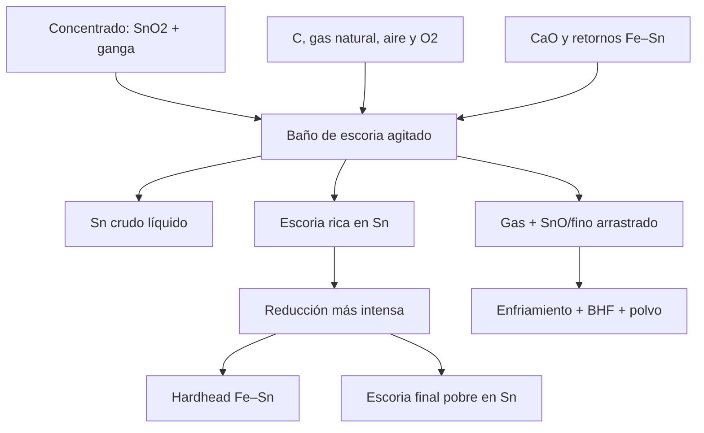
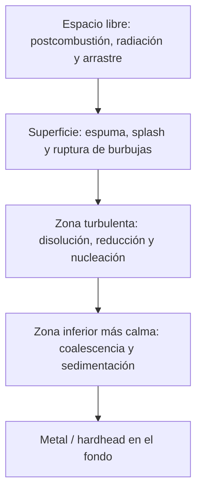
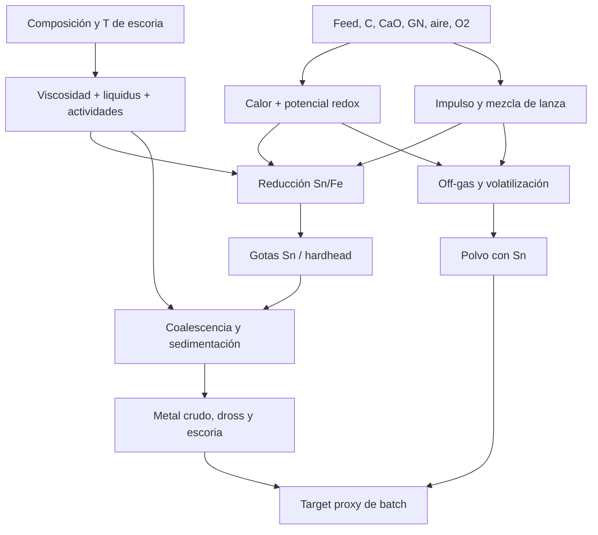

# Guía fenomenológica, fisicoquímica y analítica del horno Ausmelt para producción de estaño

## Fusión y reducción de concentrados de Sn en reactor TSL

**Propósito.** Construir una representación causal, cuantificable y utilizable para analítica del proceso registrado en `Construccion del dataset analitico(1).txt`: 11 escalones por batch, 7 clasificados como **Fusión** y 4 como **Reducción**.

**Alcance.** El Ausmelt es el reactor de **fusión reductora y reducción de escoria** que produce estaño crudo y una aleación Fe–Sn (*hardhead*). La refinación del estaño crudo hasta calidad comercial ocurre aguas abajo. Por tanto, aunque en planta pueda hablarse de “refinería”, este documento no confunde el horno con las posteriores operaciones de refinación.

**Advertencia operativa.** Los criterios aquí indicados son fenomenológicos, no consignas automáticas. Los límites numéricos de temperatura, inmersión, presión, tiro, composición y fin de etapa deben calibrarse con el diseño del horno, instrumentación, refractario, análisis de riesgo, SOP y ventanas históricas de la planta.

---

## 1. Las cinco ideas que organizan todo el proceso

1. **El Sn entra principalmente oxidado.** La casiterita es `SnO2`; para obtener Sn metálico hay que retirar oxígeno mediante C, CO y, en menor grado según la química real del combustible, H2.
2. **Sn y Fe no pueden optimizarse por separado.** Al hacer el baño suficientemente reductor para recuperar el Sn restante de la escoria también comienza a reducirse FeO. El resultado extremo no es simplemente “más Sn puro”, sino más Fe metálico disuelto en Sn: *hardhead*.
3. **La escoria es un reactivo y un medio de transporte, no un residuo pasivo.** Disuelve óxidos, define actividades químicas, controla viscosidad, transferencia de masa, coalescencia y arrastre de gotas metálicas.
4. **La lanza transforma química en velocidad.** Aire, O2 y combustible salen bajo la superficie; las burbujas, el chorro, la flotación y el *splashing* crean área interfacial y recirculación. La velocidad global depende de termodinámica **y** de transferencia de calor/masa.
5. **El target del dataset no es recuperación metalúrgica verdadera.** Es la fracción del Sn contabilizado en tres productos que aparece en metal crudo. No incluye explícitamente Sn residual en escoria ni compara el Sn recuperado contra todo el Sn alimentado.

---

## 2. Qué registra exactamente el archivo adjunto

### 2.1 Granularidad y memoria del proceso

- Cada batch tiene **7 escalones de Fusión + 4 de Reducción**.
- `fecha_final[i] = fecha_inicio[i+1]` dentro del batch.
- Las columnas `feed_*` y `volumen_*` son cantidades consumidas **durante el escalón**, aunque varios nombres terminen en `_kgh`; según el diccionario, su unidad real es kg por escalón, no kg/h.
- Temperaturas, presiones, posición y leyes son estados observados al cierre del escalón.
- El target y las tres masas de Sn de salida son valores de batch repetidos 11 veces.

Un escalón no es un reactor sin memoria. Si el estado al cierre es \(\mathbf{s}_i\), las acciones durante el intervalo son \(\mathbf{u}_i(t)\) y la carga/contexto es \(\mathbf{x}_i\), entonces:

$$
\frac{d\mathbf{s}}{dt}=\mathbf{f}(\mathbf{s},\mathbf{u},\mathbf{x},t),
\qquad
\mathbf{s}_{i}=\Phi_{\Delta t_i}(\mathbf{s}_{i-1},\mathbf{u}_i,\mathbf{x}_i).
$$

Por ello,

$$
\Delta y_i=y_i-y_{i-1}
$$

es una **respuesta neta observada entre dos cierres**, pero no demuestra que todo el cambio sea atribuible exclusivamente a la acción del escalón \(i\). También contiene inercia térmica, inventario previo, retardos de mezcla, tiempo de muestreo, retardo de laboratorio y acciones no medidas.

### 2.2 Target disponible

Definiendo

- \(M_m\): `sn_en_metal_crudo_batch_t`,
- \(M_d\): `sn_en_dross_fe_batch_t`,
- \(M_p\): `sn_en_polvo_fundicion_batch_t`,

el script calcula:

$$
Y_{proxy}=100\frac{M_m}{M_m+M_d+M_p}.
$$

Sus sensibilidades puramente aritméticas son:

$$
\frac{\partial Y}{\partial M_m}
=100\frac{M_d+M_p}{(M_m+M_d+M_p)^2}>0,
$$

$$
\frac{\partial Y}{\partial M_d}
=\frac{\partial Y}{\partial M_p}
=-100\frac{M_m}{(M_m+M_d+M_p)^2}<0.
$$

Esto es una **participación de metal crudo dentro de salidas de Sn seleccionadas**, no la recuperación verdadera:

$$
R_{Sn}^{verdadera}=100\frac{M_{Sn,\,producto\;deseado}}{M_{Sn,\,alimentado}}.
$$

Faltan, al menos, el Sn en escoria final, Sn en inventario de horno, Sn en retornos y pérdidas no contabilizadas. Por eso dos batches pueden tener el mismo \(Y_{proxy}\) y recuperaciones reales diferentes.

### 2.3 Dos inconsistencias del diccionario que deben corregirse

1. La nota de `feed_Carbon_kgh` escribe `SnO2 + 2C -> Sn + 2CO2`. **No está balanceada**: a la izquierda hay 2 átomos de C y 2 de O; a la derecha, 2 C y 4 O. Las formas globales balanceadas son:

$$
\mathrm{SnO_2+C\rightarrow Sn+CO_2}
$$

o, bajo condiciones de alta temperatura que favorecen CO,

$$
\mathrm{SnO_2+2C\rightarrow Sn+2CO}.
$$

En realidad la reducción suele proceder por reacciones gas–escoria con CO y regeneración de CO por la reacción de Boudouard.

2. `_meta.calidad_datos` menciona una ley de FeO, pero `RENOMBRES` y `CAMPOS_BASE` contienen `ley_fe_total_escoria_pct` y **no contienen FeO**. Fe total no es equivalente a FeO. Sin especiación Fe²⁺/Fe³⁺ no se observa directamente el buffer redox Fe/FeO/Fe3O4.

### 2.4 Calidad de datos ya documentada

- 3,982 filas equivalen a 362 batches completos si todos tienen 11 escalones.
- En AP0263: `ley_sn_escoria_pct = 241.5%` y `ley_al2o3_escoria_pct = 549.1%`; deben ser `NaN`, no truncarse a 100%.
- Nulos altos: `presion_punta_lanza_kpa` ≈13.6%, `presion_suministro_gn_lanza_kpa` ≈11.6% y `ley_sb_escoria_pct` ≈8.3%.
- Las leyes de escoria forman una composición cerrada: al aumentar una fracción, otras pueden disminuir matemáticamente aunque sus masas no cambien.

Para una composición \(\mathbf{x}=(x_1,\ldots,x_D)\), con \(\sum x_j=1\), las correlaciones directas no son invariantes. Una representación más coherente es, por ejemplo, el log-ratio centrado:

$$
\operatorname{clr}(x_j)=\ln\left(\frac{x_j}{g(\mathbf{x})}\right),
\qquad
g(\mathbf{x})=\left(\prod_{j=1}^{D}x_j\right)^{1/D}.
$$

Cuando existen ceros o componentes no medidas, se requiere imputación composicional y un subcomponente químicamente consistente; no se debe aplicar \(\log 0\).

---

## 3. Anatomía funcional del Ausmelt/TSL

La tecnología TSL inyecta combustible, aire y oxígeno directamente en un baño fundido mediante una lanza vertical sumergida. La disolución de la carga, combustión primaria, transferencia de energía y reacciones ocurren en la capa de escoria intensamente agitada. El fabricante también describe operación del horno sellado bajo ligera presión negativa para contener emisiones. Véase la [descripción oficial del proceso Ausmelt TSL](https://www.metso.com/portfolio/ausmelt-tsl-process/) y el [folleto técnico de Metso](https://www.metso.com/globalassets/210701_mo_ausmelt_tsl_process_brochure_update_lowres.pdf).

### 3.1 Zonas que coexisten

**Espacio libre.** Recibe CO, H2, CO2, H2O, N2, O2 residual, vapores y partículas. La postcombustión libera calor, parte del cual puede regresar al baño por radiación y por gotas de escoria en vuelo.

**Superficie.** La ruptura de burbujas genera ondas, *splashing* y gotas. Una intensidad moderada renueva superficie y mezcla; una intensidad excesiva aumenta acreción, erosión, arrastre de Sn y carga térmica/polvo en el tren de gases.

**Zona de punta/pluma.** El chorro forma cavidades y burbujas. Allí se concentran gradientes de temperatura, potencial de oxígeno y especies reductoras.

**Baño turbulento.** La escoria transporta óxidos hacia interfaces gas–escoria, carbono–escoria y metal–escoria. La turbulencia reduce capas límite y acelera transferencia.

**Zona inferior.** Las gotas de metal crecen por colisión y coalescencia y sedimentan. Es importante que no sean reoxidizadas ni reatrapadas antes de alcanzar la fase metálica.

**Protección de la lanza.** En lances tradicionales, los gases refrigeran el cuerpo y promueven una capa congelada de escoria; la estabilidad de esa capa depende de temperatura, flujo, posición y salpicadura. Las variantes refrigeradas por agua buscan mayor vida y consistencia, pero su diseño y salvaguardas son específicos; véase [Metso Ausmelt water-cooled lance](https://www.metso.com/portfolio/ausmelt-lance/water-cooled-lance/).

---

## 4. Secuencia temporal real: qué ocurre desde segundos hasta el final del batch

No hay un instante en que “termina lo físico y empieza lo químico”. En cada escalón se superponen fenómenos con escalas de tiempo diferentes:

| Escala orientativa | Fenómeno dominante | Qué observa el dataset |
|---:|---|---|
| milisegundos–segundos | salida del chorro, cavidad, burbuja, combustión local, ondas y gotas | presiones, contrapresiones y flujos agregados; no hay señal rápida |
| segundos–minutos | calentamiento de partículas, secado, pirólisis, disolución de óxidos, transferencia gas–escoria | temperatura de cierre y duración; no hay humedad ni tamaño de partícula |
| minutos–decenas de minutos | reducción SnO2→SnO→Sn, Fe redox, formación de escoria, nucleación/coalescencia | leyes discretas al cierre; operaciones integradas por escalón |
| decenas de minutos–horas | deriva del inventario, refractario, acumulaciones, enriquecimiento/empobrecimiento de escoria | `tiempo`, orden del escalón, gradientes y estado heredado |
| cierre de batch | sangría, separación, pesaje/ensaye y contabilización de productos | tres masas de Sn y `rendimiento_proxy_batch` |

### 4.0 Mapa nominal de los 11 escalones

El script solo entrega `fase_proceso` y orden; no contiene la receta que diga qué acción corresponde a F0, F1, etc. La siguiente tabla es, por tanto, un **marco de lectura temporal**, no una asignación inventada de consignas. En cada posición se debe contrastar el estado heredado, las acciones reales y la respuesta al cierre.

| Orden nominal | Pregunta física dominante | Señal que debería calcularse | Riesgo analítico |
|---|---|---|---|
| F0 | ¿Con qué baño, T, nivel, hardhead/escoria remanente y estado de lanza empezó el batch? | valores iniciales; no `diff` imputado | se desconoce el inventario preexistente; F0 no equivale a estado cero |
| F1 | ¿La primera carga se disolvió sin colapsar el margen térmico? | tasa feed, GN/O2, \(\Delta T\), presión/posición | T de cierre puede ocultar enfriamiento y recuperación dentro del intervalo |
| F2 | ¿La generación de CO y la mezcla alcanzan la demanda creciente de SnO2? | C/Sn, O2/GN, \(\Delta Sn_{slag}\) | la ley puede subir por feed aunque haya reducción simultánea |
| F3 | ¿Se estabilizaron T, escoria y caudal a un régimen de producción? | variabilidad, gradientes, potencia/feed | “estabilidad” puede ser control actuando contra disturbios |
| F4 | ¿Se mantiene selectividad Sn/Fe mientras aumenta inventario de metal? | Sn y Fe de escoria, C/O, T, dross futuro | Fe total no da FeO ni Fe metal |
| F5 | ¿La alimentación final deja suficiente tiempo/energía para disolución y coalescencia? | acumulados, superheat, tiempo desde última carga | falta timestamp de cada pulso dentro del escalón |
| F6 | ¿El estado de fin de Fusión es apto para retirar Sn crudo e iniciar limpieza de escoria? | estados finales F, pendiente tardía, exposición térmica | muestra/ensayo puede no coincidir con sangría |
| R0 | ¿Qué salto deliberado de C/O2/GN/lanza inicia el régimen reductor? | \(\Delta_{FR}\) de todas las acciones/estados | no reiniciar `diff`; marcar explícitamente transición |
| R1 | ¿La caída de Sn es rápida sin incremento desproporcionado de Fe? | \(-dSn/dt\), C acumulado, Fe/dross | ley % sin masa de escoria confunde extracción y dilución |
| R2 | ¿Empiezan rendimientos decrecientes o limitación por transporte? | curvatura de Sn(t), T, basicidad, estabilidad de presión | solo 4 muestras dificultan estimar derivadas |
| R3 | ¿El Sn incremental justifica carbón, Fe, energía, polvo, tiempo y riesgo? | valor marginal, Sn final, outputs del batch | el target actual omite Sn de escoria final y Fe del hardhead |

Para cada transición se recomienda separar:

$$
\underbrace{\mathbf s_{i-1}}_{\text{estado previo}}
+\underbrace{\int_{t_{i-1}}^{t_i}\mathbf u(t)dt}_{\text{acciones}}
\longrightarrow
\underbrace{\mathbf s_i}_{\text{estado observado}}
\longrightarrow
\underbrace{\mathbf y_{batch}}_{\text{resultado final}}.
$$

### 4.1 Antes y comienzo de Fusión: establecimiento del baño caliente

El reactor debe disponer de un baño líquido y de una lanza protegida. Al entrar carga fría:

1. Se evapora humedad:

$$
\mathrm{H_2O(l)\rightarrow H_2O(g)},
\qquad
Q_{evap}=m_{H_2O}\left[c_p\Delta T+\Delta H_{vap}\right].
$$

2. Se calientan sólidos hasta la temperatura de reacción y fusión:

$$
Q_{sens}=\sum_j m_j\int_{T_{in}}^{T}c_{p,j}(T)\,dT.
$$

3. Si el fundente fuese caliza y no CaO calcinada, ocurriría:

$$
\mathrm{CaCO_3(s)\rightarrow CaO(s)+CO_2(g)}.
$$

El dataset etiqueta la alimentación como CaO, así que no debe atribuirse calor de calcinación sin confirmar la forma mineral real.

4. El carbón se calienta, pierde volátiles y forma char reactivo. Su humedad, ceniza, carbono fijo, volátiles, granulometría y reactividad no están en el dataset.

5. La carga se disuelve en escoria. La disolución no significa reducción: primero los óxidos pasan a una fase líquida donde sus actividades químicas y movilidad cambian.

Al inicio, aumentar carga fría puede disminuir transitoriamente `temperatura_horno_celsius`; después la combustión y el calor de reacciones compensan. Por ello la relación entre alimentación y temperatura depende de retardos y no debe estimarse solo con correlación contemporánea.

### 4.2 Fusión temprana: creación de escoria y reducción selectiva del Sn

El objetivo metalúrgico del primer estadio es reducir gran parte del Sn manteniendo la reducción de Fe suficientemente limitada para obtener estaño crudo con poco Fe. La literatura TSL resume la producción de estaño en dos etapas y reporta que la primera produce metal crudo de alta ley de Sn y una escoria aún rica en Sn; la segunda reduce esa escoria y forma hardhead. Véase [Kandalam et al., 2023, Parte II](https://doi.org/10.3390/met13101742) y [Fosu et al., 2024](https://doi.org/10.3390/ma17133312).

En cada partícula o volumen de escoria aparecen:

- transferencia de calor hacia el sólido;
- disolución de SnO2 y óxidos de ganga;
- producción de CO/H2 alrededor del carbón y combustible;
- reducción de Sn(IV) a Sn(II), seguida de Sn(II) a Sn(0);
- nucleación de nanogotas/microgotas de metal;
- colisión, coalescencia y sedimentación de gotas.

Rutas gas–óxido:

$$
\mathrm{SnO_2(s,slag)+CO(g)\rightleftharpoons SnO(s,slag)+CO_2(g)},
$$

$$
\mathrm{SnO(s,slag)+CO(g)\rightleftharpoons Sn(l)+CO_2(g)},
$$

$$
\mathrm{SnO_2+2CO\rightleftharpoons Sn+2CO_2}.
$$

Rutas con hidrógeno, si existe H2 en la zona reductora:

$$
\mathrm{SnO_2+H_2\rightleftharpoons SnO+H_2O},
$$

$$
\mathrm{SnO+H_2\rightleftharpoons Sn+H_2O}.
$$

Rutas globales con carbono:

$$
\mathrm{SnO_2+C\rightleftharpoons Sn+CO_2},
$$

$$
\mathrm{SnO_2+2C\rightleftharpoons Sn+2CO}.
$$

La segunda es representativa cuando el equilibrio C–CO–CO2 a alta temperatura mantiene alto CO. No implica necesariamente contacto directo de cada molécula de SnO2 con C; puede ser la suma de reducción por CO y regeneración de CO.

### 4.3 Fusión media: combustión, generación del reductor y balance térmico

Idealizando gas natural como CH4:

$$
\mathrm{CH_4+2O_2\rightarrow CO_2+2H_2O}\qquad\text{(combustión completa)},
$$

$$
\mathrm{CH_4+\tfrac{3}{2}O_2\rightarrow CO+2H_2O}\qquad\text{(combustión parcial)},
$$

$$
\mathrm{CH_4+\tfrac{1}{2}O_2\rightarrow CO+2H_2}\qquad\text{(oxidación parcial idealizada)}.
$$

Para el carbono:

$$
\mathrm{C+O_2\rightarrow CO_2},
$$

$$
\mathrm{C+\tfrac{1}{2}O_2\rightarrow CO},
$$

$$
\mathrm{C+CO_2\rightleftharpoons 2CO}\qquad\text{(Boudouard)},
$$

$$
\mathrm{C+H_2O\rightleftharpoons CO+H_2}\qquad\text{(gas de agua)},
$$

$$
\mathrm{CO+\tfrac{1}{2}O_2\rightarrow CO_2},
\qquad
\mathrm{H_2+\tfrac{1}{2}O_2\rightarrow H_2O}.
$$

Así, subir O2 puede elevar la liberación de calor y la intensidad de mezcla, pero también consumir CO/H2 y elevar el potencial de oxígeno. Subir carbón puede elevar capacidad reductora, pero enfriar por calentamiento/gasificación, aumentar ceniza/escoria y favorecer Fe metálico si se excede.

El balance energético dinámico es:

$$
\frac{dU_{baño}}{dt}
=\dot Q_{comb}+\dot Q_{rxn}+\dot Q_{sensible,in}
-\dot Q_{offgas}-\dot Q_{pared}-\dot Q_{evap}-\dot Q_{sangría}.
$$

En forma de cierre por escalón:

$$
\Delta H_{acum,i}
=Q_{comb,i}+Q_{rxn,i}+H_{in,i}-H_{offgas,i}-Q_{pérdidas,i}-H_{out,i}.
$$

Una temperatura “alta” no prueba por sí sola que haya energía útil suficiente: puede coexistir con poco inventario, mala distribución térmica, sobreoxidación o gran pérdida por gases.

### 4.4 Fusión tardía: crecimiento de gotas, separación y control de pérdidas

Cuando se forma Sn líquido, inicialmente aparece como gotas dispersas. La separación requiere:

1. **Nucleación:** creación de una fase metálica estable al superar la barrera interfacial.
2. **Crecimiento:** más Sn reducido se incorpora a la gota.
3. **Colisión:** turbulencia y movimiento diferencial acercan gotas.
4. **Coalescencia:** se rompe/drena la película de escoria entre gotas.
5. **Sedimentación:** la densidad del metal conduce la gota al fondo.

En régimen de Stokes, solo como aproximación para gotas pequeñas y flujo laminar relativo:

$$
v_s=\frac{2}{9}\frac{(\rho_m-\rho_s)gr^2}{\mu_s}.
$$

La ecuación muestra tres palancas: radio de gota \(r\), diferencia de densidad y viscosidad de escoria \(\mu_s\). Como \(v_s\propto r^2\), la coalescencia suele ser tan importante como la reducción química. En turbulencia o gotas deformables se necesita un coeficiente de arrastre más general:

$$
\frac{1}{2}C_D\rho_s A v_s^2=(\rho_m-\rho_s)Vg.
$$

Una agitación demasiado baja deja zonas muertas y lenta transferencia; una agitación excesiva rompe gotas, reentraina metal y eleva polvo. El óptimo es un régimen que mezcle y genere interfaz, pero permita una zona/tiempo de asentamiento.

### 4.5 Transición Fusión → Reducción

La transición cambia el objetivo de selectividad:

- **Fusión:** maximizar Sn crudo limitando Fe reducido.
- **Reducción:** extraer Sn residual de la escoria aceptando la formación controlada de Fe–Sn.

El equilibrio metal–escoria central es:

$$
\mathrm{SnO_{(slag)}+Fe_{(metal)}\rightleftharpoons Sn_{(metal)}+FeO_{(slag)}}.
$$

Su constante termodinámica es:

$$
K(T)=\frac{a_{Sn}^{m}\,a_{FeO}^{s}}{a_{SnO}^{s}\,a_{Fe}^{m}}
=\frac{\gamma_{Sn}^{m}x_{Sn}^{m}\,\gamma_{FeO}^{s}x_{FeO}^{s}}
{\gamma_{SnO}^{s}x_{SnO}^{s}\,\gamma_{Fe}^{m}x_{Fe}^{m}}.
$$

Una forma industrial de coeficiente de distribución es:

$$
D=\frac{(\mathrm{wt\%\ Sn})_{metal}(\mathrm{wt\%\ Fe})_{slag}}
{(\mathrm{wt\%\ Fe})_{metal}(\mathrm{wt\%\ Sn})_{slag}}.
$$

Este vínculo explica por qué bajar más Sn en escoria suele elevar Fe en el metal. No hay una frontera completamente selectiva; existe una compensación termodinámica, modificada por actividades, temperatura y cinética.

### 4.6 Reducción temprana y media: intensificación reductora

La escoria rica en Sn del primer estadio se somete a mayor severidad reductora. En el dataset esto debería aparecer como combinación de:

- más carbono por unidad de inventario reducible;
- menor exceso de O2 para combustión;
- temperatura suficiente para baja viscosidad y cinética;
- mezcla intensa;
- descenso de `ley_sn_escoria_pct` respecto al final de Fusión;
- cambio de Fe total en escoria, aunque sin FeO no puede separarse dilución, reducción ni oxidación.

Reducciones de hierro relevantes:

$$
\mathrm{Fe_2O_3+CO\rightarrow 2FeO+CO_2},
$$

$$
\mathrm{Fe_3O_4+CO\rightarrow 3FeO+CO_2},
$$

$$
\mathrm{FeO+CO\rightleftharpoons Fe+CO_2},
$$

$$
\mathrm{FeO+C\rightleftharpoons Fe+CO}.
$$

El Fe metálico se disuelve en Sn líquido y forma el hardhead Fe–Sn. La revisión de TSL reporta hardhead con amplio intervalo de Fe y enfatiza que la reducción excesiva puede formar aleación sólida y aumentar pérdidas mecánicas por atrapamiento; esto ilustra por qué “mínimo Sn en escoria” no siempre coincide con el óptimo económico o de recuperación efectiva ([Kandalam et al., 2023](https://doi.org/10.3390/met13101742)).

### 4.7 Reducción tardía: rendimientos decrecientes y riesgo de sobre-reducción

Al caer SnO en escoria:

- disminuye la fuerza impulsora y aparecen rendimientos decrecientes;
- aumenta la importancia relativa de reducir FeO;
- el metal puede enriquecerse en Fe;
- la escoria puede volverse más viscosa si cambia la red silicatada o aparecen sólidos;
- gotas/partículas de aleación pueden quedar atrapadas;
- más tiempo, carbón y combustible pueden costar más que el Sn incremental recuperado.

Una cinética agregada de primer orden aparente puede escribirse:

$$
\frac{dC_{SnO}}{dt}=-k_{app}a\left(C_{SnO}-C_{SnO}^{*}\right),
$$

$$
C_{SnO}(t)=C_{SnO}^{*}+left[C_{SnO}(0)-C_{SnO}^{*}\right]e^{-k_{app}a t}.
$$

El tiempo de semirreacción es:

$$
t_{1/2}=\frac{\ln 2}{k_{app}a}.
$$

Aquí \(k_{app}a\) condensa cinética química, área interfacial, mezcla y transferencia. No debe interpretarse como una constante intrínseca. La literatura reporta escalas de decenas de minutos para reducción de Sn en escoria TSL, pero el valor de planta debe inferirse con sus propias muestras y retardos.

Un criterio económico de corte es detener cuando el valor esperado del Sn incremental iguala el costo y riesgo incremental:

$$
P_{Sn}\frac{dM_{Sn,rec}}{dt}
=\frac{d}{dt}\left(C_{comb}+C_{O_2}+C_C+C_{refract}+C_{offgas}+C_{tiempo}\right)
+\lambda_{Fe}\frac{dM_{Fe,metal}}{dt}
+\lambda_{riesgo}\frac{d\mathcal R}{dt}.
$$

### 4.8 Sangría, asentamiento y cierre

Antes/durante la sangría, la mezcla debe permitir separación sin solidificar la escoria ni mantener gotas suspendidas. El orden exacto de retiro de metal crudo, retención de hardhead y descarga de escoria depende del flowsheet de planta. En configuraciones de un solo vaso descritas en la literatura, el metal crudo se retira tras la primera etapa y el hardhead de la segunda puede quedar como reductor/retorno para el siguiente ciclo.

---

## 5. Termodinámica: cuándo una reacción puede ocurrir

### 5.1 Energía libre, cociente de reacción y equilibrio

Para una reacción \(\sum_i\nu_i A_i=0\):

$$
\Delta G=\Delta G^\circ(T)+RT\ln Q,
\qquad
Q=\prod_i a_i^{\nu_i}.
$$

- \(\Delta G<0\): avance directo termodinámicamente favorable.
- \(\Delta G=0\): equilibrio, \(Q=K\).
- \(\Delta G>0\): favorece el sentido inverso.

Y:

$$
\Delta G^\circ=-RT\ln K.
$$

La favorabilidad no garantiza rapidez. Una reacción favorable puede ser lenta por baja área interfacial, escoria viscosa, carbono poco reactivo, capa límite gruesa o gotas que no coalescen.

### 5.2 Relación CO/CO2 y capacidad reductora

Para

$$
\mathrm{SnO+CO\rightleftharpoons Sn+CO_2},
$$

$$
Q=\frac{a_{Sn}\,p_{CO_2}}{a_{SnO}\,p_{CO}}.
$$

A igualdad de actividades, elevar \(p_{CO}/p_{CO_2}\) reduce \(Q\) y favorece la reducción. Por eso el cociente CO/CO2 en el gas es una señal mucho más directa del régimen redox que el simple O2 inyectado. El dataset no mide CO ni CO2.

El equilibrio CO–CO2–O2 cumple:

$$
\mathrm{CO+\tfrac{1}{2}O_2\rightleftharpoons CO_2},
$$

$$
K_{CO}(T)=\frac{p_{CO_2}}{p_{CO}\,p_{O_2}^{1/2}},
$$

$$
p_{O_2}=\left(\frac{p_{CO_2}}{K_{CO}(T)p_{CO}}\right)^2.
$$

Sin T y CO/CO2 sincronizados, `exceso_o2_combustion_pct` es solo un proxy de entrada, no una medición de \(pO_2\) del baño.

### 5.3 Potencial de oxígeno y partición metal–escoria

Para oxidación genérica:

$$
\mathrm{M+\frac{x}{2}O_2\rightleftharpoons MO_x},
$$

$$
K=\frac{a_{MO_x}}{a_M p_{O_2}^{x/2}},
\qquad
p_{O_2}=\left(\frac{a_{MO_x}}{K a_M}\right)^{2/x}.
$$

Disminuir \(pO_2\) favorece metal; pero los umbrales de Sn y Fe se solapan por actividades no ideales. La composición de escoria modifica \(\gamma_{SnO}\) y \(\gamma_{FeO}\), por lo que dos escorias con igual %Sn pueden responder distinto al mismo carbón/O2.

### 5.4 Estequiometría mínima del Sn

Masas molares aproximadas:

$$
M_{Sn}=118.710,\quad M_{SnO_2}=150.708,\quad M_C=12.011\quad\mathrm{g\ mol^{-1}}.
$$

La casiterita pura contiene:

$$
w_{Sn}=\frac{118.710}{150.708}=0.78769\approx78.77\%\ Sn.
$$

Por kg de Sn originalmente como SnO2, el oxígeno a retirar es:

$$
m_{O,ret}=\frac{31.998}{118.710}=0.26955\ \mathrm{kg\ O/kg\ Sn}.
$$

Carbono teórico:

$$
\left(\frac{m_C}{m_{Sn}}\right)_{CO_2}
=\frac{12.011}{118.710}=0.10118\ \mathrm{kg/kg},
$$

$$
\left(\frac{m_C}{m_{Sn}}\right)_{CO}
=\frac{2(12.011)}{118.710}=0.20236\ \mathrm{kg/kg}.
$$

El consumo real es mayor y variable porque también hay combustión, reducción de Fe/otros óxidos, reacción con H2O/CO2, carbono no reaccionado, ceniza y pérdidas. Por eso `feed_Carbon_kgh/feed_Sn_kgf` no debe compararse con un único número estequiométrico sin balancear todas las especies.

### 5.5 Inventario compacto de reacciones que pueden coexistir

| Familia | Reacción idealizada | Consecuencia operacional |
|---|---|---|
| reducción escalonada de Sn | \(\mathrm{SnO_2+CO\rightleftharpoons SnO+CO_2}\) | consume capacidad reductora; Sn(IV) pasa a Sn(II) en escoria |
| metalización de Sn | \(\mathrm{SnO+CO\rightleftharpoons Sn+CO_2}\) | nuclea gotas metálicas; requiere luego coalescencia |
| reducción por H2 | \(\mathrm{SnO_x+xH_2\rightleftharpoons Sn+xH_2O}\) | posible si el combustible genera H2; control por H2/H2O |
| reoxidación de Sn | \(\mathrm{Sn+\tfrac12O_2\rightleftharpoons SnO}\) | eleva pérdida química/fume bajo potencial oxidante |
| oxidación completa | \(\mathrm{Sn+O_2\rightleftharpoons SnO_2}\) | estabiliza Sn(IV), desfavorable para metalización |
| intercambio Sn–Fe | \(\mathrm{SnO+Fe\rightleftharpoons Sn+FeO}\) | recupera Sn usando Fe, pero conecta composición de hardhead/escoria |
| reducción progresiva de Fe | \(\mathrm{Fe_2O_3\rightarrow Fe_3O_4\rightarrow FeO\rightarrow Fe}\) | primero ajusta Fe valente; el paso FeO→Fe aumenta hardhead |
| reoxidación de Fe | \(\mathrm{Fe+\tfrac12O_2\rightarrow FeO}\) | Fe puede actuar como reductor de SnO; cambia escoria y metal |
| formación fayalítica | \(\mathrm{2FeO+SiO_2\rightleftharpoons Fe_2SiO_4}\) | fija actividad de FeO y estructura/liquidus |
| modificación por cal | \(\mathrm{CaO+SiO_2\rightleftharpoons CaSiO_3}\) | cambia red, actividad y viscosidad; no describe toda la solución |
| combustión completa GN | \(\mathrm{CH_4+2O_2\rightarrow CO_2+2H_2O}\) | máximo calor ideal, menor reductividad local |
| combustión parcial GN | \(\mathrm{CH_4+\tfrac12O_2\rightarrow CO+2H_2}\) | genera reductores y menos calor recuperado inmediatamente |
| Boudouard | \(\mathrm{C+CO_2\rightleftharpoons2CO}\) | regenera CO; endotérmica y T-dependiente |
| gas de agua | \(\mathrm{C+H_2O\rightleftharpoons CO+H_2}\) | genera reductores; consume calor |
| postcombustión | \(\mathrm{CO+\tfrac12O_2\rightarrow CO_2}\), \(\mathrm{H_2+\tfrac12O_2\rightarrow H_2O}\) | libera calor sobre el baño; puede elevar T de off-gas |
| volatilización de SnO | \(\mathrm{SnO_{slag}\rightleftharpoons SnO_g}\) | fume de Sn; aumenta con actividad, T y transporte de gas |
| oxidación de As/Sb | \(\mathrm{4As+3O_2\rightarrow2As_2O_3(g)}\); análogo para Sb | redistribución a fume/polvo; no equivale a desaparición |

La tabla no afirma que todas dominen en cada batch. Para demostrar una ruta hacen falta especies, actividades y balances; el dataset actual solo permite inferir algunas mediante proxies.

---

## 6. Química y estructura de la escoria

### 6.1 Red silicatada

SiO2 es un formador de red: tetraedros \(\mathrm{SiO_4}\) se conectan por oxígenos puente \(\mathrm{Si-O-Si}\). CaO y, usualmente, MgO actúan como modificadores de red: aportan O²⁻ y generan oxígenos no puente, reduciendo polimerización.

Representación estructural idealizada:

$$
\mathrm{Si-O-Si+O^{2-}\rightarrow 2\,Si-O^-}.
$$

CaO no “neutraliza” SiO2 como en agua; modifica actividades, estructura, liquidus y viscosidad de una solución iónica fundida.

Formaciones simplificadas:

$$
\mathrm{2FeO+SiO_2\rightleftharpoons Fe_2SiO_4}\qquad\text{(fayalita)},
$$

$$
\mathrm{CaO+SiO_2\rightleftharpoons CaSiO_3},
$$

$$
\mathrm{2CaO+SiO_2\rightleftharpoons Ca_2SiO_4}.
$$

Estas fórmulas nombran extremos/compuestos; la escoria industrial es una solución multicomponente y puede contener líquido más sólidos.

### 6.2 Basicidad y por qué el efecto no es monotónico

El script define:

$$
B_2=\frac{\%CaO}{\%SiO_2},
$$

$$
B_4=\frac{\%CaO+\%MgO}{\%SiO_2+\%Al_2O_3}.
$$

Al aumentar CaO desde una escoria muy polimerizada puede disminuir viscosidad y mejorar sedimentación. Pero demasiado CaO puede acercar la composición a campos de alto liquidus o sólidos, elevar viscosidad efectiva, atacar refractario o cambiar desfavorablemente actividades. Por eso el óptimo es una **ventana de fase líquida, viscosidad y actividad**, no “máxima basicidad”.

Una forma empírica local para viscosidad completamente líquida es:

$$
\ln\mu=A+\frac{B}{T},
$$

pero \(A\) y \(B\) dependen fuertemente de composición. Cerca del liquidus, la fracción sólida \(\phi_s\) puede elevar la viscosidad efectiva:

$$
\mu_{eff}\approx\mu_l\left(1-\frac{\phi_s}{\phi_{max}}\right)^{-n}.
$$

### 6.3 Al2O3, MgO y Cr

- **Al2O3** es anfótero: puede incorporarse a la red y suele elevar polimerización/viscosidad en ciertos rangos; también puede provenir de ganga o desgaste refractario. Su efecto cambia con basicidad y temperatura.
- **MgO** puede modificar la red, pero exceso o baja T puede acercar a saturación de fases refractarias/espinelas.
- **Cr** suele asociarse a Cr2O3 o espinelas. Puede ser marcador de feed o desgaste refractario y contribuir a sólidos suspendidos.

Experimentos en el sistema SnO–FeOx–CaO–SiO2–Al2O3 muestran que la solubilidad de Al2O3 depende de T y relaciones Fe/SiO2 y CaO/SiO2, mientras la partición Sn escoria/metal es muy sensible a la condición oxidante ([Iksan et al., 2024](https://doi.org/10.1021/acsomega.4c07621)).

### 6.4 Pérdida química y pérdida mecánica de Sn

El Sn en escoria tiene al menos dos componentes:

$$
M_{Sn,slag}=M_{Sn,disuelto\;como\;óxido}+M_{Sn,metal\;atrapado}+M_{Sn,partículas\;no\;reaccionadas}.
$$

- La pérdida **química** disminuye al reducir actividad/potencial de oxígeno.
- La pérdida **mecánica** disminuye al favorecer coalescencia, baja viscosidad, tiempo de asentamiento y evitar sobreagitación/solidificación.

Un ensayo total de `%Sn` no separa estos mecanismos. Para hacerlo se requeriría, por ejemplo, microscopía/MLA, extracción selectiva, especiación o balances con muestras de metal/escoria.

---

## 7. Hidrodinámica, lanza y mecánica del baño

### 7.1 Del flujo al chorro

Para caudal volumétrico real \(Q\) y área de salida \(A\):

$$
U=\frac{Q}{A}.
$$

Los Nm3 deben convertirse a volumen real a T y P de línea:

$$
Q_{real}=Q_N\frac{T_{real}}{T_N}\frac{P_N}{P_{real}}\frac{Z_{real}}{Z_N}.
$$

La presión dinámica ideal es:

$$
q=\frac{1}{2}\rho_g U^2,
$$

y una aproximación de potencia neumática entregada es:

$$
\dot W_g\approx\Delta P\,Q_{real},
\qquad
\varepsilon_g=\frac{\dot W_g}{M_{baño}}.
$$

`presion_suministro`, `contrapresion` y `presion_punta` no son intercambiables: cada una incluye diferentes pérdidas de línea, fricción, boquillas, columna hidrostática y dinámica.

### 7.2 Profundidad de inmersión

La presión mínima para descargar bajo una profundidad \(h\) incluye:

$$
\Delta P\approx\rho_sgh+\Delta P_{fricción}+\Delta P_{boquilla}+\Delta P_{dinámica}.
$$

Por tanto, solo tras calibración:

$$
h\approx\frac{P_{punta}-P_{espacio\;libre}-\Delta P_{pérdidas}}{\rho_sg}.
$$

**Muy superficial:** menor contacto gas–líquido, combustión/postcombustión sobre el baño, menor mezcla profunda, más exposición térmica de la punta y posible pérdida de capa protectora; puede elevar temperatura de off-gas y reducir cinética de reducción del volumen profundo.

**Muy profunda:** mayor cabeza requerida, burbujas grandes y energéticas, más carga mecánica/vibración, riesgo de *sloshing*, erosión localizada, salpicadura y acercamiento a la interfase metal–escoria; puede reentrainar metal y aumentar Fe/Sn en polvo o acreciones.

**Óptimo:** inmersión relativa estable respecto del nivel dinámico del baño, con presión/caudal suficientes para mezcla y área interfacial, sin reentrainment ni inestabilidad excesiva. No se define por un `mm` universal; depende del nivel del baño, geometría, viscosidad, caudal y etapa.

Estudios CFD y experimentales muestran que la inmersión puede influir en la dinámica incluso más que el caudal y que viscosidad y tensión superficial impiden describir el sistema solo con Froude ([Obiso et al., 2019](https://doi.org/10.1007/s11663-019-01630-z); [Wang et al., 2022](https://doi.org/10.1007/s11663-022-02631-1)).

### 7.3 Números adimensionales útiles

$$
Re=\frac{\rho U D}{\mu}\qquad\text{(inercia/viscosidad)},
$$

$$
Fr=\frac{U^2}{gD}\qquad\text{(inercia/gravedad)},
$$

$$
We=\frac{\rho U^2D}{\sigma}\qquad\text{(inercia/tensión superficial)},
$$

$$
Eo=\frac{\Delta\rho gD^2}{\sigma}\qquad\text{(gravedad/tensión superficial)}.
$$

Para transferencia de masa:

$$
Sh=\frac{k_mD}{D_{AB}}=f(Re,Sc),
\qquad
Sc=\frac{\mu}{\rho D_{AB}}.
$$

Y para competencia reacción–transporte:

$$
Da=\frac{\text{tiempo de transporte}}{\text{tiempo de reacción}}
\sim\frac{k_{rxn}L}{k_m}.
$$

Estos grupos son mejores features si se conocen diámetro de lanza, área de boquilla, propiedades de escoria y nivel de baño. Con las variables actuales solo pueden construirse proxies parciales.

### 7.4 Splashing, sloshing y arrastre

- **Splashing:** gotas expulsadas por ruptura de burbujas/chorro. Moderado: transfiere calor y renueva interfaz. Excesivo: acreciones, erosión, polvo, pérdida de Sn y perturbación de presión.
- **Sloshing:** oscilación coherente del nivel del baño. Puede acoplarse con la frecuencia de generación de burbujas y geometría, elevar carga lateral y hacer variar la inmersión efectiva.
- **Entrainment:** gotas/partículas transportadas por otra fase. Puede ser Sn metálico atrapado en escoria o finos/gotas hacia off-gas.

La velocidad superficial del gas en el horno, no disponible, sería:

$$
U_{sg}=\frac{Q_{offgas,real}}{A_{horno}}.
$$

El arrastre tiende a crecer con \(U_{sg}\), finura de alimentación, intensidad de splash y volatilidad, pero no necesariamente de forma lineal.

---

## 8. Off-gas, tiro, temperaturas pre-BHF y polvo

### 8.1 Tiro

La presión del horno se mantiene ligeramente inferior a la atmosférica:

$$
\Delta P_{horno}=P_{horno}-P_{atm}<0.
$$

El porcentaje `tiro_horno_pct` parece ser comando/porcentaje de sistema, no una presión física; 70–99% no puede convertirse a Pa sin curva del ID fan, posición de damper y transmisor. A mayor comando suelen aumentar succión y caudal, pero la relación cambia con ensuciamiento y resistencia del circuito:

$$
\Delta P_{sistema}\approx KQ^2.
$$

**Tiro insuficiente:** presión cercana a cero/positiva, emisiones fugitivas, salida por aberturas, alimentación inestable y daño térmico local.

**Tiro excesivo:** ingreso de aire falso, mayor volumen de gas, enfriamiento, consumo de ventilador, oxidación no deseada en espacio libre, mayor velocidad/arrastre y carga del BHF.

**Óptimo:** mínima depresión estable que contenga gases bajo todas las perturbaciones, coordinada con caudal de lanza, alimentación, postcombustión, ensuciamiento y límites de temperatura/ΔP del sistema.

### 8.2 Temperaturas antes del BHF y antes de la cuchilla

Estas temperaturas integran:

$$
T_{gas}=f(\dot Q_{comb},\dot Q_{postcomb},Q_{falso},Q_{offgas},Q_{enfriamiento},\text{depósitos},T_{baño},\text{retardo}).
$$

Pueden actuar como:

- proxy de calor que escapó del horno;
- señal de postcombustión de CO/H2;
- señal de aire falso/dilución si caen con tiro alto;
- indicador de riesgo para mangas, condensación o pegajosidad del polvo;
- indicador indirecto de ensuciamiento/intercambio térmico.

No son palancas primarias de recuperación y sus límites dependen del material de manga, acondicionamiento y diseño. Un T alto puede significar combustión intensa útil **o** mala recuperación térmica; un T bajo puede significar buen enfriamiento **o** infiltración de aire. Se necesita ΔP del BHF, O2/CO/CO2, caudal y estado de limpieza para desambiguar.

### 8.3 Formación de polvo y fume de Sn

Debe distinguirse:

- **polvo mecánico:** finos de alimentación y gotas secadas/solidificadas arrastradas;
- **fume:** especie volatilizada que condensa en partículas ultrafinas;
- **acreción:** material depositado sobre lanza, paredes o ductos.

Rutas idealizadas de volatilización/reoxidación:

$$
\mathrm{SnO_{(slag)}\rightleftharpoons SnO_{(g)}},
$$

$$
\mathrm{Sn_{(l)}+\tfrac12O_2\rightleftharpoons SnO_{(g)}},
$$

$$
\mathrm{SnO_{(g)}+\tfrac12O_2\rightarrow SnO_2(s,fume)}.
$$

La `sn_en_polvo_fundicion_batch_t` combina potencialmente volatilización química y arrastre mecánico; sin mineralogía/tamaño del polvo no se separan.

---

## 9. Impurezas As, Sb y Cr

Las rutas exactas dependen de mineralogía y potencial de oxígeno. Especies volátiles idealizadas incluyen As2O3 y Sb2O3:

$$
\mathrm{4As+3O_2\rightarrow 2As_2O_3(g)},
$$

$$
\mathrm{4Sb+3O_2\rightarrow 2Sb_2O_3(g)}.
$$

Pero bajo condiciones reductoras As y Sb pueden repartirse a metal/hardhead; bajo otras composiciones pueden formar arseniatos/antimoniatos en escoria. Por tanto:

- su caída en escoria no equivale automáticamente a eliminación segura;
- pueden haber migrado al metal, polvo, gas o simplemente diluirse;
- sus efectos sobre target son indirectos: calidad de metal, volatilización, polvo, viscosidad y cronología del feed.

Cr suele ser menos volátil y puede formar Cr2O3/espinelas. Un aumento puede indicar alimentación, concentración por reducción de otras especies o desgaste refractario. No debe interpretarse como palanca independiente sin balance de masa.

---

## 10. De operaciones a estados: mapa causal

La relación causal correcta casi siempre contiene mediadores y compensaciones. Ejemplo: más O2 → más calor → menor viscosidad → mejor coalescencia → más Sn en metal, pero simultáneamente más O2 → mayor \(pO_2\) → más Sn oxidado/fume. La relación marginal puede ser positiva, negativa o en campana según el estado.

---

## 11. Diccionario fenomenológico completo de variables base

### 11.0 Trazabilidad nombre original → nombre analítico

| Nombre original | Nombre analítico | Unidad interpretada |
|---|---|---|
| `Batch` | `Batch` | identificador |
| `Fase del proceso` | `fase_proceso` | categoría |
| `Fecha inicio real` | `fecha_inicio` | timestamp |
| `Fecha final real` | `fecha_final` | timestamp |
| `TMF Sn total F+ R (Kg)` | `feed_Sn_kgf` | kg de Sn fino durante escalón |
| `TMH tolva: 3+4+5+7+1 (Kg)` | `feed_total_kgh` | kg húmedos durante escalón |
| `tmh tolva 4 Hierro WF (Kg)` | `feed_Fe_kgh` | kg durante escalón |
| `tmh tolva 5 Dross Fierro` | `feed_dross_Fe_kgh` | kg durante escalón |
| `CaO total (kg)` | `feed_CaO_kgh` | kg durante escalón |
| `Carbon total F+R (Kg)` | `feed_Carbon_kgh` | kg durante escalón |
| `Gas Natural total (Nm3)` | `volumen_gas_natural_inyectado_lanza_escalon_nm3` | Nm3 durante escalón |
| `O2 total (Nm3)` | `volumen_o2_inyectado_lanza_escalon_nm3` | Nm3 durante escalón |
| `Aire total (Nm3)` | `volumen_aire_inyectado_lanza_escalon_nm3` | Nm3 durante escalón |
| `T °C cara interior del horno` | `temperatura_horno_celsius` | °C al cierre |
| `Tiro de horno (%)` | `tiro_horno_pct` | % de actuación/indicación |
| `Presión ingreso gas natural lanza Ausmelt (kPa)` | `presion_suministro_gn_lanza_kpa` | kPa |
| `Presión oxígeno Lanza Ausmelt (kPa)` | `presion_suministro_o2_lanza_kpa` | kPa |
| `Gas Back Pressure (kPa)` | `contrapresion_gn_lanza_kpa` | kPa |
| `Lance Air Back Pressure (kPa)` | `contrapresion_aire_lanza_kpa` | kPa |
| `H1 - Tip Pressure (kPa)` | `presion_punta_lanza_kpa` | kPa |
| `Horno 1 Lance Height (Posición Lanza) (mm)` | `posicion_vertical_lanza_mm` | mm de coordenada, no inmersión directa |
| `%Sn` | `ley_sn_escoria_pct` | % masa, escoria |
| `%Fe` | `ley_fe_total_escoria_pct` | % Fe total, escoria |
| `%SiO2` | `ley_sio2_escoria_pct` | % masa, escoria |
| `%CaO` | `ley_cao_escoria_pct` | % masa, escoria |
| `Alumina` | `ley_al2o3_escoria_pct` | % masa, escoria |
| `%MgO` | `ley_mgo_escoria_pct` | % masa, escoria |
| `%As` | `ley_as_escoria_pct` | % masa, escoria |
| `%Sb` | `ley_sb_escoria_pct` | % masa, escoria |
| `Cromo` | `ley_cr_escoria_pct` | % masa, escoria |
| `Temperatura entrada gases BHF (antes bag house) °C` | `temperatura_gas_pre_bhf_celsius` | °C |
| `Temperatura entrada Gases BHF (antes cuchilla) °C` | `temperatura_gas_pre_cuchilla_celsius` | °C |
| `Sn al Metal Crudo (t)` | `sn_en_metal_crudo_batch_t` | t de Sn por batch |
| `Sn al Dross Fe (t)` | `sn_en_dross_fe_batch_t` | t de Sn por batch |
| `Sn al Polvo de Fundición (t)` | `sn_en_polvo_fundicion_batch_t` | t de Sn por batch |

Los sufijos `_kgh` heredados son engañosos: el diccionario y la verificación incluida en el adjunto indican **kg del escalón**, no kg/h. Conviene renombrarlos en una siguiente versión (`*_escalon_kg`) o, como mínimo, fijar metadatos de unidad.

### 11.1 Convención de relación esperada con el target

| Símbolo | Lectura |
|---|---|
| `+` | al aumentar la variable, se espera mayor target, **condicionado al mismo estado** |
| `−` | al aumentar, se espera menor target |
| `∩` | existe una ventana intermedia; ambos extremos perjudican |
| `U` | extremos pueden elevar la respuesta y el centro reducirla |
| `±` | signo dependiente de fase, estado, retardo o mecanismo dominante |
| `0 causal` | identifica/ordena, pero no cambia físicamente el proceso |
| `definicional` | relación impuesta por la fórmula del target, no descubrimiento causal |

La dirección se refiere al efecto causal local; una correlación bruta puede mostrar el signo contrario por decisiones del operador. Por ejemplo, se agrega más carbón precisamente a batches difíciles, generando correlación negativa aunque el efecto incremental del carbón dentro de una ventana segura sea beneficioso.

### 11.2 Identidad, fase y tiempo

| Variable | Qué representa | Rol en Fusión | Rol en Reducción | Relación esperada con target y criterio fenomenológico |
|---|---|---|---|---|
| `Batch` | Identificador de corrida | Agrupa estado inicial, feed y secuencia F1–F7 | Une R1–R4 con la escoria heredada de Fusión | `0 causal`. Es la unidad independiente para particionar train/test, bootstrap e inferencia. Nunca dividir filas del mismo batch entre train y test. |
| `fase_proceso` | Etiqueta Fusión/Reducción | Indica régimen orientado a Sn crudo y selectividad contra Fe | Indica régimen más reductor orientado a limpiar escoria y formar hardhead | `±`. Es un modificador de todos los efectos; no debe usarse como simple dummy aditivo si las pendientes de C/O2/T cambian por fase. |
| `fecha_inicio` | Inicio del escalón | Ordena acciones e identifica calendario/turno/campaña | Igual | `0 causal` como timestamp, aunque captura deriva de campaña, refractario, calibraciones y estacionalidad. No usar componentes futuros o ID temporal como atajo. |
| `fecha_final` | Cierre del escalón | Momento del estado/ensayo atribuido al intervalo | Igual | `0 causal`. Permite duración y alineación; comprobar si el análisis de laboratorio realmente corresponde al cierre o se cargó después. |
| `delta_tiempo` | Duración del escalón en min | Exposición integrada a feed, mezcla, calor y reacción | Tiempo disponible para agotamiento de SnO y coalescencia | `±/∩`. Muy corto: conversión/asentamiento insuficientes. Muy largo: menor productividad, más energía, Fe y refractario. Debe interactuar con tasas e inventario. |
| `tiempo` | Minutos desde inicio hasta cierre | Proxy de madurez térmica/química y acumulación de masa | Proxy del estado heredado y proximidad al fin | `±`. No es palanca independiente; puede absorber toda la secuencia. Validar modelos sin `tiempo` para medir dependencia de cronología. |

### 11.3 Alimentaciones sólidas y fundente

| Variable | Rol físico/químico | Fusión | Reducción | Efecto esperado y óptimo |
|---|---|---|---|---|
| `feed_Sn_kgf` | Masa de Sn fino alimentada durante el escalón; carga reducible, no necesariamente masa de SnO2 | Principal fuente de Sn; aumenta carga fría, oxígeno químico a retirar y producción potencial de metal/escoria | Según el diccionario, puede existir pero normalmente debería ser menor; verificar retornos o alimentación residual | Sobre \(Y_{proxy}\), `±`: mayor feed eleva potencial de metal, pero también demanda C/calor, Sn residual y polvo si se excede capacidad. Óptimo: tasa compatible con potencia térmica, C/O, disolución, nivel de baño y capacidad de gases. Normalizar por duración y por capacidad/inventario. |
| `feed_Fe_kgh` | Mineral de hierro WF de tolva 4 | Aporta Fe oxidado/ganga; puede regular química de escoria y el equilibrio SnO+Fe⇌Sn+FeO; agrega masa fría | Puede aportar FeO buffer/escoria si se dosifica; aumenta carga que puede terminar como Fe metal | `±/∩`. Muy poco Fe puede dar química de escoria inadecuada; demasiado aumenta escoria, demanda reductora y hardhead/dross. Óptimo por razón Fe/SiO2, FeO real y liquidus, no por kg aislado. Confirmar composición de “WF”. |
| `feed_dross_Fe_kgh` | Dross de Fe retornado; probablemente contiene Fe, Sn y óxidos/metal | Recupera Sn circulante y puede aportar Fe metálico reductor según especiación | Aumenta inventario Fe–Sn y puede ayudar a reducir SnO vía Fe, pero también eleva hardhead | `±/∩`. Beneficia circularidad hasta que carga de Fe/impurezas y masa circulante penalizan metal crudo. Requiere ensayo del dross (%Sn, %Fe, metal/óxido); kg solos mezclan calidad y cantidad. |
| `feed_CaO_kgh` | Fundente/modificador de red | Ajusta basicidad, liquidus, viscosidad y capacidad de disolución | Facilita fluidez/coalescencia en escoria más agotada y severa | `∩`. Deficiencia: escoria polimerizada/viscosa; exceso: sólidos/alto liquidus, mayor masa de escoria y posible desgaste. Óptimo condicionado a SiO2, Al2O3, MgO, FeOx y T. |
| `feed_Carbon_kgh` | Reductor sólido y posible fuente térmica | Genera CO, reduce SnO2/SnO; exceso inicia FeO→Fe y aumenta ceniza | Palanca principal para limpiar Sn, pero eleva riesgo de hardhead/over-reduction | `∩`. Bajo: Sn alto en escoria. Alto: Fe metálico, aleación sólida/atrapamiento, carbono remanente, enfriamiento por gasificación y polvo. Controlar por carbono fijo/reactividad y demanda de oxígeno de la carga, no kg brutos. |
| `feed_total_kgh` | Masa húmeda total de varias tolvas | Determina carga fría, nivel, residencia, throughput y perturbación térmica | Puede reflejar reductores/retornos agregados, pero es redundante con componentes | `∩/±`. Muy alta respecto a potencia: baja T, material no disuelto y polvo. Muy baja: baja productividad y sobrecalentamiento. Evitar usar junto a todos sus componentes sin revisar identidad/colinealidad; derivar “otros feed” solo si el balance es válido. |

#### Features estequiométricas superiores a ratios crudos

Si `feed_Sn_kgf` es masa de Sn contenido, una demanda reductora mínima parcial por escalón puede comenzar con:

$$
n_{Sn,i}=\frac{m_{Sn,i}}{M_{Sn}},
$$

$$
n_{C,Sn,i}^{teo}=\alpha_C n_{Sn,i},
\qquad 1\leq\alpha_C\leq 2,
$$

donde \(\alpha_C=1\) si C termina idealmente en CO2 y \(\alpha_C=2\) si termina en CO. Un balance ampliado sería:

$$
n_{C,dem}=\alpha_C n_{SnO_2}+n_{FeO\rightarrow Fe}+3n_{Fe_2O_3\rightarrow 2Fe}+\cdots.
$$

El índice de carbono debe usar carbono fijo:

$$
I_C=\frac{m_C\,w_{C,fijo}\,\eta_C}{m_{C,dem}^{teo}},
$$

no simplemente kg de carbón/kg de carga.

### 11.4 Gas natural, oxígeno, aire y balances redox

| Variable | Rol físico/químico | Fusión | Reducción | Efecto esperado y óptimo |
|---|---|---|---|---|
| `volumen_gas_natural_inyectado_lanza_escalon_nm3` | Energía química y volumen/momento de gas; según mezcla puede generar CO/H2 | Mantiene T y mezcla frente a carga fría | Mantiene T y puede aportar especies reductoras bajo combustión subestequiométrica | `∩/±`. Insuficiente: baja T/viscosidad alta. Exceso: gran off-gas, arrastre, consumo y posible régimen muy reductor si falta O2. Usar tasa, energía \(Q_N\times PCI\) y relación O2/combustible; confirmar composición real del GN. |
| `volumen_o2_inyectado_lanza_escalon_nm3` | Oxidante concentrado; eleva temperatura de llama y reduce N2 por unidad de O2 | Permite combustión intensa y throughput; exceso reoxida Sn/consume CO | Debe balancear calor sin destruir capacidad reductora; exceso eleva SnO/FeO | `∩`. Óptimo condicionado a GN, aire, C y oxígeno químico del feed. No interpretar Nm3 aislado. |
| `volumen_aire_inyectado_lanza_escalon_nm3` | Aporta ≈20.95% O2 y ≈79% N2; también enfría lanza y da momento | Combustión, mezcla y protección de lanza; N2 eleva volumen de off-gas | Mezcla/protección, pero puede oxidar y diluir reductores | `∩`. Poco: mezcla/protección/combustión insuficiente. Mucho: dilución, pérdida sensible, arrastre y oxidación. Separar función metalúrgica de mínimo de refrigeración exigido por diseño. |
| `o2_teorico_combustion_nm3` | Derivada: \(2V_{GN}\) suponiendo CH4 puro | Referencia de O2 solo para GN | Igual | `±`; no es palanca adicional. Es incompleta si GN no es CH4 y no considera C, CO/H2, feed ni postcombustión. |
| `o2_disponible_nm3` | Derivada: \(V_{O2}+0.21V_{aire}\) | Oxidante nominal de entrada | Igual | `±`; usar 0.2095 o análisis de gas si se requiere precisión. No equivale a O2 que llega al baño. |
| `exceso_o2_combustion_pct` | \(100(O2_{disp}-2V_{GN})/(2V_{GN})\) | Proxy: mediana documentada ≈+18.9% | Proxy: mediana ≈−4.8% | `∩/±`. Útil para separar régimen, no como \(pO_2\). Divisor inestable si GN≈0 y sesgo grave al ignorar carbón. La ventana óptima debe aprenderse por fase y estado. |

El balance de O2 mejorado por escalón debería ser:

$$
n_{O_2,in}=n_{O_2,puro}+y_{O_2,aire}n_{aire}+n_{O_2,postcomb},
$$

$$
n_{O_2,dem}=n_{O_2,GN\rightarrow CO_2,H_2O}
+n_{O_2,C\rightarrow CO/CO_2}
+n_{O_2,CO/H_2\rightarrow CO_2/H_2O}
+n_{O_2,oxidación\;feed/metal}.
$$

Definir:

$$
\lambda_{global}=\frac{n_{O_2,in}}{n_{O_2,dem}}.
$$

Pero en reducción parte del “déficit” es deliberado y el objetivo no es combustión completa. Un estimador aún mejor combina \(\lambda\) con CO/CO2, H2/H2O y Fe²⁺/Fe³⁺.

### 11.5 Temperatura del horno

| Variable | Rol | Fusión | Reducción | Efecto esperado y óptimo |
|---|---|---|---|---|
| `temperatura_horno_celsius` | Estado térmico en la cara interior al cierre; no necesariamente T representativa de todo el baño | Controla disolución, velocidad de reducción, líquido/sólido y viscosidad | Es crítica para cinética y fluidez de escoria agotada/hardhead | `∩`. Baja: alta viscosidad, sólidos, mala disolución/coalescencia. Alta: volatilización de SnO, desgaste refractario, pérdidas térmicas, menor selectividad y posible intensificación de Fe. Óptimo: margen suficiente sobre liquidus de la composición actual, con off-gas/refractario dentro de límites. Calibrar sesgo/retardo del punto de medición. |

Features recomendadas:

$$
\Delta T_{superheat}=T_{baño}-T_{liquidus}(\mathbf{x}_{slag}),
$$

$$
Q_{GN,i}^{in}=V_{GN,i}\,PCI_{GN},
$$

$$
I_{térmico,i}=\frac{Q_{GN,i}^{in}+Q_{postcomb,i}^{est}}{m_{feed,i}c_p\Delta T+Q_{fusión,i}+Q_{evap,i}}.
$$

### 11.6 Tiro y sistema de gases

| Variable | Rol | Fusión | Reducción | Efecto esperado y óptimo |
|---|---|---|---|---|
| `tiro_horno_pct` | Porcentaje de actuación/comando del sistema de depresión; no presión en Pa | Contiene emisiones y evacua alto volumen de combustión/feed | Evacua CO/H2 y requiere coordinación con postcombustión | `∩`. Bajo: fugitivas/presión positiva. Alto: aire falso, oxidación, enfriamiento y arrastre. Convertir a una métrica física con presión de horno, velocidad del fan, damper y curva \(\Delta P-Q\). |
| `temperatura_gas_pre_bhf_celsius` | T del gas antes del baghouse | Proxy de calor escapado, postcombustión, enfriamiento y carga del tren | Puede subir por combustión de CO/H2 aguas arriba | `±/∩`. No asumir causalidad directa. Óptimo: dentro de límites del material filtrante, por encima de problemas de condensación y compatible con control de emisiones; valores exactos son específicos del BHF. |
| `temperatura_gas_pre_cuchilla_celsius` | T antes de la “cuchilla” del sistema BHF | Permite estimar enfriamiento/ganancia entre dos puntos | Igual | `±`. Usar diferencia y retardo para detectar aire falso, intercambio, postcombustión o depósitos. Confirmar cuál sensor está aguas arriba. |

Derivadas físicas:

$$
\Delta T_{ducto}=T_{preBHF}-T_{preCuchilla}
$$

con signo definido después de confirmar topología, y

$$
\dot Q_{gas}\approx \dot m_{gas}\bar c_{p,gas}(T_{out}-T_{ref}).
$$

Sin \(\dot m_{gas}\), temperatura sola no mide pérdida térmica.

### 11.7 Presiones, contrapresiones y posición de lanza

| Variable | Qué mide / mecanismo | Fusión | Reducción | Efecto esperado y óptimo |
|---|---|---|---|---|
| `presion_suministro_gn_lanza_kpa` | Presión upstream disponible para vencer pérdidas y sostener GN | Influye en estabilidad/atomización/caudal y llama | Igual, con impacto en régimen reductor | `∩/±`. Baja a caudal pedido: caída/combustión inestable. Alta sin cambio de caudal puede ser regulador/obstrucción. Óptimo es margen operativo estable, no máximo. Interactúa con caudal y contrapresión. |
| `presion_suministro_o2_lanza_kpa` | Presión upstream de O2 | Sostiene caudal y mezcla de oxidante | Sostiene caudal, pero la química depende del flujo, no solo P | `∩/±`. Debe superar contrapresión/pérdidas con margen; P alta puede indicar restricción. No usar como sustituto de O2 real. |
| `contrapresion_gn_lanza_kpa` | Resistencia efectiva vista por la línea de GN | Señala inmersión, pérdidas, boquilla y posible obstrucción | Igual; cambios pueden reflejar viscosidad/nivel o acreción | `∩/±`. Muy baja: fuga, baja inmersión/caudal o medición. Muy alta: obstrucción, mayor inmersión, viscosidad/acreción. Óptimo como banda residual dada por caudal y posición, no valor bruto. |
| `contrapresion_aire_lanza_kpa` | Resistencia de aire de lanza | Proxy hidráulico y de protección de lanza | Proxy de inmersión/dinámica durante régimen distinto | `∩/±`. Modelar residual contra caudal, posición y T; desviaciones importan más que nivel absoluto. |
| `presion_punta_lanza_kpa` | Presión cerca de la punta según instrumentación | Integra cabeza hidrostática, chorro, burbujeo, pérdidas y oscilación | Puede detectar cambio de nivel, viscosidad, burbujas y sloshing | `∩/±`. Baja: punta superficial/fuga/bajo caudal. Alta: inmersión/restricción/carga. Óptimo: banda estable y coherente con caudales; 13.6% de nulos exige indicador de disponibilidad. |
| `posicion_vertical_lanza_mm` | Coordenada del actuador, no profundidad directamente | Ajusta inmersión mientras sube nivel con alimentación | Debe seguir nivel y densidad/composición del baño | `∩`. Muy alta/superficial: mala mezcla profunda. Muy baja/profunda: sobrepresión, vibración, sloshing, erosión/reentrainment. Convertir a \(h_{inmersión}=H_{baño}-z_{punta}\) respetando convención de signo y cero mecánico. |

Features de diagnóstico de la lanza:

$$
\Delta P_{margen,GN}=P_{sum,GN}-P_{back,GN},
$$

$$
\Delta P_{margen,aire}=P_{sum,aire}-P_{back,aire},
$$

si existe presión de suministro de aire; no está en el archivo. También:

$$
r_{P,Q}=P_{back}-\widehat P_{back}(Q_{real},z_{lanza},T,\mathbf{x}_{slag}),
$$

donde el residual puede señalar tapado, desgaste, fuga, cambio de nivel o sensor.

### 11.8 Leyes de escoria

Las leyes son estados al cierre, no palancas instantáneas. Su relación con el target puede tener **causalidad inversa**: una buena operación causa baja ley de Sn; la ley no “causa” retroactivamente el metal producido. Para prescripción en línea solo son válidas si están disponibles antes de la decisión.

| Variable | Papel fisicoquímico | Fusión | Reducción | Efecto esperado y óptimo |
|---|---|---|---|---|
| `ley_sn_escoria_pct` | Sn total en escoria: mezcla de Sn oxidado, metal atrapado y no reaccionado | Puede subir con incorporación de feed antes de reducirse; al final mide pérdida/intermedio para segunda etapa | Debe disminuir, pero perseguir el mínimo absoluto puede sobre-reducir Fe y atrapar aleación | Con \(Y_{proxy}\), normalmente `−`, pero target no incluye escoria: la asociación puede ser débil/sesgada. Óptimo final: límite económico y metalúrgico, no cero; separar pérdida química/mecánica. AP0263 241.5%→NaN. |
| `ley_fe_total_escoria_pct` | Fe total sin especiación ni masa de escoria | Constituyente del sistema ferro-silicatado y buffer redox indirecto | Puede bajar al reducir FeO a Fe o subir porcentualmente si sale Sn/otros componentes | `±`. No se puede asignar signo sin Fe²⁺/Fe³⁺, masa de escoria y Fe del metal. Óptimo por fase líquida, equilibrio Sn–Fe y calidad de hardhead. |
| `ley_sio2_escoria_pct` | Principal formador de red y ácido de escoria | Disuelve/estructura ganga y combina FeO/CaO | Si es alto y falta modificador puede elevar viscosidad; si es bajo puede cambiar liquidus/actividad | `∩/±`. Óptimo con CaO, FeOx, Al2O3, MgO y T. No maximizar ni minimizar aisladamente. Casi cero hace explotar B2/B4 y sugiere error o composición atípica. |
| `ley_cao_escoria_pct` | Modificador de red/fundente básico | Ajusta viscosidad, liquidus y actividades | Favorece fluidez hasta saturación/cambio de fase | `∩`. Interpretar junto a CaO alimentado: la ley puede bajar aunque se agregue CaO por dilución/masa total. |
| `ley_al2o3_escoria_pct` | Óxido anfótero; red/viscosidad y posible desgaste refractario | Ganga o disolución refractaria; modifica liquidus | Puede concentrarse y elevar viscosidad/solubilidad según T/basicidad | `±/∩`. Óptimo es compatibilidad con fase líquida y refractario. AP0263 549.1%→NaN. Cambios anómalos con Cr/MgO pueden señalar desgaste. |
| `ley_mgo_escoria_pct` | Modificador y componente refractario/espinela | Afecta estructura y liquidus | Puede concentrarse conforme se remueven Sn/Fe; sólidos empeoran separación | `±/∩`. Banda compatible con liquidus; subida no prueba adición, puede ser cierre composicional o desgaste. |
| `ley_sb_escoria_pct` | Sb retenido en escoria; especiación variable | Oxidación puede favorecer escoria/fume; reducción puede llevarlo a metal | Régimen reductor puede transferir Sb al hardhead/metal | Respecto a \(Y_{proxy}\), `±`; respecto a calidad, normalmente indeseable. Óptimo multisalida: baja impureza total con captura segura, no solo baja ley en escoria. 8.3% nulos. |
| `ley_cr_escoria_pct` | Cr/Cr2O3 o espinelas; feed/desgaste | Puede elevar fracción sólida/viscosidad y marcar refractario | Puede concentrarse por remoción de Sn | `−/±` si sólidos/desgaste dominan, pero no necesariamente causal. Optimizar estabilidad/refractario, no target aislado. |
| `ley_as_escoria_pct` | As retenido; puede volatilizarse o pasar a metal | Oxidación puede generar especies volátiles/escoria | Reducción puede favorecer metal | `±`. Una ley baja puede significar fuming al polvo, no mejora. Target de recuperación debe acompañarse con restricciones de calidad/emisiones. |

#### Por qué un cambio de ley no es un cambio de masa

Para componente \(j\):

$$
w_{j,i}=\frac{M_{j,i}}{M_{slag,i}},
$$

$$
\Delta w_j\neq\frac{\Delta M_j}{M_{slag}}
$$

cuando cambia \(M_{slag}\). La identidad diferencial es:

$$
dw_j=\frac{1}{M_{slag}}dM_j-\frac{M_j}{M_{slag}^2}dM_{slag}.
$$

Para inferir extracción de Sn se necesita masa de escoria o un marcador inerte confiable. Sin eso, `d_ley_sn_escoria_pct` es indicativo, no balance metalúrgico.

### 11.9 Productos de Sn y target

| Variable | Papel | Relación con target | Uso analítico correcto |
|---|---|---|---|
| `sn_en_metal_crudo_batch_t` | Sn contenido en producto deseado del primer estadio | `+ definicional` | Resultado, nunca feature de un modelo que prediga/recomiende el mismo target. Complementar con masa total y ley del metal crudo. |
| `sn_en_dross_fe_batch_t` | Sn en dross de Fe; metal recuperable/circulante pero no contado como crudo | `− definicional` | Resultado/pérdida o inventario reciclable. Distinguir generación bruta de pérdida neta tras reciclaje. |
| `sn_en_polvo_fundicion_batch_t` | Sn en polvo/fume capturado | `− definicional` | Resultado; separar polvo recirculado de pérdida final. Sirve como target secundario de emisiones/reciclo. |
| `rendimiento_proxy_batch` | \(100M_m/(M_m+M_d+M_p)\) repetido por escalón | target | Modelar una predicción por batch o secuencia completa. Para recomendación temprana, usar solo información disponible hasta el tiempo de decisión. No llamar “recuperación” sin calificativo. |

El objetivo industrial debería ser multiobjetivo:

$$
\max_{\mathbf u}
J=P_{Sn}M_{Sn,crudo}
-c_{GN}V_{GN}-c_{O_2}V_{O_2}-c_Cm_C
-c_t t-c_{dust}M_{Sn,dust}-c_{dross}M_{Sn,dross}
-c_{Fe}M_{Fe,metal}-c_{ref}\mathcal W,
$$

sujeto a:

$$
T_{min}(\mathbf{x}_{slag})\leq T\leq T_{max},
$$

$$
P_{horno}<P_{atm},\quad
\Delta P_{BHF}\leq\Delta P_{max},\quad
\text{calidad de metal, emisiones, nivel y estabilidad dentro de límites}.
$$

---

## 12. Variables derivadas del script: interpretación y límites

### 12.1 Tasas por minuto

El script propone:

$$
\operatorname{tasa}_{x,i}=\frac{x_i}{\Delta t_i}.
$$

Esto es correcto para comparar escalones de distinta duración **si** el total del escalón y sus timestamps están bien alineados. El total y la tasa responden preguntas distintas:

- total \(x_i\): dosis/energía/impulso integrado que recibió el escalón;
- tasa \(x_i/\Delta t_i\): intensidad promedio;
- perfil intraintervalo: no observable; dos escalones con igual promedio pueden tener rampas distintas.

| Variable derivada | Interpretación física | Uso recomendado |
|---|---|---|
| `tasa_feed_Sn_kg_min` | intensidad de carga de Sn fino | Interactuar con potencia térmica, C, O2 y nivel. Una tasa alta sin capacidad compensatoria causa enfriamiento/no conversión/polvo. |
| `tasa_feed_Fe_kg_min` | intensidad de aporte de material WF/Fe | Relacionar con Fe/SiO2, carga fría y formación de hardhead. |
| `tasa_feed_dross_Fe_kg_min` | intensidad de retorno Fe–Sn | Requiere ley del dross; kg/min sin composición no cuantifica Sn/Fe retornado. |
| `tasa_feed_CaO_kg_min` | velocidad de ajuste de escoria | Efecto retardado por disolución; usar acumulado y composición inicial además de tasa. |
| `tasa_feed_Carbon_kg_min` | intensidad de reductor | Palanca crítica por fase; normalizar por demanda reducible y carbono fijo. |
| `tasa_feed_total_kg_min` | throughput de carga húmeda | Comparar con potencia térmica y caudal de gas; vigilar redundancia con tasas componentes. |
| `tasa_gn_nm3_min` | potencia química aproximada y caudal de gas | Transformar también a MW con PCI y a caudal real en punta. |
| `tasa_o2_nm3_min` | intensidad de oxidante | Combinar con GN, aire, C y feed; no usar como indicador redox unilateral. |
| `tasa_aire_nm3_min` | O2 diluido, N2 y momento/refrigeración | Derivar O2 aportado, N2, caudal total y energía sensible del gas. |

La potencia térmica del GN, si \(PCI_{GN}\) está en MJ/Nm3, es:

$$
\dot Q_{GN}[\mathrm{MW}]
=\frac{\operatorname{tasa}_{GN}[\mathrm{Nm^3/min}]\,PCI_{GN}[\mathrm{MJ/Nm^3}]}{60}.
$$

### 12.2 Diferencias y gradientes de estados

El script define:

$$
d_{y,i}=y_i-y_{i-1},
\qquad
grad_{y,i}=\frac{y_i-y_{i-1}}{\Delta t_i}.
$$

No reiniciar el `diff` en Fusión→Reducción conserva el salto más informativo. Sin embargo, hay que crear explícitamente un indicador `es_transicion_FR`; de lo contrario, el modelo puede mezclar un cambio de régimen deliberado con dinámica ordinaria.

| Familia de `d_`/`grad_` | Significado útil | Riesgo de interpretación |
|---|---|---|
| `temperatura_horno_celsius` | calentamiento/enfriamiento neto aparente | sensor de pared/cara, retardo y carga heredada; no equivale a balance de calor |
| `tiro_horno_pct` | cambio de comando/depresión relativa | porcentaje sin Pa; puede ser respuesta del control a una perturbación, no causa |
| presiones de suministro | cambio de disponibilidad/regulación | alteración puede deberse a consigna, caudal o red común |
| contrapresiones y presión de punta | cambio hidráulico/dinámico | mezclar con cambios de caudal, posición, nivel y viscosidad |
| `posicion_vertical_lanza_mm` | movimiento de lanza | el signo físico depende de la convención; `+mm` puede ser subir o bajar |
| leyes de escoria | cambio de fracción másica | composición cerrada, error de muestreo y cambio de masa total de escoria |
| temperaturas de gases | cambio térmico del tren | retardo de transporte; alinear por tiempo de residencia del gas |

Inventario explícito de columnas que genera el patrón:

| Estado base | Delta generado | Gradiente generado | Lectura física principal |
|---|---|---|---|
| `temperatura_horno_celsius` | `d_temperatura_horno_celsius` | `grad_temperatura_horno_celsius` | calentamiento/enfriamiento neto aparente |
| `tiro_horno_pct` | `d_tiro_horno_pct` | `grad_tiro_horno_pct` | cambio de actuación/depresión relativa |
| `presion_suministro_gn_lanza_kpa` | `d_presion_suministro_gn_lanza_kpa` | `grad_presion_suministro_gn_lanza_kpa` | cambio de margen upstream de GN |
| `presion_suministro_o2_lanza_kpa` | `d_presion_suministro_o2_lanza_kpa` | `grad_presion_suministro_o2_lanza_kpa` | cambio de margen upstream de O2 |
| `contrapresion_gn_lanza_kpa` | `d_contrapresion_gn_lanza_kpa` | `grad_contrapresion_gn_lanza_kpa` | cambio de resistencia/inmersión aparente en GN |
| `contrapresion_aire_lanza_kpa` | `d_contrapresion_aire_lanza_kpa` | `grad_contrapresion_aire_lanza_kpa` | cambio de resistencia/inmersión aparente en aire |
| `presion_punta_lanza_kpa` | `d_presion_punta_lanza_kpa` | `grad_presion_punta_lanza_kpa` | cambio dinámico cerca de la punta |
| `posicion_vertical_lanza_mm` | `d_posicion_vertical_lanza_mm` | `grad_posicion_vertical_lanza_mm` | movimiento de lanza; confirmar signo físico |
| `ley_sn_escoria_pct` | `d_ley_sn_escoria_pct` | `grad_ley_sn_escoria_pct` | cambio de fracción de Sn total; no masa extraída |
| `ley_fe_total_escoria_pct` | `d_ley_fe_total_escoria_pct` | `grad_ley_fe_total_escoria_pct` | cambio de Fe total relativo; no FeO reducido |
| `ley_sio2_escoria_pct` | `d_ley_sio2_escoria_pct` | `grad_ley_sio2_escoria_pct` | cambio relativo del formador de red |
| `ley_cao_escoria_pct` | `d_ley_cao_escoria_pct` | `grad_ley_cao_escoria_pct` | cambio relativo del modificador CaO |
| `ley_al2o3_escoria_pct` | `d_ley_al2o3_escoria_pct` | `grad_ley_al2o3_escoria_pct` | cambio de Al2O3 por feed, concentración o refractario |
| `ley_mgo_escoria_pct` | `d_ley_mgo_escoria_pct` | `grad_ley_mgo_escoria_pct` | cambio de MgO por feed, concentración o refractario |
| `ley_sb_escoria_pct` | `d_ley_sb_escoria_pct` | `grad_ley_sb_escoria_pct` | redistribución relativa de Sb |
| `ley_cr_escoria_pct` | `d_ley_cr_escoria_pct` | `grad_ley_cr_escoria_pct` | redistribución relativa de Cr/espinelas/desgaste |
| `ley_as_escoria_pct` | `d_ley_as_escoria_pct` | `grad_ley_as_escoria_pct` | redistribución relativa de As |
| `temperatura_gas_pre_bhf_celsius` | `d_temperatura_gas_pre_bhf_celsius` | `grad_temperatura_gas_pre_bhf_celsius` | cambio térmico aparente en punto pre-BHF |
| `temperatura_gas_pre_cuchilla_celsius` | `d_temperatura_gas_pre_cuchilla_celsius` | `grad_temperatura_gas_pre_cuchilla_celsius` | cambio térmico aparente en punto pre-cuchilla |

Para leyes con ruido de laboratorio, el gradiente divide por \(\Delta t\) y amplifica error:

$$
\operatorname{Var}(grad_y)
\approx\frac{\sigma_{y_i}^2+\sigma_{y_{i-1}}^2}{\Delta t_i^2}.
$$

Por tanto, para escalones cortos puede ser preferible un modelo de estados con error de medición, suavizado robusto o diferencias por fase/ventana, sin borrar el salto F→R.

### 12.3 Basicidades

| Variable | Fórmula | Valor y riesgo |
|---|---|---|
| `basicidad_B2` | \(CaO/SiO_2\) | interpretable como descriptor simple, no suficiente para sistema multicomponente; media documentada ≈0.53 en Fusión |
| `basicidad_B4` | \((CaO+MgO)/(SiO_2+Al_2O_3)\) | integra modificadores/formadores, pero presupone papeles fijos que no siempre valen; explota si el denominador≈0 |
| `relacion_CaO_carga_Fe` | \(m_{CaO}/(m_{Fe}+m_{dross})\) | dosis feed, no composición de escoria; indefinida/inestable con denominador pequeño |

No recortar outliers para entrenar sin antes distinguir error de proceso real. Para razones:

$$
r_{estable}=\frac{a}{b+\epsilon}
$$

evita división numérica por cero, pero \(\epsilon\) cambia la interpretación. Es mejor marcar denominador bajo y usar numerador/denominador por separado o log-ratio cuando ambos son positivos.

### 12.4 Relación carbono/carga

La variable exacta es `relacion_C_carga`:

$$
relacion\_C\_carga
=\frac{m_C}{m_{Sn}+m_{Fe}+m_{dross}}.
$$

- En Fusión puede comparar intensidad reductora contra carga fresca, aunque mezcla masas de Sn fino, mineral WF y dross de composiciones distintas.
- En Reducción el denominador puede aproximarse a cero porque se trata la escoria ya presente. El ratio deja de medir severidad reductora y debe ser invalidado, no winsorizado silenciosamente.
- En Reducción usar `tasa_feed_Carbon_kg_min`, C acumulado desde F→R y, si se consigue, C por kg de SnO/FeO reducible en el inventario de escoria.

### 12.5 Orden e indicadores

| Variable | Uso correcto | Advertencia |
|---|---|---|
| `orden_escalon_fase` | alinea F0–F6 y R0–R3; permite curvas de respuesta y efectos específicos | puede convertirse en proxy casi determinista del estado y ocultar física; interactuar con fase y validar fuera de tiempo |
| `es_primer_escalon_fase` | identifica F0 y R0/transición | para R0 es especialmente valioso; para F0 coincide con primer batch |
| `es_primer_escalon_batch` | marca estados sin precedente y `diff=NaN` estructural | no imputar sus gradientes con media como si faltaran al azar |

Conviene añadir:

$$
es\_transicion\_FR=\mathbb{1}(fase_i=R\land fase_{i-1}=F),
$$

$$
tiempo\_fase_i=t_i-t_{inicio\,fase},
$$

$$
fraccion\_fase_i=\frac{orden_i}{N_{fase}-1}.
$$

---

## 13. Relaciones entre variables que deberían verse —y por qué podrían no verse

### 13.1 Firmas fenomenológicas esperadas

| Firma conjunta | Interpretación plausible | Alternativas/confusores |
|---|---|---|
| ↑C, ↓exceso O2, ↓Sn escoria durante R | reducción efectiva de SnO | dilución de ley, retardo de muestra o cambio de masa de escoria |
| ↑C, ↓Sn escoria, ↑Sn dross/hardhead | sobre-reducción/Fe–Sn | feed dross de mayor ley o cambio de práctica de separación |
| ↑GN/O2, ↑T horno, ↓viscosidad proxy, ↑metal crudo | suficiencia térmica mejora coalescencia | operador aplicó más energía a batches fríos/difíciles; causalidad inversa |
| ↑aire/tiro, ↑T pre-BHF, ↑Sn polvo | más arrastre/postcombustión/volatilización | BHF más eficiente o polvo reciclado; temperatura sin caudal |
| ↑CaO, ↓B2 o ↓%CaO | aumento de masa/dilución o retardo de disolución | error de timestamps/feed |
| ↑posición de lanza y ↓presión de punta | lanza se hizo más superficial, **si +mm significa subir** | convención opuesta, cambio de caudal o sensor |
| ↑Al2O3+Cr/MgO sostenido por campaña | posible desgaste refractario | cambio de mineralogía del feed |
| ↓Sn escoria por debajo de umbral, ↑Fe metal/dross y peor target | sobre-reducción y atrapamiento | falta medir masa/ley Fe metal y escoria |

### 13.2 Relaciones necesariamente no lineales

Para una palanca \(u\) con beneficio inicial y penalización posterior:

$$
Y(u)=\beta_0+\beta_1u-\beta_2u^2,
\qquad \beta_1,\beta_2>0,
$$

$$
u^*=\frac{\beta_1}{2\beta_2}.
$$

Pero el verdadero óptimo es condicional:

$$
u^*(\mathbf{s},\mathbf{x},fase)
=\arg\max_{u\in\mathcal U(\mathbf{s})}
\mathbb E[J\mid do(u),\mathbf{s},\mathbf{x},fase].
$$

Esto aplica a carbón, O2, GN, aire, CaO, temperatura, inmersión y tiro. Un único setpoint global carece de sentido si cambian inventario, composición y fase.

### 13.3 Interacciones mínimas a evaluar

$$
\text{C} \times \text{O2 disponible} \times \text{fase},
$$

$$
\text{GN} \times \text{O2} \times \text{aire},
$$

$$
T \times B_2 \times Al_2O_3 \times MgO,
$$

$$
Q_{gas} \times z_{lanza} \times P_{punta},
$$

$$
\text{C} \times Sn_{slag,prev} \times Fe_{slag,prev},
$$

$$
\text{tiro} \times Q_{offgas}^{proxy} \times T_{preBHF}.
$$

No es necesario crear todos los productos manualmente si se usa un modelo capaz de interacciones, pero sí hay que imponer/diagnosticar coherencia física y cobertura de datos.

---

## 14. Criterio de punto óptimo por familia de operación

| Palanca | Muy baja | Ventana útil | Muy alta |
|---|---|---|---|
| Carbón | SnO residual, baja fuerza reductora | CO suficiente, Sn cae sin Fe excesivo | hardhead/Fe, sólidos, atrapamiento, ceniza, enfriamiento |
| O2 | baja potencia/combustión, CO alto y riesgo operativo | calor y mezcla con redox adecuado a fase | reoxidación Sn, consumo de CO/H2, fume |
| GN | baño frío, alta viscosidad | potencia térmica y momento suficientes | off-gas/arrastre/costo; redox depende de O2 |
| Aire | poca mezcla/enfriamiento de lanza | protección, combustión y agitación estables | N2, pérdida térmica, oxidación y polvo |
| CaO | escoria viscosa o liquidus desfavorable | fase líquida y actividad/viscosidad adecuadas | exceso de sólidos/más escoria/desgaste |
| T | sólidos, lenta reacción/coalescencia | superheat suficiente sobre liquidus | SnO volátil, refractario, energía, Fe y off-gas |
| Inmersión | contacto superficial/mala mezcla | pluma estable y recirculación con zona de asentamiento | presión/vibración/sloshing/erosión/reentrainment |
| Tiro | fugitivas y presión positiva | ligera depresión estable | aire falso, enfriamiento, oxidación y arrastre |
| Tiempo de R | under-reduction | Sn incremental rentable | over-reduction, Fe, costo y desgaste |

El óptimo observable debe cumplir simultáneamente:

1. **Termodinámica:** CO/CO2 o \(pO_2\) suficientemente reductor para Sn, sin cruzar demasiado hacia Fe.
2. **Cinética:** caída de Sn por unidad de tiempo aún material.
3. **Fases:** escoria líquida con viscosidad/coalescencia adecuadas.
4. **Hidrodinámica:** mezcla suficiente sin arrastre/reentrainment excesivo.
5. **Energía:** margen térmico sobre liquidus con pérdidas controladas.
6. **Economía:** valor de Sn incremental superior a costo y penalidades.
7. **Seguridad/equipo:** presión, tiro, BHF, refractario y lanza dentro de envolvente.

---

## 15. Analítica robusta: cómo traducir el fenómeno a un modelo

### 15.1 No tratar las 3,982 filas como 3,982 targets independientes

El target se repite 11 veces por batch. Entrenar un regresor por fila produce:

- pseudorreplicación;
- intervalos de confianza demasiado estrechos;
- posible fuga si un batch aparece en train y test;
- once predicciones incongruentes del mismo resultado.

Tres formulaciones defendibles:

#### A. Modelo tabular por batch con features fenomenológicas

Construir una fila por batch con:

- estado inicial de Fusión;
- estado al final de Fusión;
- estado al inicio/final de Reducción;
- deltas F→R;
- dosis y tasas por fase;
- exposición sobre/bajo ventanas térmicas/redox;
- pendientes tempranas y tardías;
- máximos, mínimos, variabilidad y tiempo en zona;
- features de trayectoria, no solo medias.

Ejemplos:

$$
A_{C,R}=\sum_{i\in R}m_{C,i},
$$

$$
I_{red,R}=\sum_{i\in R}\Delta t_i\,\max(0,-excesoO2_i),
$$

$$
S_{Sn,R}=\frac{Sn_{slag,R_{fin}}-Sn_{slag,R_{inicio}}}{t_{R,fin}-t_{R,inicio}},
$$

$$
E_{T,liq}=\sum_i\Delta t_i\max\left(0,T_i-T_{liq}(\mathbf{x}_i)\right).
$$

#### B. Modelo secuencial de 11 pasos

Entrada:

$$
\mathbf X_b\in\mathbb R^{11\times p},
$$

con máscara de faltantes y \(\Delta t\). Usar un TCN, GRU pequeña, Transformer restringido o modelo de estado. La salida es una sola \(\hat Y_b\). La poca cantidad de batches favorece arquitecturas pequeñas, regularización y baselines fuertes.

#### C. Modelo de transición de estado + optimización

Aprender:

$$
\hat{\mathbf s}_{i+1}=f_\theta(\mathbf s_i,\mathbf u_i,\mathbf x_i,\Delta t_i),
$$

y luego simular acciones seguras. Es conceptualmente superior para prescripción, pero con el target actual faltan estados cruciales: masa de escoria, FeO, CO/CO2, nivel y composición de metal.

### 15.2 Separar predicción, explicación y prescripción

- **Predicción:** \(\mathbb E[Y\mid X]\). Puede explotar asociaciones del operador.
- **Explicación del modelo:** SHAP/PDP/ALE explican \(\hat f(X)\), no necesariamente el proceso causal.
- **Prescripción:** requiere \(\mathbb E[Y\mid do(u)]\), restricciones y soporte histórico para la acción propuesta.

No recomendar un valor fuera de cobertura. Definir distancia o densidad de soporte:

$$
\mathcal U_{segura}(x)=\{u:\ p(u\mid x)>\epsilon,\ g_k(u,x)\le0\}.
$$

### 15.3 Variables manipulables, estados, contexto y resultados

| Clase | Variables actuales |
|---|---|
| Manipulables | feeds de Sn/Fe/dross/CaO/C; volúmenes/tasas GN, O2, aire; posición de lanza; tiro como comando indirecto |
| Estados medidos | T horno, presiones/contrapresiones, leyes de escoria, T pre-BHF/pre-cuchilla |
| Contexto | fase, orden, timestamps, duración, batch/campaña |
| Resultados | Sn en metal crudo, dross, polvo y target proxy |

No optimizar estados como si fueran actuadores. “Subir temperatura” debe traducirse a una acción factible —GN/O2/feed/tiempo— con consecuencias redox y de gases.

### 15.4 Features causales disponibles antes de cada decisión

Para recomendar en escalón \(i\), solo usar:

$$
\mathcal I_i=\{\mathbf s_0,\mathbf u_0,\ldots,\mathbf s_{i-1},\mathbf u_{i-1},\text{contexto conocido en }i\}.
$$

La ley o temperatura medida al cierre de \(i\) no puede recomendar la acción que ya ocurrió dentro de \(i\), salvo que se modele como respuesta. Esta distinción evita leakage temporal.

### 15.5 Validación

- Split por `Batch`, nunca por fila.
- Preferir *walk-forward* por fecha/campaña para medir deriva real.
- Reportar MAE/RMSE/R² a nivel batch y calibración de incertidumbre.
- Bootstrap por batch/campaña, no por escalón.
- Evaluar desempeño por fase operacional, rango de feed, campaña y faltantes.
- Comparar con baselines: media histórica por campaña, regresión regularizada y gradient boosting por batch.
- Para recomendación, hacer backtesting con política histórica, *off-policy evaluation* prudente y revisión metalúrgica.

### 15.6 Pérdida multiobjetivo y restricciones

Una función de entrenamiento/prescripción más coherente:

$$
\mathcal L
=w_1\ell(Y_{proxy},\hat Y)
+w_2\ell(M_{Sn,dust},\widehat M_{Sn,dust})
+w_3\ell(M_{Sn,dross},\widehat M_{Sn,dross})
+w_4\ell(Sn_{slag,fin},\widehat{Sn}_{slag,fin})
+\sum_k\lambda_k\operatorname{ReLU}(g_k)^2.
$$

Los pesos deben derivarse de valor económico, riesgo y escalas normalizadas; no fijarse arbitrariamente para “mejorar” una métrica.

---

## 16. Features recomendadas, con fórmula y fundamento

### 16.1 Inventarios y acumulados causales

Aunque `feed_*` no son contadores acumulativos, sí conviene construir exposiciones:

$$
CumX_i=\sum_{j\le i}X_j,
$$

$$
CumX_{fase,i}=\sum_{j\le i,\,fase_j=fase_i}X_j.
$$

Ejemplos: C acumulado en R, Sn alimentado acumulado, CaO acumulado, energía GN acumulada y O2 disponible acumulado. Estos representan el inventario de acciones que el baño ha experimentado.

### 16.2 Intensidades balanceadas

$$
I_{O2/GN}=\frac{V_{O2}+0.2095V_{aire}}{V_{GN}},
$$

$$
I_{C/Sn}=\frac{m_Cw_{C,fijo}}{m_{Sn,reducible}+\epsilon},
$$

$$
I_{Ca/Si}=\frac{n_{CaO,feed}+n_{CaO,slag,prev}}
{n_{SiO_2,feed}+n_{SiO_2,slag,prev}+\epsilon}.
$$

La última exige masas/composiciones que hoy faltan; B2 es solo una aproximación de composición.

### 16.3 Trayectoria térmica

$$
T_{mean,w}=\frac{\sum_iT_i\Delta t_i}{\sum_i\Delta t_i},
$$

$$
A_{T<Tmin}=\sum_i\Delta t_i\max(0,T_{min,i}-T_i),
$$

$$
A_{T>Tmax}=\sum_i\Delta t_i\max(0,T_i-T_{max})
$$

y número/duración de excursiones, no solo promedio.

### 16.4 Estabilidad hidrodinámica

Dentro de cada fase:

$$
CV(P_{tip})=\frac{\operatorname{sd}(P_{tip})}{|\operatorname{mean}(P_{tip})|},
$$

$$
TV(P_{tip})=\sum_i|P_{tip,i}-P_{tip,i-1}|,
$$

$$
Corr(P_{tip},z_{lanza}),\quad Corr(P_{back},Q_g).
$$

Con 4–7 puntos por fase, estas estadísticas son ruidosas; idealmente calcularlas de historian de alta frecuencia.

### 16.5 Indicadores de separación

Proxies con data actual:

$$
I_{sep}=f(T-T_{liq}^{proxy},B_2,B_4,Q_g,z_{lanza},\text{tiempo sin feed al final}),
$$

pero el indicador físico real requeriría viscosidad, fracción sólida, nivel, tamaño de gotas y período de settling.

### 16.6 Cambio Fusión→Reducción

$$
\Delta_{FR}y=y_{R0}-y_{F6},
$$

para T, tiro, presiones, posición y leyes. Features especialmente informativas:

$$
\Delta_{FR}Sn_{slag},\quad
\Delta_{FR}Fe_{slag},\quad
\Delta_{FR}T,\quad
\Delta_{FR}P_{tip},\quad
\Delta_{FR}excesoO2.
$$

El cambio en leyes puede reflejar el procedimiento de muestreo/transición; validar cronología antes de atribución física.

---

## 17. Variables faltantes de mayor valor informativo

### Prioridad 1: necesarias para cerrar química y balances

1. **CO, CO2, O2 y, si es posible, H2/H2O de off-gas**, sincronizados y corregidos por aire falso.
2. **FeO y Fe2O3/Fe3O4 o Fe²⁺/Fe³⁺ en escoria**, no solo Fe total.
3. **Masa de escoria por batch/escalón** y Sn de escoria final.
4. **Masa y ley completa del metal crudo y hardhead**: Sn, Fe, As, Sb y otros.
5. **Composición del concentrado y de cada retorno**: SnO2, Fe2O3/FeO, SiO2, Al2O3, CaO, MgO, As, Sb, humedad y granulometría.
6. **Carbón:** carbono fijo, ceniza, volátiles, humedad, tamaño y reactividad.
7. **Gas natural:** composición, PCI/PCS y condiciones normales usadas.

### Prioridad 2: necesarias para hidrodinámica y energía

8. Nivel/masa del baño y profundidad real de inmersión.
9. Diámetros/áreas de salida, caudales instantáneos y presión del espacio libre.
10. Temperatura real del baño con ubicación/calidad de medición y temperatura de metal/escoria a sangría.
11. Caudal, composición, humedad y presión del off-gas; ΔP del BHF; estado/limpieza de mangas.
12. Señal de alta frecuencia de presión/acústica/vibración para bubbling, splashing y sloshing.
13. Tiempo y condiciones de settling, sangría y retiro/retención de hardhead.
14. Estado de campaña, edad de refractario/lanza, intervenciones, acreciones y eventos de tapado.

### Prioridad 3: para pérdidas y mecanismo

15. Mineralogía/especiación del Sn en escoria y polvo.
16. Distribución de tamaño de gotas metálicas atrapadas.
17. Masa total de polvo, %Sn y fracción reciclada versus pérdida neta.
18. Viscosidad/liquidus estimados con FactSage u otro modelo termodinámico calibrado.

---

## 18. Reglas de coherencia y tests automatizables

### 18.1 Balance de tiempo

$$
fecha\_final_i>fecha\_inicio_i,
$$

$$
fecha\_final_i=fecha\_inicio_{i+1}\quad\text{dentro del batch},
$$

$$
N_{F}=7,\qquad N_R=4.
$$

### 18.2 Rango físico y composición

$$
0\le w_j\le100,
$$

pero no exigir \(\sum w_j=100\) si el análisis reporta solo subconjunto o bases diferentes. Primero confirmar si `ley_fe_total` se expresa como Fe elemental y otros como óxidos; sumar Fe elemental con %óxidos no constituye cierre químico válido.

### 18.3 Flujos y cantidades

$$
X_i\ge0,\qquad \Delta t_i>0.
$$

Buscar saltos de contador, duplicados y escalones con tasa incompatible con capacidad. No aplicar `diff()` a `feed_*` ni `volumen_*`.

### 18.4 Presión/caudal

Con misma configuración, caudal de orificio idealizado:

$$
Q\propto C_dA\sqrt{\frac{2\Delta P}{\rho}},
$$

o flujo compresible si corresponde. Desviaciones persistentes entre \(Q\) y \(\Delta P\) pueden señalar sensor, fuga, obstrucción o cambio de régimen.

### 18.5 Target

$$
0\le Y_{proxy}\le100,
$$

y debe ser constante dentro de `Batch`:

$$
\operatorname{nunique}(Y_{proxy}\mid Batch)\le1.
$$

Verificar unidades t versus kg y que ningún producto haya sido registrado como cero por ausencia de dato.

### 18.6 Coherencia temporal de muestras

Registrar, para cada ley:

$$
t_{muestra},\quad t_{laboratorio},\quad t_{carga\;sistema},
$$

y asociar la química al intervalo que físicamente representa, no al timestamp de digitación.

---

## 19. Hipótesis contrastables prioritarias

1. En Reducción, la pendiente de caída de Sn en escoria mejora con C hasta un umbral y después se asocia a mayor Sn en dross/hardhead.
2. El efecto de C depende de `exceso_o2_combustion_pct`; C alto con O2 alto puede consumirse como combustible sin aumentar reducción neta.
3. La temperatura modera el efecto de basicidad: B2 útil a T suficiente puede ser perjudicial cerca de campos sólidos.
4. La mejor recuperación aparece con presión de punta/posición dentro de una banda, no en extremos.
5. Alta tasa total de gas combinada con tiro alto y T pre-BHF alta aumenta Sn en polvo.
6. La transición F→R contiene más información que medias globales porque identifica el cambio de redox aplicado a un inventario específico.
7. La variabilidad intrafase de presión/T perjudica separación aunque los promedios sean “correctos”.
8. Parte de la relación entre leyes de escoria y target desaparece al usar log-ratios o balances de masa, revelando correlación composicional espuria.
9. Los efectos aparentes cambian por campaña/refractario; un split aleatorio sobreestima generalización.
10. Un modelo que predice bien \(Y_{proxy}\) puede no predecir recuperación real por omitir Sn en escoria e inventario.

Cada hipótesis debe formularse con estado previo y fase. Ejemplo:

$$
\Delta Sn_{slag,i}
=f(C_i,O2_i,GN_i,T_{i-1},Sn_{slag,i-1},Fe_{slag,i-1},B_{2,i-1},z_i,\Delta t_i)+\epsilon_i.
$$

Esto es más causalmente próximo que predecir directamente un target final repetido con una única fila.

---

## 20. Propuesta de gemelo fenomenológico mínimo

### 20.1 Estados

$$
\mathbf s=
\begin{bmatrix}
M_{SnO}^{slag} & M_{FeO}^{slag} & M_{Sn}^{metal} & M_{Fe}^{metal} & M_{slag} & T & h_{bath}
\end{bmatrix}^{\top}.
$$

### 20.2 Acciones

$$
\mathbf u=
\begin{bmatrix}
\dot m_{feed} & \dot m_C & \dot m_{CaO} & \dot V_{GN} & \dot V_{O2} & \dot V_{aire} & z_{lanza} & tiro
\end{bmatrix}^{\top}.
$$

### 20.3 Ecuaciones de evolución conceptuales

$$
\frac{dM_{SnO}^{slag}}{dt}
=\dot M_{SnO,in}-r_{Sn,red}-r_{SnO,vol}-\dot M_{SnO,tap},
$$

$$
\frac{dM_{Sn}^{metal}}{dt}
=r_{Sn,red}-r_{Sn,reox}-r_{Sn,entrain}-\dot M_{Sn,tap},
$$

$$
\frac{dM_{FeO}^{slag}}{dt}
=\dot M_{FeO,in}+r_{Fe,ox}-r_{Fe,red}-\dot M_{FeO,tap},
$$

$$
\frac{dM_{Fe}^{metal}}{dt}
=r_{Fe,red}-r_{Fe,ox}-\dot M_{Fe,tap},
$$

$$
M_{bath}c_{p,eff}\frac{dT}{dt}=\dot Q_{net}.
$$

Una tasa híbrida:

$$
r_{Sn,red}=k_{Sn}(T,\mathbf{x}_{slag})\,a_{int}(Q_g,z,\mu,\sigma)
\left[\mathcal D_{red}(CO/CO_2,H_2/H_2O)-\mathcal D_{eq}\right]_+M_{SnO}^{slag}.
$$

La forma separa cuatro mecanismos: cinética, área interfacial, fuerza reductora y cantidad disponible.

### 20.4 Observaciones disponibles

$$
\mathbf y_i=h(\mathbf s_i)+\boldsymbol\eta_i,
$$

donde hoy \(h\) observa porcentajes de escoria, T, presiones y resultados finales, pero no masas internas. Esto revela un problema de identificabilidad: varios estados físicos pueden producir la misma fila observada.

---

## 21. Qué conclusiones sí y no permite la data actual

### Sí permite

- comparar trayectorias operativas de 11 escalones entre batches;
- identificar asociaciones no lineales y regímenes F/R;
- construir proxies de energía, redox de entrada, basicidad y estabilidad;
- predecir el proxy de partición de Sn si se valida por batch/tiempo;
- detectar anomalías de operación/sensor y transiciones desfavorables;
- proponer recomendaciones restringidas al soporte histórico, sujetas a revisión.

### No permite por sí sola

- cerrar recuperación verdadera de Sn;
- medir \(pO_2\) o CO/CO2 del baño;
- distinguir FeO de Fe2O3/Fe3O4;
- calcular viscosidad/liquidus con confiabilidad;
- separar Sn oxidado de Sn metálico atrapado en escoria;
- convertir posición mm a inmersión sin nivel/geometría;
- convertir tiro % a depresión/caudal;
- atribuir causalidad usando correlación/SHAP;
- recomendar extrapolaciones seguras fuera de condiciones históricas.

---

## 22. Checklist para revisar cualquier resultado analítico

- [ ] ¿El split es por batch y preferentemente por tiempo/campaña?
- [ ] ¿El target se evalúa una vez por batch?
- [ ] ¿Se distingue proxy de recuperación real?
- [ ] ¿Cada feature estaba disponible al momento de la decisión?
- [ ] ¿Se separan Fusión y Reducción o se modelan interacciones con fase?
- [ ] ¿Se usan totales y tasas con su significado correcto?
- [ ] ¿Los feeds/volúmenes no fueron diferenciados por error?
- [ ] ¿Los estados usan diferencias sin afirmar causalidad automática?
- [ ] ¿Se marca la transición F→R?
- [ ] ¿Se trata AP0263 como error y los nulos como potencialmente informativos?
- [ ] ¿Se reconoce composición cerrada en leyes?
- [ ] ¿Fe total no se interpreta como FeO?
- [ ] ¿El exceso de O2 no se llama \(pO_2\)?
- [ ] ¿Se modelan C×O2×fase, T×composición y gas×lanza?
- [ ] ¿La recomendación cae dentro del soporte y envolvente de seguridad?
- [ ] ¿La función objetivo incluye polvo, dross, energía, Fe, tiempo y restricciones?
- [ ] ¿El resultado fue revisado contra balances y conocimiento de operadores/metalurgistas?

---

## 23. Referencias técnicas principales

1. Metso. [Ausmelt TSL Process](https://www.metso.com/portfolio/ausmelt-tsl-process/) y [folleto técnico del proceso](https://www.metso.com/globalassets/210701_mo_ausmelt_tsl_process_brochure_update_lowres.pdf). Descripción oficial de inyección de aire/O2/combustible, agitación, transferencia y presión negativa.
2. Kandalam, A. et al. (2023). [A Review of Top-Submerged Lance Processing—Part I: Plant and Reactor Engineering](https://doi.org/10.3390/met13101728). *Metals*, 13, 1728.
3. Kandalam, A. et al. (2023). [A Review of Top-Submerged Lance Processing—Part II: Thermodynamics, Slag Chemistry and Plant Flowsheets](https://doi.org/10.3390/met13101742). *Metals*, 13, 1742. Incluye específicamente fusión de concentrado de Sn, reducción de escoria, equilibrio SnO–Fe, hardhead y coalescencia.
4. Obiso, D. et al. (2019). [The Importance of Viscous and Interfacial Forces in the Hydrodynamics of the Top-Submerged-Lance Furnace](https://doi.org/10.1007/s11663-019-01630-z). *Metallurgical and Materials Transactions B*, 50, 2403–2420.
5. Wang, Y. et al. (2022). [The State-of-the-Art in the Top Submerged Lance Gas Injection Technology: A Review](https://doi.org/10.1007/s11663-022-02631-1). *Metallurgical and Materials Transactions B*.
6. Cao, L. et al. (2022). [Bubble Formation and Surface Sloshing in the TSL Flow with a Viscous Liquid](https://doi.org/10.1007/s11837-022-05539-y). *JOM*.
7. Fosu, A. Y. et al. (2024). [Insight into the Extractive Metallurgy of Tin from Cassiterite](https://doi.org/10.3390/ma17133312). *Materials*, 17, 3312.
8. Iksan, A. N. et al. (2024). [Thermodynamic Simulation and Laboratory-Scale Experiments of Tin Smelting at Al2O3 Saturation](https://doi.org/10.1021/acsomega.4c07621). *ACS Omega*.
9. Fuente interna suministrada: `Construccion del dataset analitico(1).txt`, que contiene diccionario, renombres, selección de campos y construcción de features/target.

---

## 24. Síntesis final

El Ausmelt de Sn funciona porque superpone, en el mismo baño, **generación de calor, producción de gases reductores, disolución de óxidos, control de actividad de la escoria, transferencia de masa y separación de gotas metálicas**. En Fusión se busca producir Sn crudo sin reducir demasiado Fe; en Reducción se limpia la escoria bajo condiciones más severas y aparece inevitablemente la compensación Sn recuperado–Fe en hardhead. El resultado no depende de una variable aislada, sino del estado del baño y de interacciones C–O2–GN–aire–T–composición–lanza–tiempo.

La data actual captura bien la **trayectoria operativa discreta**, pero observa incompletamente el mecanismo: carece de CO/CO2, FeO/especiación, masa de escoria, nivel, composición de feed/metal y recuperación verdadera. Por eso el enfoque más defendible es un modelo por batch o secuencial de 11 pasos, con features fenomenológicas, validación temporal por batch, objetivo multiobjetivo y recomendaciones limitadas a la envolvente histórica. El próximo salto de calidad no vendrá solo de un algoritmo más complejo, sino de cerrar balances y medir las variables que identifican redox, inventario y separación.
